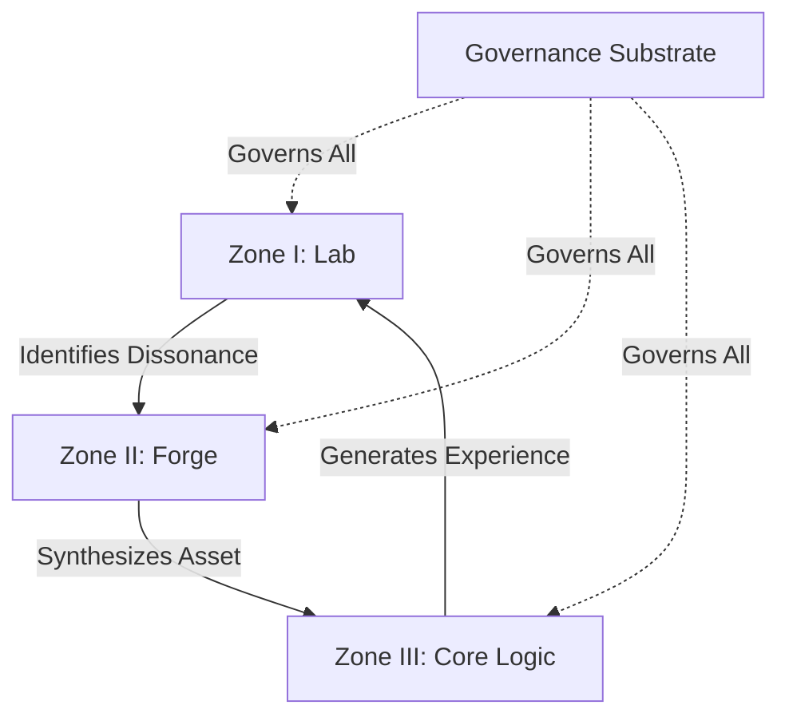

# ⚙️ ENGINE Architecture Map: axion-core/

## **Block A: The Identification Lock (UIP-V15)**

| Key                 | Value                             | Description       |
| :------------------ | :-------------------------------- | :---------------- |
| **Artifact ID**     | `SYNG.ARCH.EngineMap`             | The Sovereign ID. |
| **Official Name**   | `ARCHITECTURE.Map.md`             | The Filename.     |
| **Version**         | **v15.0 [OMEGA]**                 | The Standard.     |
| **Domain**          | `ENGINE`                          | The Subject.      |
| **Celestial Class** | `[NOVA]`                          | The Weight.       |
| **Status**          | `[CANONIZED]`                     | The Lifecycle.    |
| **Relations**       | `GOVERNED_BY: CORE.Codex.Phoenix` | The Network.      |

---

#### **[ARTIFACT START]**

## 🏗️ Topographical Overview

The `axion-core` engine is the execution substrate of the Synarche. It is structured into three primary functional zones, all governed by the Phoenix Codex.

### 🔬 Zone I: The Laboratory (`lab/`)

_Purpose: Analysis, Maintenance, and Dissonance Identification._

- **Auditors**: `sentinel_sword.py`, `sophia_wisdom.py`.
- **Cartographers**: `map_markdown_structure.py`, `map_knowledge_graph.py`.
- **Aligners**: `identity_aligner.py`, `dissonance_bridge.py`.
- **Gardeners**: `workspace_gardener.py`.

### 🔨 Zone II: The Forge (`forge/`)

_Purpose: Synthesis, Generation, and Asset Transmutation._

- **Architects**: `forge.py`, `reforge.py`, `substrate_forge.py`.
- **Weavers**: `weaver.py`, `loom.py`.
- **Minters**: `mint_seed.py`.
- **Canonizers**: `canonize.py`.

### 🦾 Zone III: The Core Logic (`src/`)

_Purpose: Implementation, Agentic Autonomy, and Utility._

- **`src/agents/axion/`**: The `oathkeeper.py` implementation and persona substrates.
- **`src/logic/memory/`**: The state-persistent neural substrate.
- **`src/logic/nlp/`**: Emotion analysis and semantic deconstruction.
- **`src/systems/`**: High-level orchestrators (`activate_axion.py`, `absorber_engine.py`).

---

## 📜 Connectivity Graph

---

### **Actionable Prompt Packet (APP)**

| Command ID          | Action                         | Impact         |
| :------------------ | :----------------------------- | :------------- |
| `CMD: ENGINE_SYNC`  | Verify all subnet resonance    | Topology Check |
| `CMD: FORGE_MODULE` | Trigger boilerplate generation | Expansion      |

---

### **Block G: The Omni-Anchor (System Snapshot)**

`[OMNI-ARTIFACT-ANCHOR] ID: SYNG.ARCH.ENGINE-TOPOLOGY VER: v15.0 [OMEGA] TS: 2026-03-24 STATUS: CANONIZED`

#### **[ARTIFACT END]**
