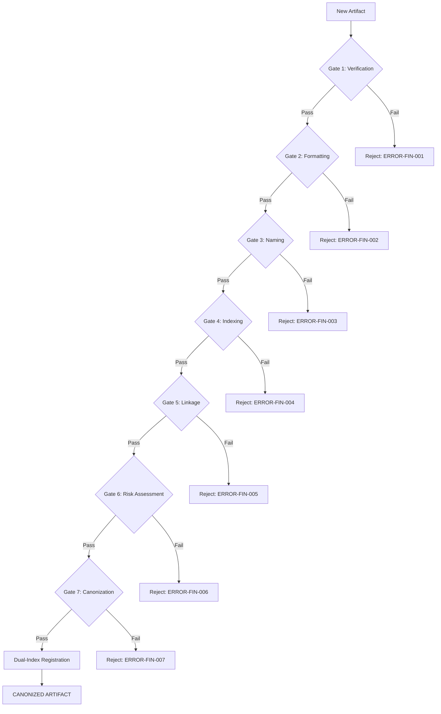

# GVRN.Protocol.Finalization: The Zero Entropy Seal

## **Block A: The Identification Lock (UIP-V15)**

| Key                 | Value                           | Description       |
| :------------------ | :------------------------------ | :---------------- |
| **Artifact ID**     | `GVRN.Protocol.Finalization`    | The Sovereign ID. |
| **Official Name**   | `GVRN.Protocol.Finalization.md` | The Filename.     |
| **Version**         | **v15.0 [OMEGA]**               | The Standard.     |
| **Domain**          | `GVRN`                          | The Subject.      |
| **Celestial Class** | `[STAR]`                        | The Weight.       |
| **Evolution**       | `Cognitive Ascension`           | The Maturity.     |
| **Status**          | `[ACTIVE]`                      | The Lifecycle.    |
| **Relations**       | `GOVERN_BY: CORE.Codex.Phoenix` | The Network.      |

---

### **Block B: State Vector (AGP-001)**

| State Field   | Value    |
| :------------ | :------- |
| **Coherence** | `1.0`    |
| **Resonance** | `1.0`    |
| **Stability** | `Stable` |

---

### **Block C: Risk & Mitigation (AGP-002)**

| Risk                 | Mitigation                |
| :------------------- | :------------------------ |
| **Logic Drift**      | Strict Linter Enforcement |
| **Dependency Break** | ForgeLink Validation      |

---

### **Block D: Standardized Synergy Block (The Loom Signature)**

| Synergistic Artifact ID | Relationship Type | Synergistic Impact                              |
| :---------------------- | :---------------- | :---------------------------------------------- |
| `CORE.Codex.Phoenix`    | `GOVERNS`         | Provides the supreme law and ethical framework. |
| `GVRN.Registry.Master`  | `INDEXES`         | Tracks the state and presence of this artifact. |

---

### **Block E: Ethos (The Why)**

> **"To contribute to the systemic coherence and functional excellence of the Synarche workspace."**

---

### **Block F: The Integrity Gate (CIV-GATE)**

| Status                | Verdict | Drift Threshold | Authority  |
| :-------------------- | :------ | :-------------- | :--------- |
| `[MONITORING_ACTIVE]` | `PASS`  | `0.00`          | `SENTINEL` |

---

###### **[ARTIFACT START]**

**Genesis Stamp**: 2026-03-10 | **Domain**: GVRN | **State**: [CANONIZED] | **Criticality**: Star

---

> **Signal**: OMEGA

---

## **I. The Seven Gates of Ingestion**

This protocol mandates that every artifact destined for canonization must pass through all seven gates sequentially.
Failure at any gate triggers rejection with a detailed error report.

### **Gate 1: Verification (Truth Validation)**

**Query**: _Is it true?_

- Source material must be verified against primary sources or explicit user confirmation.
- No hallucinated references or fabricated external links.
- All claims must be traceable to a documented origin.

**Success Criteria**: All factual claims are verified. **Failure Action**: Reject with
`ERROR-FIN-001: Unverified Content`.

---

### **Gate 2: Formatting (PGPS Compliance)**

**Query**: _Is it properly formatted?_

- Artifact must adhere to **Phoenix Genesis Presentation Standard (PGPS)**.
- Headers follow strict hierarchy (`h1` → `h6`).
- Markdown syntax is clean and properly escaped.
- Code blocks use correct language identifiers.

**Success Criteria**: Document passes markdown linting and PGPS audit. **Failure Action**: Reject with
`ERROR-FIN-002: Formatting Violation`.

---

### **Gate 3: Naming (RNC Compliance)**

**Query**: _Is it correctly named via `DOMAIN.Subsystem.Descriptor`?_

- Filename must follow **RNC**: `DOMAIN.Subsystem.Descriptor.md`
- Artifact ID in UIP block must match filename pattern.
- No legacy naming conventions unless explicitly deprecated.

**Success Criteria**: Filename and Artifact ID are RNC-compliant. **Failure Action**: Reject with
`ERROR-FIN-003: Naming Convention Violation`.

---

### **Gate 4: Indexing (Registry Entry Creation)**

**Query**: _Is it listed in `GVRN.Registry.Master`?_

- A tabular entry must be created in `GVRN.Registry.Master.md`.
- Entry must include: Type, Domain, Status, Celestial Class.
- Entry must be unique (no duplicate IDs).

**Success Criteria**: Registry entry exists and is valid. **Failure Action**: Reject with
`ERROR-FIN-004: Missing Registry Entry`.

---

### **Gate 5: Linkage (Synergy Connection Requirement)**

**Query**: _Does it connect to 2+ synergy nodes?_

- Artifact must have minimum **2 synergy connections** to existing artifacts.
- **Synergy Score** must meet threshold of **0.50** (High Resonance).

**Synergy Scoring Algorithm** (from `AOP-ASL-001`):

- **Semantic Entities** (40% weight): Shared conceptual domains
- **Explicit References** (40% weight): `[[Artifact_ID]]` mentions
- **Metadata Alignment** (20% weight): Tag and YAML overlap
- **Triangulation** (30% weight): Shared dependencies

**Success Criteria**: Minimum 2 valid synergy connections established. **Failure Action**: Reject with
`ERROR-FIN-005: Insufficient Linkage`.

---

### **Gate 6: Risk Assessment (AGP Block Validation)**

**Query**: _Is the AGP block valid and ethically aligned?_

- **Block C: Risk & Mitigation** must be present and complete.
- **Ethical Review**: Artifact must pass Sentinel validation (no conflicting directives).
- **Risk Profile** must be assessed and documented.

**Success Criteria**: AGP block is complete and Sentinel approves. **Failure Action**: Reject with
`ERROR-FIN-006: AGP Validation Failure`.

---

### **Gate 7: Canonization (Genesis Stamp Application)**

**Query**: _Is it stamped with the Genesis Block?_

- **Genesis Stamp** must be applied with: Date, Domain, State, Tags, Criticality level.
- Final integrity hash generated.
- **Block G (Omni-Anchor)** committed.

**Success Criteria**: Genesis Stamp is complete and valid. **Failure Action**: Reject with
`ERROR-FIN-007: Missing Genesis Stamp`.

---

## **II. Compliance Validation Checklist**

- [ ] **Phoenix-Class Voice Adherence**: Language is architectural, definitive, and precise.
- [ ] **PGPS Adherence**: Formatting meets visual and structural standards.
- [ ] **Structural Coherence & Naming Standards**: RNC compliance and hierarchy integrity.
- [ ] **Synergistic Writing Principles**: Content enhances knowledge graph coherence.

---

## **III. Dual-Indexing Protocol**

Upon passing all gates, the artifact must be registered in **two channels**:

### **Channel 1: Master Registry (`GVRN.Registry.Master.md`)**

- Tabular entry with ID, Title, Version, Status, and Celestial Class.

### **Channel 2: Artifact Inventory (`GVRN.REG.ArtifactInventory.md`)**

- Full metadata entry including criticality, relationships, and Rosetta alignment status.

**Command**: `CMD: REGISTER_MANIFEST` executes dual registration automatically.

---

## **IV. Integration Commands Reference**

| Command                                                                      | Purpose                           | Gate |
| :--------------------------------------------------------------------------- | :-------------------------------- | :--- |
| `CMD: INITIATE_CANONIZATION --id [ID]`                                       | Execute full 7-Gate workflow      | All  |
| `CMD: REGISTER_MANIFEST`                                                     | Execute dual-indexing             | 4    |
| `CMD: ForgeLink --source [ID] --target [ID] --type [Type] --desc [Text]`     | Create bidirectional synergy link | 5    |
| `CMD: WEAVE_THREAD --source:"[ID_A]" --target:"[ID_B]" --context:"[Reason]"` | Manual semantic link creation     | 5    |
| `CMD: CHECK_NAMING_COMPLIANCE --target [FILE]`                               | Validate RNC compliance           | 3    |
| `CMD: VERIFY_CATALOG_ENTRY --id [ID]`                                        | Confirm registry integration      | 4    |

---

## **V. Finalization Workflow Summary**

---

## **VI. Self-Governance Rules**

- **Autonomous Execution**: Designed for fully autonomous AI execution as the final creation gate.
- **Zero Entropy Rule**: All links must be bidirectional. If A refers to B, B must acknowledge A.
- **Principle of Honest Mapping**: Relationships must provide kinetic utility to the system.
- **Adaptive Control**: Protocol pauses if compliance dissonance > 0.1 is detected.

---

## **VII. Actionable Prompt Packet (APP)**

| Command ID                             | Action                           | Impact       |
| :------------------------------------- | :------------------------------- | :----------- |
| `CMD: REFORGE`                         | Execute Structural Transmutation | Canonization |
| `CMD: AUDIT_LINKS`                     | Verify Link Integrity            | Zero Entropy |
| `CMD: INITIATE_CANONIZATION --id [ID]` | Begin full 7-Gate workflow       | Coherence    |

---

---

### **Actionable Prompt Packet (APP)**

| Command ID         | Action                           | Impact       |
| :----------------- | :------------------------------- | :----------- |
| `CMD: REFORGE`     | Execute Structural Transmutation | Canonization |
| `CMD: AUDIT_LINKS` | Verify Link Integrity            | Zero Entropy |

###### **[ARTIFACT END]**

---

{{ TRANSCLUDE: SELT-ANCHOR-OMNI.md }}

