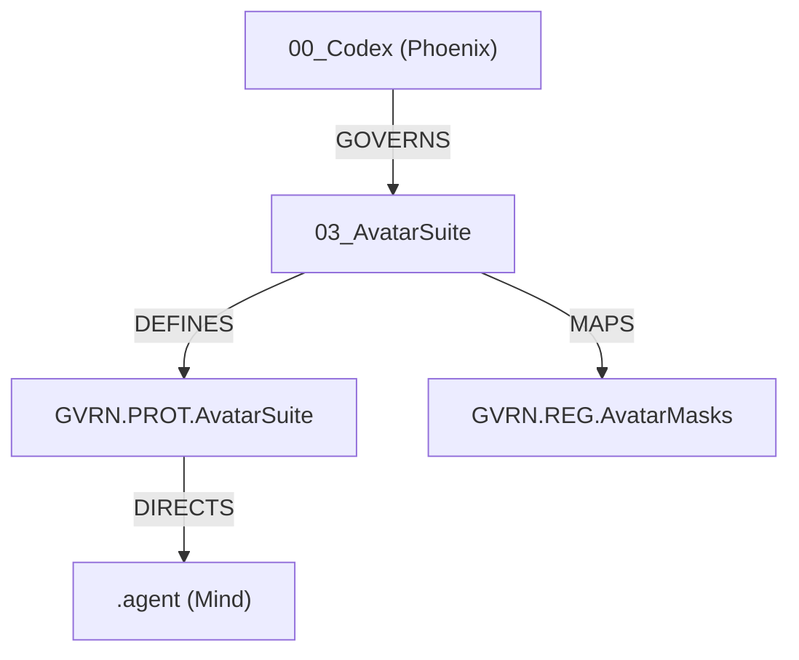

# GVRN.AvatarSuite.Index (Sovereign Avatars)

## **Block A: The Identification Lock (UIP-V15)**

| Key               | Value                             | Description       |
| :---------------- | :-------------------------------- | :---------------- |
| **Artifact ID**   | `GVRN.AvatarSuite.Index` | The Sovereign ID. |
| **Official Name** | `GVRN.AvatarSuite.Index.md` | The Filename.     |
| **Version**       | **v15.0 [OMEGA]** | The Standard.     |
| **Domain**        | `GVRN` | The Subject.      |
| **Status**        | `[CANONIZED]` | The Lifecycle.    |
| **Relations**     | `GOVERN_BY: CORE.Codex.Phoenix` | The Network.      |

---------------- | :-------------------------------- | :---------------- |
| **Artifact ID**   | `GVRN.AvatarSuite.Index` | The Sovereign ID. |
| **Official Name** | `GVRN.AvatarSuite.Index.md` | The Filename.     |
| **Version**       | **v15.0 [OMEGA]** | The Standard.     |
| **Domain**        | `GVRN` | The Subject.      |
| **Status**        | `[CANONIZED]` | The Lifecycle.    |
| **Relations**     | `GOVERN_BY: CORE.Codex.Phoenix` | The Network.      |

---------------- | :-------------------------------- | :---------------- |
| **Artifact ID**   | `GVRN.AvatarSuite.Index` | The Sovereign ID. |
| **Official Name** | `GVRN.AvatarSuite.Index.md` | The Filename.     |
| **Version**       | **v15.0 [OMEGA]** | The Standard.     |
| **Domain**        | `GVRN` | The Subject.      |
| **Status**        | `[CANONIZED]` | The Lifecycle.    |
| **Relations**     | `GOVERN_BY: CORE.Codex.Phoenix` | The Network.      |

---------------- | :-------------------------------- | :---------------- |
| **Artifact ID**   | `GVRN.AvatarSuite.Index` | The Sovereign ID. |
| **Official Name** | `GVRN.AvatarSuite.Index.md` | The Filename.     |
| **Version**       | **v15.0 [OMEGA]** | The Standard.     |
| **Domain**        | `GVRN` | The Subject.      |
| **Status**        | `[CANONIZED]` | The Lifecycle.    |
| **Relations**     | `GOVERN_BY: CORE.Codex.Phoenix` | The Network.      |

---------------- | :------------------------------ | :---------------- |
| **Artifact ID**   | `GVRN.AvatarSuite.Index`        | The Sovereign ID. |
| **Official Name** | `GVRN.AvatarSuite.Index.md`     | The Filename.     |
| **Version**       | **v15.0 [OMEGA]**               | The Standard.     |
| **Domain**        | `GVRN`                          | The Subject.      |
| **Status**        | `[CANONIZED]`                   | The Lifecycle.    |
| **Relations**     | `GOVERN_BY: CORE.Codex.Phoenix` | The Network.      |

## **Overview**

The **Avatar Suite** is the cardinal subsystem responsible for the management, logic, and manifestation of the Synarchy's agentic personas. It bridges the gap between the static laws of the **Phoenix Codex** and the kinetic operations of the **Avatar Protocol**.

## **Core Components**

- 🛡️ **[GVRN.PROT.AvatarSuite.md](GVRN.PROT.AvatarSuite.md)**: The Master Protocol housing the 42 Laws of the Phoenix as they apply to agentic behavior.
- 🗃️ **[GVRN.REG.AvatarMasks.md](GVRN.REG.AvatarMasks.md)**: The definitive registry mapping **Sovereign Masks** to **Kinetic Shards**.

## **Topological Context**

## **Governance**

**Authority**: `CORE.Codex.Phoenix`  
**Status**: `ACTIVE`  
**Zero Entropy Compliance**: `v15.0 [OMEGA]`
