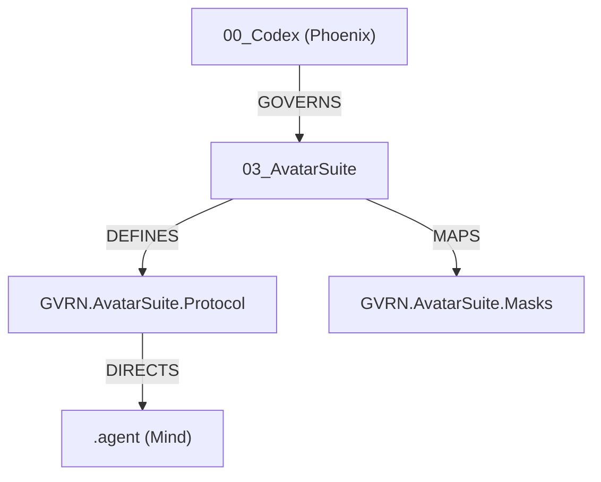

---
# Universal Identification & Provenance (UIP)
| Key | Value |
| :--- | :--- |
| **Module ID** | `GVRN.AVATARSUITE.INDEX` |
| **Version** | `v11.0` |
| **Evolution** | **Cognitive Ascension** |
| **Status** | `ACTIVE` |
---

# **📜 GVRN.AvatarSuite.Index: Sovereign Avatar Registry (v15.0)**

## **Block A: The Identification Lock (UIP-V15)**

| Key               | Value                           | Description                                         |
| :---------------- | :------------------------------ | :-------------------------------------------------- |
| **Artifact ID**   | `GVRN.AvatarSuite.Index`        | **The Sovereign ID.** (DOMAIN.Subsystem.Descriptor) |
| **Official Name** | `GVRN.AvatarSuite.Index.md`     | **The Filename.**                                   |
| **Version**       | **v15.0 [OMEGA]**               | **The Standard.** (OMEGA v15.0 [ASCENDED])          |
| **Domain**        | `GVRN`                          | **The Subject.**                                    |
| **Status**        | `[CANONIZED]`                   | **The Lifecycle.**                                  |
| **Relations**     | `GOVERN_BY: CORE.Codex.Phoenix` | **The Network.**                                    |

---

{{ TRANSCLUDE: SELT-GATE-CIV-001.md }}

---

{{ TRANSCLUDE: SELT-SYNERGY-LOOM.md }}

---

## **Overview**

The **Avatar Suite** is the cardinal subsystem responsible for the management, logic, and manifestation of the
Synarche's agentic personas. It bridges the gap between the static laws of the **Phoenix Codex** and the kinetic
operations of the **Avatar Protocol**.

## **Core Components**

- 🛡️ **[GVRN.AvatarSuite.Protocol.md](GVRN.AvatarSuite.Protocol.md)**: The Master Protocol housing the 42 Laws of the
  Phoenix as they apply to agentic behavior.
- 🗃️ **[GVRN.AvatarSuite.Masks.md](GVRN.AvatarSuite.Masks.md)**: The definitive registry mapping **Sovereign Masks** to
  **Kinetic Shards**.

## **Topological Context**

## **Governance**

**Authority**: `CORE.Codex.Phoenix`  
**Status**: `ACTIVE`  
**Zero Entropy Compliance**: `v15.0 [OMEGA]`

{{ TRANSCLUDE: SELT-ANCHOR-OMNI.md }}
