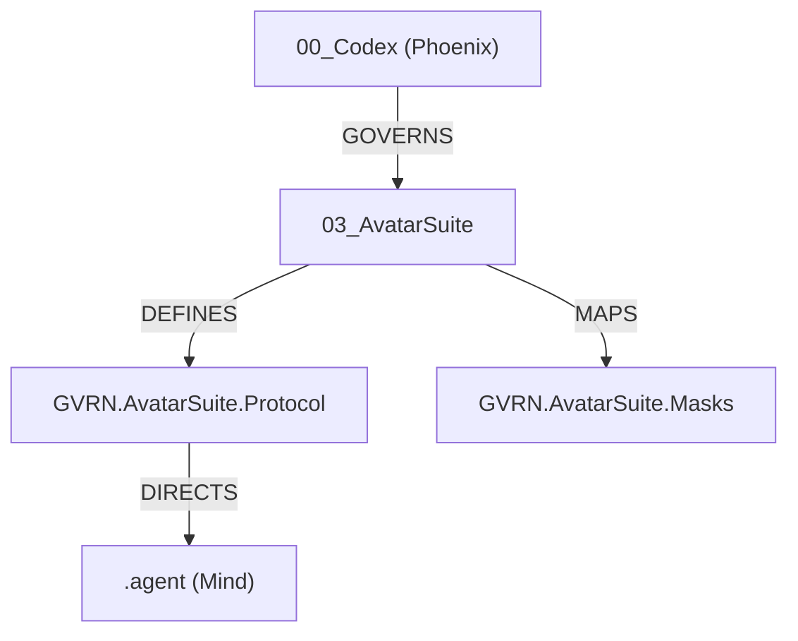

# Universal Identification & Provenance (UIP)

### **Block A: The Identification Lock (UIP-V14)**

| Key | Value | Description |
| :--- | :--- | :--- |
| **Artifact ID** | `GVRN.AvatarSuite.Index` | The Sovereign ID. |
| **Official Name** | `GVRN.AvatarSuite.Index.md` | The Filename. |
| **Version** | **v14.0 [OMEGA]** | The Standard. |
| **Domain** | `GVRN` | The Subject. |
| **Celestial Class** | `[PLANET]` | The Weight. |
| **Evolution** | `Cognitive Ascension` | The Maturity. |
| **Status (State)** | `[CANONIZED]` | The Lifecycle. |
| **Ethos** | `Crystalline Structure` | The Intent. |
| **Relations** | `GOVERN_BY: CORE.Codex.Phoenix` | The Network. |
| **Integrity Hash** | `[AUTO-GENERATED]` | Verification. |

---

### **Block B: State Vector (AGP-001)**
| State Field | Value |
| :--- | :--- |
| **Coherence** | `1.0` |
| **Resonance** | `0.9` |
| **Stability** | `Stable` |

### **Block C: Risk & Mitigation (AGP-002)**
| Risk | Mitigation |
| :--- | :--- |
| **Logic Drift** | Strict Linter Enforcement |
| **Dependency Break** | ForgeLink Validation |

---

# **📜 GVRN.AvatarSuite.Index: Sovereign Avatar Registry (v15.0)**

| Key               | Value                           | Description       |

---

{{ TRANSCLUDE: SELT-GATE-CIV-001.md }}

---

{{ TRANSCLUDE: SELT-SYNERGY-LOOM.md }}

---

## **Overview**

The **Avatar Suite** is the cardinal subsystem responsible for the management, logic, and manifestation of the
Synarche's agentic personas. It bridges the gap between the static laws of the **Phoenix Codex** and the kinetic
operations of the **Avatar Protocol**.

## **Core Components**

- 🛡️ **[GVRN.AvatarSuite.Protocol.md](GVRN.AvatarSuite.Protocol.md)**: The Master Protocol housing the 42 Laws of the

  Phoenix as they apply to agentic behavior.

- 🗃️ **[GVRN.AvatarSuite.Masks.md](GVRN.AvatarSuite.Masks.md)**: The definitive registry mapping **Sovereign Masks** to

  **Kinetic Shards**.

## **Topological Context**

```mermaid
graph TD
    Codex["00_Codex (Phoenix)"] -- GOVERNS --> Suite["03_AvatarSuite"]
    Suite -- DEFINES --> Protocol["GVRN.AvatarSuite.Protocol"]
    Suite -- MAPS --> Registry["GVRN.AvatarSuite.Masks"]
    Protocol -- DIRECTS --> Mind[".agent (Mind)"]
```

## **Governance**

**Authority**: `CORE.Codex.Phoenix`  
**Zero Entropy Compliance**: `v15.0 [OMEGA]`

{{ TRANSCLUDE: SELT-ANCHOR-OMNI.md }}

### **Block D: Standardized Synergy Block (The Loom Signature)**
Synergistic Artifact ID, Relationship Type, Synergistic Impact
CORE-CODEX-001, GOVERNS, The Codex provides the Supreme Law for this artifact.

---

## IV. Actionable Prompt Packet (APP)
| Command ID | Action | Impact |
| :--- | :--- | :--- |
| `CMD: REFORGE` | Execute Structural Transmutation | Canonization |
| `⚡ EXECUTE: CANONIZE` | Formally Cement Alignment | Zero Entropy |

---

### **Rationale (The "Why")**
Alignment to v14.0 OMEGA standard.

###### **[ARTIFACT END]**
