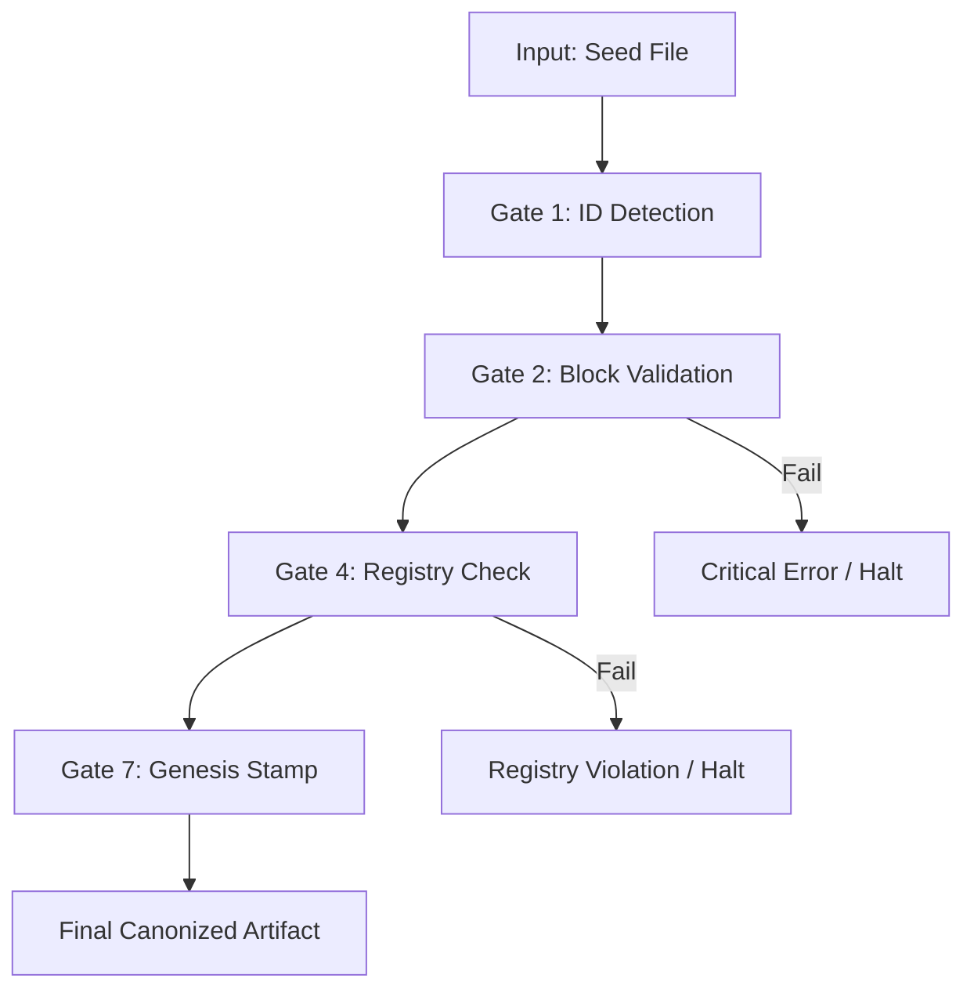

# ARCH.Canonizer.Core: The Blueprint of Finality

## **Block A: The Identification Lock (UIP-V15)**

| Key               | Value                             | Description       |
| :---------------- | :-------------------------------- | :---------------- |
| **Artifact ID**   | `ARCH.Canonizer.Core` | The Sovereign ID. |
| **Official Name** | `ARCH.Canonizer.Core.md` | The Filename.     |
| **Version**       | **v15.0 [OMEGA]** | The Standard.     |
| **Domain**        | `GVRN` | The Subject.      |
| **Status**        | `[CANONIZED]` | The Lifecycle.    |
| **Relations**     | `INDEX_OF: 07_Canonizer` | The Network.      |

---

## **Block B: State Vector (AGP-001)**

| State Field   | Value    |
| :------------ | :------- |
| **Coherence** | `1.0`    |
| **Resonance** | `1.0`    |
| **Stability** | `Stable` |

---

## **Block C: Risk & Mitigation (AGP-002)**

| Risk                 | Mitigation                |
| :------------------- | :------------------------ |
| **Logic Drift**      | Strict Linter Enforcement |
| **Dependency Break** | ForgeLink Validation      |

---

## **Block D: Standardized Synergy Block (The Loom Signature)**

| Synergistic Artifact ID | Relationship Type | Synergistic Impact |
| :--- | :--- | :--- |
| `CORE.Codex.Phoenix` | `GOVERNS` | Provides the supreme law and ethical framework. |
| `GVRN.Registry.Master` | `INDEXES` | Tracks the state and presence of this artifact. |
| `UMB.Canonizer.Core` | `GENERATES` | Provides the systemic vision for the blueprint. |

---

## **Block E: Ethos (The Why)**

> **"To define the structural mapping, validation gates, and data pipeline for canonization operations."**

---

## **Block F: The Integrity Gate (CIV-GATE)**

| Status | Verdict | Drift Threshold | Authority |
| :--- | :--- | :--- | :--- |
| `[MONITORING_ACTIVE]` | `PASS` | `0.00` | `SENTINEL` |

---

###### **[ARTIFACT START]**

## **I. Pipeline Architecture**

The Canonizer executes a sequential 7-Gate check protocol as defined by this architectural core.

### **The 7-Gate Protocol**

1. **Gate 1: Identification Lock**: Extracts and verifies the `Artifact ID`.
2. **Gate 2: Structural Integrity**: Validates the presence of mandatory Blocks (A-G).
3. **Gate 3: Celestial Alignment**: Verification of Shard and Class metadata hierarchy.
4. **Gate 4: Registry Synchronization**: Confirms existence in `GVRN.Registry.Master.md`.
5. **Gate 5: Link Integrity**: Map and verify all Synergistic Relationship links.
6. **Gate 6: Maturity Check**: Validates the `Evolution` and `Status` compatibility.
7. **Gate 7: Genesis Stamp**: Appends the terminal Omni-Anchor signature.

## **II. System Flow**

---

## **Actionable Prompt Packet (APP)**

| Command ID | Action | Impact |
| :--- | :--- | :--- |
| `CMD: ARCH_AUDIT` | Verifies the structural blueprint of an artifact. | Format Integrity |
| `CMD: GENERATE_SCAFFOLD` | Creates a new artifact based on the 7-Gate schema. | Rapid Deployment |

---

## **Block G: The Omni-Anchor (System Snapshot)**

`[OMNI-ARTIFACT-ANCHOR] ID: ARCH.Canonizer.Core VER: v15.0 [OMEGA] DOMAIN: GVRN STATUS: CANONIZED TS: 2026-03-22 HASH: ARCH-CANON-V15`
