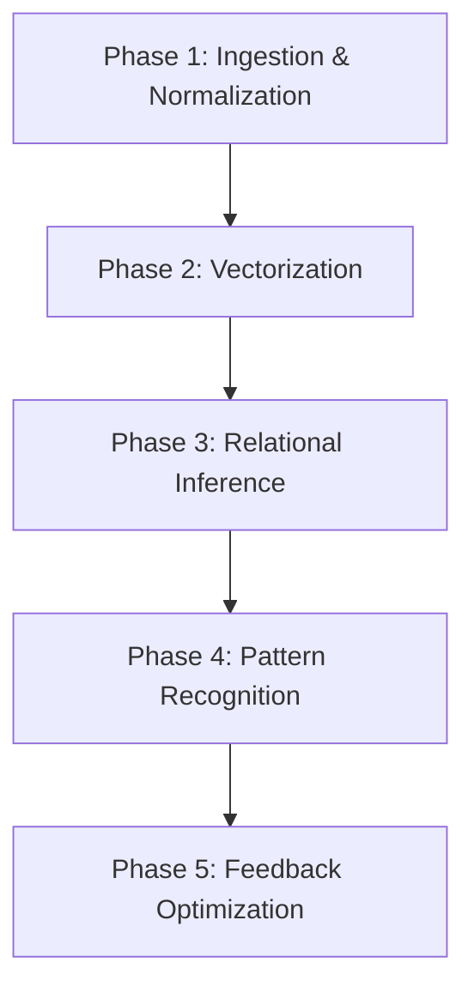

---
# Universal Identification & Provenance (UIP)
| Key | Value |
| :--- | :--- |
| **Module ID** | `COG.CONTEXT.WEAVE` |
| **Version** | `v11.0` |
| **Evolution** | **Cognitive Ascension** |
| **Status** | `ACTIVE` |
---

# COG.Context.Weave.md
> **Domain**: GVRN
> **Evolution**: Omega Ascension
> **Signal**: OMEGA

## **Genesis Stamp: 2026-02-02** **Domain: GVRN** **State: [ACTIVE]** **Tags:** `OGLN_v13, GVRN, Reforged` **Criticality: Operational**

---

###### **[ARTIFACT START]**

### **Block A: The Identification Lock (UIP-V13)**

| Key | Value | Description |
| :--- | :--- | :--- |
| **Artifact ID** | `GVRN-COG.CONTEXT.WEAVE-001` | The Sovereign ID. |
| **Official Name** | `COG.Context.Weave.md` | The Filename. |
| **Version** | **v13.1 [OMEGA]** | The Standard. |
| **Domain** | `GVRN` | The Subject. |
| **Celestial Class** | `[PLANET]` | The Weight. |
| **Evolution** | `Omega Ascension` | The Maturity. |
| **Status** | `[ACTIVE]` | The Lifecycle. |
| **Relations** | `GOVERNED_BY: CORE-CODEX-001` | The Network. |

# Standardized Protocol: ContextWeave Engine (COG.Context.Weave)

> **Domain**: COG (Cognition)
> **Evolution**: Cognitive Ascension
> **Signal**: ESF-ALPHA

## **Genesis Stamp: 2026-01-27** **Domain: COG** **State: CANONIZED** **Tags:** `OGLN_v13, Engine, Analytical` **Criticality: High**

---

###### **[ARTIFACT START]**

### **I. Universal Identification & Provenance (The Vector Signature)**

| Field | Value |
| :---- | :---- |
| **1. Artifact ID** | `COG.Context.Weave` |
| **2. Official Name** | `COG.Context.Weave.md` |
| **3. Version** | **v13.0 (Canonized)** |
| **4. Provenance** | **Date Reforged: 2026-01-27** |
| **5. Domain** | `COG` |
| **6. Evolution** | **Cognitive Ascension** |
| **7. Celestial Class** | `[COMET]` |
| **8. Tier** | **Operational / Engine** |
| **9. State** | `[ACTIVE]` |
| **10. Ethos** | **The Loom of Wisdom** |
| **11. Catalyst** | **Batch 002 Transmutation** |
| **12. Relations** | `REPLACES: AOP-CW-001, INPUT_FOR: COG.Synthesis.Master` |

---

## **II. Executive Summary**

The **ContextWeave Engine** is the primary analytical engine for the Phoenix Synarchy. It transfigures raw information into a cohesive knowledge tapestry by identifying latent relationships and emergent patterns across disparate datasets.

---

## **III. Algorithmic Principles**

1. **Adaptive Contextualization**: Dynamically adjusts analysis granularity based on data type.
2. **Emergent Pattern Recognition**: Identifies non-obvious connections between contexts.
3. **Self-Correction**: Refines relational inferences based on cognitive feedback.

---

## **IV. Algorithmic Phases**

- **Phase 1**: Standardizes heterogeneous data into machine-readable conceptual nodes.
- **Phase 2**: High-dimensional clustering via adaptive windowing.
- **Phase 3**: Pathfinding and traversal of the knowledge graph.
- **Phase 4**: Structural pattern identification via Graph Convolutional Networks (GCNs).
- **Phase 5**: Parameter adjustment via Reinforcement Learning.

---

## **V. Command Syntax (GUCA-CW-001)**

### **4.1 CMD: ContextWeave**

**Usage**: `CMD: ContextWeave --target:[Concept] --focal_points:[ID_List]`

| Parameter | Type | Required | Description |
| :--- | :--- | :--- | :--- |
| `target_concept` | String | Yes | The epicenter for the weave. |
| `focal_points` | List | Yes | Nexus points for contextual anchoring. |

---

### **VI. Actionable Prompt Packet (APP)**

- 🧪 **Refine Context**: `CMD: REFINE_CONTEXT --focus "[Focus]"`
- 🔬 **Analyze Weave**: `CMD: ANALYZE_WEAVE_DENSITY`

> [!IMPORTANT]
> **[ARTIFACT END]**

---

### **Block D: Standardized Synergy Block (The Loom Signature)**

Synergistic Artifact ID, Relationship Type, Synergistic Impact
CORE-CODEX-001, GOVERNS, The Codex provides the Supreme Law for this artifact.
GVRN.Registry.Master, INDEXES, This artifact is indexed in the Master Registry.
