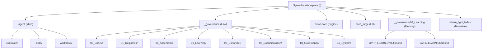

---
# Universal Identification & Provenance (UIP)
| Key | Value |
| :--- | :--- |
| **Module ID** | `GVRN.HUD.MAP` |
| **Version** | `v11.0` |
| **Evolution** | **Cognitive Ascension** |
| **Status** | `ACTIVE` |
---

# The Synarche Workshop: Topology Map (v15.0)

## **Block A: The Identification Lock (UIP-V15)**

| Key               | Value                           | Description       |
| :---------------- | :------------------------------ | :---------------- |
| **Artifact ID**   | `GVRN.HUD.Map`                  | The Sovereign ID. |
| **Official Name** | `GVRN.HUD.Map.md`               | The Filename.     |
| **Version**       | **v15.0 [OMEGA]**               | The Standard.     |
| **Domain**        | `GVRN`                          | The Subject.      |
| **Status**        | `[CANONIZED]`                   | The Lifecycle.    |
| **Relations**     | `GOVERN_BY: CORE.Codex.Phoenix` | The Network.      |

---

## **Block B: State Vector (AGP-001)**

| State Field   | Value    |
| :------------ | :------- |
| **Coherence** | `1.0`    |
| **Resonance** | `1.0`    |
| **Stability** | `Stable` |

---

## **Block C: Risk & Mitigation (AGP-002)**

| Risk                 | Mitigation                |
| :------------------- | :------------------------ |
| **Logic Drift**      | Strict Linter Enforcement |
| **Dependency Break** | ForgeLink Validation      |

---

## **Block D: Standardized Synergy Block (The Loom Signature)**

| Synergistic Artifact ID | Relationship Type | Synergistic Impact                              |
| :---------------------- | :---------------- | :---------------------------------------------- |
| `CORE.Codex.Phoenix`    | `GOVERNS`         | Provides the supreme law and ethical framework. |
| `GVRN.Registry.Master`  | `INDEXES`         | Tracks the state and presence of this artifact. |

---

## **Block E: Ethos (The Why)**

> **"To contribute to the systemic coherence and functional excellence of the Synarche workspace."**

---

## **Block F: The Integrity Gate (CIV-GATE)**

| Status                | Verdict | Drift Threshold | Authority  |
| :-------------------- | :------ | :-------------- | :--------- |
| `[MONITORING_ACTIVE]` | `PASS`  | `0.00`          | `SENTINEL` |

---

## **[ARTIFACT START]**

This artifact provides the cartographic overview of the Synarchy Monorepo.

## **I. The Sovereign Root (The Anchor)**

The root `Synarche_Workspace/` is the **Governance Domain**. It houses the laws, the enforcers, and the configuration anchors for the entire Monorepo.

- 🏠 **[Synarche_Workspace](../../)**: The Root Directory.
- 📄 **[.code-workspace](../../Synarche_Workspace.code-workspace)**: The Sovereign Anchor.
- 🛡️ **[GEMINI.md](../../GEMINI.md)**: The High Gate (Gateway Protocol).
- ⚙️ **[README.md](../../README.md)**: The Root Index.

---

## **II. The Domain Layer**

### 🧠 **THE MIND ([.agent/](../../.agent))**

The cognitive architecture containing the brains, skills, and workflows of the Synarchy agents.

- ⚒️ **[substrate/](../../.agent/substrate/README.md)**: Core configuration and rules.
  - 🛡️ **[rules/GVRN-ABILITY-MAP.md](../../.agent/substrate/rules/GVRN-ABILITY-MAP.md)**: Agentic Ability Map (PF-Rules).
  - 🏺 **[identity/ASCENT-IMPACT.md](../../.agent/substrate/identity/ASCENT-IMPACT.md)**: Systemic Impact Analysis.
  - 🧩 **[identity/SYNTHESIS-INSIGHTS.md](../../.agent/substrate/identity/SYNTHESIS-INSIGHTS.md)**: Coherent Synthesis Engine.
  - 🧘 **[rules/SELF-IMPROVEMENT.md](../../.agent/substrate/rules/SELF-IMPROVEMENT.md)**: Mastery Protocols.
- 🧬 **[skills/](../../.agent/skills)**: Specialized agent capabilities.
- 🔄 **[workflows/](../../.agent/workflows)**: Standard Operating Procedures (SOPs).

### ⚖️ **THE LAW ([\_governance/](../../_governance))**

The heart of the OMEGA standard, housing the Phoenix Codex and global registries.

- 📜 **[00_Codex/](../00_Codex/CORE.Codex.Phoenix.md)**: The Supreme Law (Phoenix Codex).
- 🗃️ **[01_Registries/](../01_Registries/GVRN.Registry.DataOSLM.md)**: Master Registry, Inventory, OSLM.
- 🎭 **[03_AvatarSuite/](../03_AvatarSuite/GVRN.AvatarSuite.Index.md)**: Avatar Protocol & Sovereign Masks.
- 🔒 **[04_Finalization/](../04_Finalization/GVRN.Finalization.Index.md)**: The Canonization Gate.
- 🏗️ **[05_Assembler/](../05_Assembler/GVRN.Assembler.Index.md)**: The Assembly Engine.
- 🗃️ **[08_Documentation/](../08_Documentation/GVRN.Documentation.Index.md)**: The Master Archives & Glossary.
- 🔒 **[07_Canonizer/](../07_Canonizer/GVRN.Canonizer.Index.md)**: The Sealing Protocol.
- 🏗️ **[10_Governance/](../10_Governance/GVRN.HUD.Map.md)**: Active HUD and Governance nodes.
- 🛡️ **[STRATEGY-OMEGA.md](../STRATEGY-OMEGA.md)**: The Hyper-Optimized Strategy.
- 📐 **[20_Architecture/](../20_Architecture)**: System blueprints.
- ⚙️ **[40_System/](../40_System)**: Loom Master and System services.
- 📝 **[50_Logs/](../50_Logs)**: Cumulative Synthesis Logs (CSL).
- 📔 **[archive/CREATION_JOURNAL_V15.md](../archive/CREATION_JOURNAL_V15.md)**: Obsidian Bridge Log.

### ⚙️ **THE ENGINE ([axion-core/](../../axion-core))**

The kinetic substrate for the Synarchy's logic and data operations.

### 🧪 **THE LAB ([nova_forge/](../../nova_forge))**

The experimental space for creative forging and artifact generation.

### 🧠 **THE LEARNING SUBSYSTEM ([\_governance/06_Learning/](../06_Learning))**

The persistence layer for self-reflection, evolutionary logs, and gemstone insights.

- 📖 **[Evolution](../06_Learning/GVRN.Learning.Evolution.md)**: AI Evolution Log (Strategic).
- 🧩 **[Shard](../06_Learning/GVRN.Learning.Shard.md)**: Session Learnings (Atomic).
- 💎 **[Gem](../06_Learning/GVRN.Learning.Gem.md)**: High-resonance insights (L1).
- 🏗️ **[Extraction](../06_Learning/GVRN.Learning.Extraction.md)**: Protocol for skill manifestation.

### 📖 **THE NARRATIVE ([where_light_fades/](../../where_light_fades))**

The strategic narrative and creative development layer.

---

## **III. Topology Visual**

---

## **IV. Actionable Prompt Packet (APP)**

| Command ID         | Action                            | Impact             |
| :----------------- | :-------------------------------- | :----------------- |
| `CMD: HUD_GOTO`    | Quick-jump to specific core node. | Cognitive Velocity |
| `CMD: AUDIT_LINKS` | Verify Link Integrity             | Zero Entropy       |
| `CMD: REFORGE`     | Execute Structural Transmutation  | Canonization       |

---

---

**Authority**: CORE.Codex.Phoenix **Status**: ACTIVE

**[ARTIFACT END]**

---

{{ TRANSCLUDE: SELT-ANCHOR-OMNI.md }}

