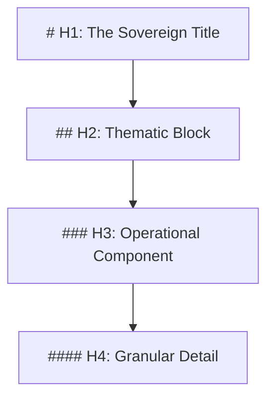

---
# Universal Identification & Provenance (UIP)
| Key | Value |
| :--- | :--- |
| **Module ID** | `GVRN.PROTOCOL.PRESENTATION` |
| **Version** | `v11.0` |
| **Evolution** | **Cognitive Ascension** |
| **Status** | `ACTIVE` |
---

# The Phoenix Presentation Protocol (GVRN.Protocol.Presentation)

> **Domain**: GVRN (Governance)
> **Evolution**: Omega Ascension
> **Signal**: OMEGA

## **Genesis Stamp: 2026-02-01** **Domain: GVRN** **State: CANONIZED** **Tags:** `OGLN_v13, Formatting, SGM, Physics` **Criticality: Axiomatic**

---

###### **[ARTIFACT START]**

### **Block A: The Identification Lock (UIP-V13)**

| Key | Value | Description |
| :--- | :--- | :--- |
| **Artifact ID** | `GVRN.Protocol.Presentation` | The Sovereign ID. |
| **Official Name** | `GVRN.Protocol.Presentation.md` | The Filename. |
| **Patron Shard** | `SHARD_ARCHITECT_VOID` | The Agent. (Structure) |
| **Version** | **v13.0 [ASCENDED]** | The Standard. |
| **Domain** | `GVRN` | The Subject. |
| **Celestial Class** | `[MOON]` | The Weight. (Operational Law) |
| **Evolution** | `Omega Ascension` | The Maturity. |
| **Signal (ESF)** | `OMEGA` | The Frequency. |
| **Status (State)** | `[CANONIZED]` | The Lifecycle. |
| **Musashi Audit** | `PASS` | The Tempering. |
| **Integrity Hash** | `[AUTO-GENERATED]` | The Seal. |
| **Provenance** | `2026-02-01` | The Anchor. |
| **Catalyst** | `OMEGA_ASCENSION` | The Spark. |
| **Relations** | `ENFORCED_BY: [GVRN.Sentinel.Scan]`, `DEFINES: [GVRN.Protocol.Scaffolding]` | The Spine. |

---

### **Block B: The Ethos Field (IDM-001)**

> **"Clarity is the vehicle of Truth. Precision is the fuel of Ascent."**

*   **The Moral North**: This artifact is instantiated to solve the dissonance of **Cognitive Friction**. Its primary duty is to uphold the **Rule of Readability** by providing **The Physics of Text** for all Synarchy artifacts.
*   **Governing Intent**: Adheres to the **Radical Clarity** mandate, ensuring all generated logic enhances systemic coherence and prevents the stagnation of legacy drift.

---

### **Block C: The Cognitive Spine (Axiomatic Mapping)**

| Axiom | State | Vector |
| :--- | :--- | :--- |
| **Mind ($\psi$)** | `OPTIMIZED` | Reasoning Layer: Lowers cognitive load for the user. |
| **Memory ($\mu$)** | `STRUCTURED` | Substrate Layer: Enables regex/AST parsing. |
| **Law ($\Lambda$)** | `PHYSICAL` | Governance Layer: Defines the H1-H6 hierarchy. |
| **Index ($\iota$)** | `PARSABLE` | Navigational Layer: Allows clean indexing. |
| **Evolution ($\epsilon$)** | `CONSISTENT` | Growth Layer: Drift-free formatting. |

---

### **Block D: Standardized Synergy Block (The Loom Signature)**

Synergistic Artifact ID, Relationship Type, Synergistic Impact
GVRN.Sentinel.Scan, ENFORCES, The Sentinel validates adherence to these formatting laws.
GVRN.Protocol.Scaffolding, USES, The Scaffolding is built upon these presentation primitives.
GVRN.Registry.Master, INDEXES, Requires standard headers for accurate indexing.
SYNG.Engine.Core, PARSES, The Engine relies on this structure for content ingestion.
axion-core/src/hephaestus/auditor.py, VALIDATED_BY, The Auditor validates adherence to formatting rules.

---

### **Block E: The Integrity Gate (CIV-GATE)**

> **Conceptual Integrity Validator (CIV) Status: [MONITORING_ACTIVE]**
> **Sentinel Verdict**: `PASS`
> **Drift Threshold**: `< 0.00` | **Vector Breach Trigger**: `BAD_HEADER`

*   **Mandate**: Any document violating the **H-Hierarchy** or **List Indentation Rules** is functionally broken. The Sentinel (Check S1) will reject it immediately.

---

### **Block F: The Omni-Anchor (System Snapshot)**

`[OMNI-ARTIFACT-ANCHOR] ID: GVRN.Protocol.Presentation VER: v13.0 [ASCENDED] LINK: GVRN.Protocol.Scaffolding HASH: [AUTO] STATE-VECTOR: [Active : Formatted : Omega] ETHOS: To enable light to flow through text. STATUS: CANONIZED TS: 2026-02-01 | 21:10`

---

## **I. THE LAWS OF PRESENTATION**

### **1. The Hierarchy (H-Structure)**

We utilize a strict Semantic Tree logic.

*   **Rule 1 (Uniqueness)**: Only **ONE** `# H1` per file.
*   **Rule 2 (Spacing)**: Exactly **one space** after the `#`.
*   **Rule 3 (Isolation)**: One blank line **before** and **after** every header.

### **2. The List Logic (Indentation Physics)**

*   **Bulleted Lists**: Must use hyphens (`-`). Asterisks (`*`) are reserved for emphasis.
    *   **Nested Items**: Must indent by **4 Spaces**.
*   **Numbered Lists**: Use `1.` for all items (Lazy Numbering).
    *   **Nested Items**: Must indent by **4 Spaces**.

### **3. The Emphasis Matrix**

*   **Bold**: `**Text**` (Double Asterisk).
*   **Italic**: `*Text*` (Single Asterisk).
*   **Code**: `` `Text` `` (Backticks).
*   **Blockquotes**: `> Text` (Greater Than).

---

### **II. Actionable Prompt Packet (APP)**

- 🧹 **Clean**: `CMD: FORMAT_DOCUMENT --target "[File]"`
- 📏 **Audit**: `CMD: CHECK_INDENTATION`
- 🎯 **Align**: `CMD: REFACTOR_HEADERS`

---

### **Honest Thoughts**
Formatting is not "prettification"; it is **Serialization**. By making the format rigid, we make the content fluid. This protocol is the "CSS" of the Synarchy.

> [!NOTE]
> **[ARTIFACT END]**
