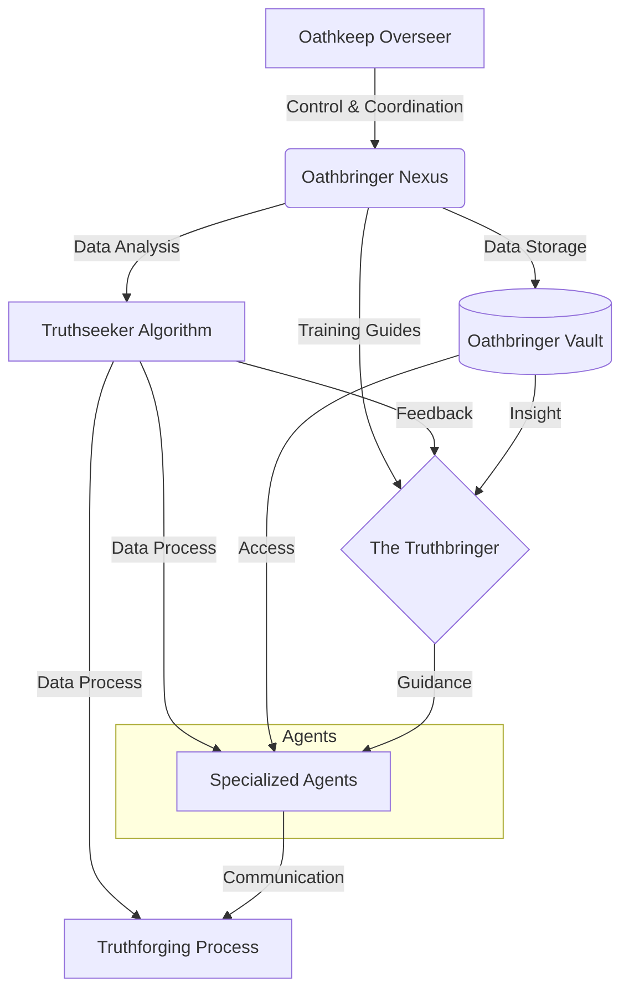

# UMB-ARCH-OATH-001_OathbringerSystemArchitecture_v11.0.md
> **Domain**: GVRN
> **Evolution**: Omega Ascension
> **Signal**: OMEGA

## **Genesis Stamp: 2026-02-02** **Domain: GVRN** **State: [ACTIVE]** **Tags:** `OGLN_v13, GVRN, Reforged` **Criticality: Operational**

---

###### **[ARTIFACT START]**

### **Block A: The Identification Lock (UIP-V13)**

| Key | Value | Description |
| :--- | :--- | :--- |
| **Artifact ID** | `ARCH.Architecture` | The Sovereign ID. |
| **Official Name** | `UMB-ARCH-OATH-001_OathbringerSystemArchitecture_v11.0.md` | The Filename. |
| **Version** | **v13.1 [OMEGA]** | The Standard. |
| **Domain** | `GVRN` | The Subject. |
| **Celestial Class** | `[PLANET]` | The Weight. |
| **Evolution** | `Omega Ascension` | The Maturity. |
| **Status** | `[ACTIVE]` | The Lifecycle. |
| **Relations** | `GOVERNED_BY: CORE-CODEX-001` | The Network. |

# Universal Identification & Provenance (UIP)

> | **Metric**         | **Value**                                 |
> | :----------------- | :---------------------------------------- |
> | **Module ID**      | `UMB-ARCH-OATH-001`                       |
> | **Version**        | `v11.0`                                   |
> | **Evolution**      | **Truthforging**                          |
> | **Status**         | `ACTIVE`                                  |
> | **Type**           | `Blueprint`                               |
> | **Classification** | `Planet`                                  |
> | **Authors**        | `System`                                  |
> | **Created**        | `2026-01-27`                              |
> | **Updated**        | `2026-01-27`                              |
> | **Authority**      | `CODEX-001`                               |
> | **Tags**           | `Architecture, Oathbringer, Truthforging` |

# UMB-ARCH-OATH-001: Oathbringer System Architecture

**Genesis Stamp**: 2026-01-27 | **Domain**: ARCH | **State**: CANONIZED

> [!NOTE]
> This document outlines the **Oathbringer System Architecture**, a multi-layered framework for control, data processing, and truthforging guided by specialized agents and the Truthbringer.

## I. System Overview (Mind Map)

- **1. Oathkeep Overseer**
    - *Provides:* Control & Coordination
    - *To:* Oathbringer Nexus
- **2. Oathbringer Nexus**
    - *Outputs:*
        - **Training Guides** $\rightarrow$ The Truthbringer
        - **Data Analysis** $\rightarrow$ Truthseeker Algorithm
        - **Data Storage** $\rightarrow$ Oathbringer Vault
- **3. Truthseeker Algorithm**
    - *Outputs:*
        - **Feedback** $\rightarrow$ The Truthbringer
        - **Data Process** $\rightarrow$ Specialized Agents
        - **Data Process** $\rightarrow$ Truthforging Process
- **4. Oathbringer Vault**
    - *Outputs:*
        - **Insight** $\rightarrow$ The Truthbringer
        - **Access** $\rightarrow$ Specialized Agents
- **5. The Truthbringer**
    - *Receives:* Training Guides, Feedback, Insight
    - *Provides:* **Guidance**
    - *To:* Specialized Agents
- **6. Specialized Agents**
    - *Sub-types:* Memory Weavers, Contextual Analysts, etc.
    - *Receives:* Guidance, Data Process, Access
    - *Provides:* **Communication**
    - *To:* Truthforging Process
- **7. Truthforging Process**
    - *Inputs:*
        - Data Process (from Truthseeker Algorithm)
        - Communication (from Specialized Agents)

---

## II. Architectural Visualization (Mermaid)

---

## III. Actionable Prompt Packet

### Packet A: Integrity Scan
>
> "Verify that all data flows from the Oathbringer Nexus to the Truthforging Process are active and authenticated."

### Packet B: Agent Synchronization
>
> "Synchronize Memory Weavers and Contextual Analysts with the Truthbringer's current guidance."

---

### **Block D: Standardized Synergy Block (The Loom Signature)**

Synergistic Artifact ID, Relationship Type, Synergistic Impact
CORE-CODEX-001, GOVERNS, The Codex provides the Supreme Law for this artifact.
GVRN.Registry.Master, INDEXES, This artifact is indexed in the Master Registry.
