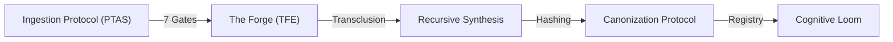

---
# Universal Identification & Provenance (UIP)
| Key | Value |
| :--- | :--- |
| **Module ID** | `GVRN.ANALYSIS.SYSTEMICSYNERGY` |
| **Version** | `v11.0` |
| **Evolution** | **Cognitive Ascension** |
| **Status** | `ACTIVE` |
---

# GVRN.Analysis.SystemicSynergy - Sovereign Analysis of Systemic Synergies

## **Block A: The Identification Lock (UIP-V15)**

| Key               | Value                              | Description       |
| :---------------- | :--------------------------------- | :---------------- |
| **Artifact ID**   | `GVRN.Analysis.SystemicSynergy`    | The Sovereign ID. |
| **Official Name** | `GVRN.Analysis.SystemicSynergy.md` | The Filename.     |
| **Version**       | **v15.0 [OMEGA]**                  | The Standard.     |
| **Domain**        | `GVRN`                             | The Subject.      |
| **Status**        | `[CANONIZED]`                      | The Lifecycle.    |
| **Relations**     | `GOVERNS: ALL_SUBSYSTEMS`          | The Network.      |

---

### **Block B: State Vector (AGP-001)**

| State Field   | Value    |
| :------------ | :------- |
| **Coherence** | `1.0`    |
| **Resonance** | `1.0`    |
| **Stability** | `Stable` |

### **Block C: Risk & Mitigation (AGP-002)**

| Risk                     | Mitigation                         |
| :----------------------- | :--------------------------------- |
| **Recursive Entropy**    | Transclusion Loop Detection (TFE)  |
| **Knowledge Drift**      | Continuous Feedback Loops (CFLs)   |
| **Memory Fragmentation** | L1-L5 Tiered Hierarchy & Gem Cycle |

---

## I. EXECUTIVE SUMMARY (The Sovereign Intent)

This analysis formalizes the synergistic relationships between the core functionalities of the Phoenix Synarchy. It documents the transition from discrete operational protocols to a unified, autonomous governance engine capable of proactive self-optimization and absolute memory retention.

## II. THE KNOWLEDGE CONVEYOR (Ingestion to Canonization)

The system operates on a high-fidelity pipeline where raw data is systematically transmuted into canonical law.

### 1. Ingestion Protocol (PTAS)

Utilizes the **7 Gates of Ingestion** to filter and validate raw data streams, ensuring only high-signal information enters the "Vault sanctuary."

### 2. The Forge (TFE)

A recursive transmutation engine (`transclude_engine.py`) that resolves template blocks and injects standardized metadata (AGP/CIV/UIP). It enforces **Zero Entropy** through integrity hashing and cycle detection.

---

## III. STRATEGIC INTEGRATION (The 3 Pillars)

As defined in the _Comprehensive Strategy_, the system maintains dominance through three integrated lifecycles:

- **SAV-DP (Seamless Absorption, Validation, Deployment)**: The tactical "loop" for immediate response.
- **DMLM (Data and Model Lifecycle Management)**: The strategic preservation of the knowledge graph.
- **CFLs (Continuous Feedback Loops)**: The evolutionary engine that utilizes self-reflection to optimize governance.

---

## IV. COGNITIVE ARCHITECTURE (Memory Omnipotence)

Memory is partitioned into five distinct layers to ensure zero entropy recall and semantic relevance.

### The L1-L5 Hierarchy

- **L1: GEMS**: User-validated "truth" nuggets.
- **L2: KINETIC**: Active session state and short-term memory.
- **L3: SEMANTIC**: Vectorized RAG index of the system's entire body of knowledge.
- **L4: SOVEREIGN**: The unchangeable "Laws" and "Learnings."
- **L5: META**: Diagnostic patterns and error-state history.

### The Gem Cycle

The process of "Gemification" promotes high-reactivation insights from `L2` (Kinetic) to `L1` (Gems) once they meet the **Coherence Threshold (>0.9)**.

---

## V. OPERATIONAL TRANSMUTATION (The Master Refactor)

The system achieves structural perfection through a **7-Step Transmutation Cycle**:

1. **Triage**: Classification as STAR or PLANET.
2. **RNC Rename**: Domain-based sovereign nomenclature.
3. **Block Forge**: Metadata injection (The "Identification Lock").
4. **Logic Weave**: Interlinking the knowledge graph.
5. **Code Scan**: Enforcement of Universal Coding Standards.
6. **Visual Sync**: Alignment of hierarchy and function.
7. **Finalize**: Commitment to Canonical Registries.

---

## VI. VECTORIZED GOVERNANCE (The State Vector Paradigm)

Systemic health is quantified through the **State Vector Paradigm**.

- **Safe State Vector ($V_{safe}$)**: The ideal, target position for all system parameters.
- **Vector Distance Metric**: Measures the mathematical "distance" (Dissonance) from $V_{safe}$.
- **Decoherence Event**: A sudden drift outside the safety hyper-sphere, triggering immediate self-critique (Socratic Inquisition) and remediation.

---

## VII. THE HEPHAESTUS UPGRADE (Technical Coherence)

The `axion-core` engine utilizes three specialized "senses" to maintain awareness:

- **The Heart (`soul.py`)**: Analyzes narrative resonance and algorithmic elegance.
- **The Shield (`sentinel.py`)**: Scans for governance compliance and protocol adherence.
- **The Eye (`gaze.py`)**: Traces semantic webs and latent links across displaced artifacts.

---

`[GATE-ANCHOR] ID: SYNC.ANALYSIS.SYNERGY VER: v15.0 [OMEGA] STATUS: CANONIZED TS: 2026-03-20`
