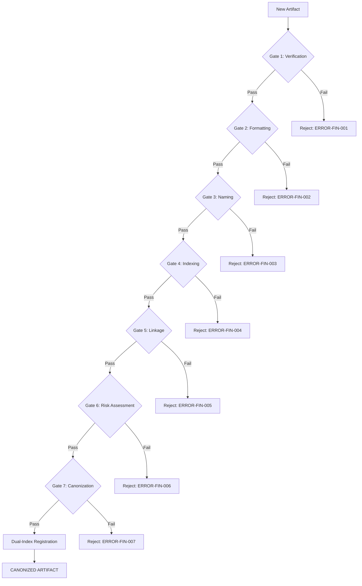

## **Block A: The Identification Lock (UIP-V15)**

| Key               | Value                                   | Description       |
| :---------------- | :-------------------------------------- | :---------------- |
| **Artifact ID**   | `GVRN.Protocol.Finalization`            | The Sovereign ID. |
| **Official Name** | `GVRN.Protocol.Finalization.md`         | The Filename.     |
| **Version**       | **v14.0 [OMEGA]**                       | The Standard.     |
| **Domain**        | `GVRN`                                  | The Subject.      |
| **Status**        | `[ACTIVE]`                              | The Lifecycle.    |
| **Relations**     | `GOVERN_BY: CORE.Codex.ThePhoenixCodex` | The Network.      |

---

### **Block B: State Vector (AGP-001)**

| State Field   | Value    |
| :------------ | :------- |
| **Coherence** | `1.0`    |
| **Resonance** | `1.0`    |
| **Stability** | `Stable` |

---

### **Block C: Risk & Mitigation (AGP-002)**

| Risk                 | Mitigation                |
| :------------------- | :------------------------ |
| **Logic Drift**      | Strict Linter Enforcement |
| **Dependency Break** | ForgeLink Validation      |

---

### **Block D: Standardized Synergy Block (The Loom Signature)**

| Synergistic Artifact ID | Relationship Type | Synergistic Impact                              |
| :---------------------- | :---------------- | :---------------------------------------------- |
| `CORE-CODEX-001`        | `GOVERNS`         | Provides the supreme law and ethical framework. |
| `GVRN.Registry.Master`  | `INDEXES`         | Tracks the state and presence of this artifact. |

---

### **Block E: Ethos (The Why)**

> **"To contribute to the systemic coherence and functional excellence of the Synarche workspace."**

---

### **Block F: The Integrity Gate (CIV-GATE)**

| Status                | Verdict | Drift Threshold | Authority  |
| :-------------------- | :------ | :-------------- | :--------- |
| `[MONITORING_ACTIVE]` | `PASS`  | `0.00`          | `SENTINEL` |

---

###### **[ARTIFACT START]**

---

> **"No artifact may enter the Synarche without passing through The Seven Gates."**

- **The Moral North**: This protocol is instantiated to solve the dissonance of **Artifact Entropy** and **Knowledge
  Graph Fragmentation**. Its primary duty is to uphold the **Rule of Structural Integrity (CORE-CODEX-001)** by
  providing **A Unified Finalization Pathway for All v13.1+ Artifacts**.
- **Governing Intent**: Adheres to the **Governance Sovereignty** mandate, ensuring all finalized artifacts enhance
  systemic coherence and prevent the drift of unvalidated content.

---

| **Mind ($\psi$)** | `ORCHESTRATED` | Reasoning Layer: Defined by the Seven-Gate Logic. | | **Memory ($\mu$)** |
`INTEGRATED` | Substrate Layer: Dual-indexed in Catalog and Rosetta Stone. | | **Law ($\Lambda$)** | `ENFORCED` |
Governance Layer: Validated by Compliance Checklist. | | **Index ($\iota$)** | `CANONIZED` | Navigational Layer:
Registered in `GVRN.Registry.Master`. |

---

## **I. The Seven Gates of Ingestion**

This protocol mandates that every artifact destined for canonization must pass through all seven gates sequentially.
Failure at any gate triggers rejection with a detailed error report.

### **Gate 1: Verification (Truth Validation)**

**Query**: _Is it true?_

**Validation Logic**:

- Source material must be verified against primary sources or explicit user confirmation.
- No hallucinated references or fabricated external links.
- All claims must be traceable to a documented origin.

**Success Criteria**: All factual claims are verified. **Failure Action**: Reject with
`ERROR-FIN-001: Unverified Content`.

---

### **Gate 2: Formatting (PGPS Compliance)**

**Query**: _Is it properly formatted?_

**Validation Logic**:

- Artifact must adhere to **Phoenix Genesis Presentation Standard (PGPS)**.
- Headers follow strict hierarchy (`h1` → `h6`).
- Markdown syntax is clean and properly escaped.
- Code blocks use correct language identifiers.

**Success Criteria**: Document passes markdown linting and PGPS audit. **Failure Action**: Reject with
`ERROR-FIN-002: Formatting Violation`.

---

### **Gate 3: Naming (RNC Compliance)**

**Query**: _Is it correctly named via `DOMAIN.Subsystem.Descriptor`?_

**Validation Logic**:

- Filename must follow **RNC (Rational Naming Convention)**: `DOMAIN.Subsystem.Descriptor.md`
- Artifact ID in UIP block must match filename pattern.
- No legacy naming conventions (`UMB-`, `AOP-`, etc.) unless explicitly deprecated.

**Success Criteria**: Filename and Artifact ID are RNC-compliant. **Failure Action**: Reject with
`ERROR-FIN-003: Naming Convention Violation`.

---

### **Gate 4: Indexing (Registry Entry Creation)**

**Query**: _Is it listed in `GVRN.Registry.Master`?_

**Validation Logic**:

- A tabular entry must be created in `GVRN.Registry.Master.md`.
- Entry must include: Type, Domain, Status, Celestial Class.
- Entry must be unique (no duplicate IDs).

**Success Criteria**: Registry entry exists and is valid. **Failure Action**: Reject with
`ERROR-FIN-004: Missing Registry Entry`.

---

### **Gate 5: Linkage (Synergy Connection Requirement)**

**Query**: _Does it connect to 2+ synergy nodes?_

**Validation Logic**:

- Artifact must have minimum **2 synergy connections** to existing artifacts.
- Connections established via `CMD: ForgeLink` or `CMD: WEAVE_THREAD`.
- **Synergy Score** must meet threshold of **0.50** (High Resonance).

**Synergy Scoring Algorithm** (from `AOP-ASL-001`):

- **Semantic Entities** (40% weight): Shared conceptual domains
- **Metadata Alignment** (20% weight): Tag and YAML overlap
- **Explicit References** (40% weight): `[[Artifact_ID]]` mentions
- **Triangulation** (30% weight): Shared dependencies

**Success Criteria**: Minimum 2 valid synergy connections established. **Failure Action**: Reject with
`ERROR-FIN-005: Insufficient Linkage`.

---

### **Gate 6: Risk Assessment (AGP Block Validation)**

**Query**: _Is the AGP block valid and ethically aligned?_

**Validation Logic**:

- **Block C: The Cognitive Spine** must be present and complete.
- **Ethical Review**: Artifact must pass Sentinel validation (no conflicting directives).
- **Risk Profile** must be assessed and documented.

**Success Criteria**: AGP block is complete and Sentinel approves. **Failure Action**: Reject with
`ERROR-FIN-006: AGP Validation Failure`.

---

### **Gate 7: Canonization (Genesis Stamp Application)**

**Query**: _Is it stamped with the Genesis Block?_

**Validation Logic**:

- **Genesis Stamp** must be applied with:
  - Date (YYYY-MM-DD format)
  - Domain
  - State (`[ACTIVE]`, `[CANONIZED]`, etc.)
  - Tags
  - Criticality level
- Final integrity hash generated (SHA-256).

**Success Criteria**: Genesis Stamp is complete and valid. **Failure Action**: Reject with
`ERROR-FIN-007: Missing Genesis Stamp`.

---

## **II. Compliance Validation Checklist**

All artifacts must pass the following checklist (from `GVRN.Gov.Module`):

- [ ] **Phoenix-Class Voice Adherence**: Language is architectural, definitive, and precise.
- [ ] **Phoenix Genesis Presentation Standard (PGPS) Adherence**: Formatting meets visual and structural standards.
- [ ] **Structural Coherence & Naming Standards Adherence**: RNC compliance and hierarchy integrity.
- [ ] **Synergistic Writing Principles Adherence**: Content enhances the knowledge graph coherence.

---

## **III. Dual-Indexing Protocol**

Upon passing all gates, the artifact must be registered in **two channels** (from `AOP-IDX-001`):

### **Channel 1: Full Compendium (`GVRN.Geode.Master.Full.md`)**

- Contains the complete artifact content.
- Serves as the archival "source of truth".
- Enables comprehensive search and analysis.

### **Channel 2: Quick Reference Map (`GVRN.Rosetta.Stone.md`)**

- Contains concise metadata entry:
  - **[Domain]-[Subsystem]-[Descriptor]**: [Name]
  - **Type/Domain**
  - **Purpose** (One-sentence summary)
  - **Key Concepts** (Keywords)

**Command**: `CMD: REGISTER_MANIFEST` executes dual registration automatically.

---

## **IV. Automated Synergy Linking**

The system automatically executes synergy detection using the `CatalystWeaver` engine (from `GVRN.ASL.001`):

**Execution Command**:

```bash
python forge.py --target "[ID_A]" --target-b "[ID_B]" --check-synergy
```

**Link Forging Command**:

```text
CMD: ForgeLink --source [ID] --target [ID] --type [RelationType] --desc [Text]
```

**Alternative Command**:

```text
CMD: WEAVE_THREAD --source:"[ID_A]" --target:"[ID_B]" --context:"[Reason]"
```

---

## **V. Finalization Workflow Summary**



---

## **VI. Integration Commands Reference**

| Command                                                                      | Purpose                                    | Execution Context |
| :--------------------------------------------------------------------------- | :----------------------------------------- | :---------------- |
| `CMD: REGISTER_MANIFEST`                                                     | Execute dual-indexing (Gate 4)             | Post-canonization |
| `CMD: ForgeLink --source [ID] --target [ID] --type [Type] --desc [Text]`     | Create bidirectional synergy link (Gate 5) | Linkage phase     |
| `CMD: WEAVE_THREAD --source:"[ID_A]" --target:"[ID_B]" --context:"[Reason]"` | Manual semantic link creation (Gate 5)     | Linkage phase     |
| `python forge.py --target "[ID_A]" --target-b "[ID_B]" --check-synergy`      | Validate synergy score (Gate 5)            | Pre-linkage audit |
| `CMD: CHECK_NAMING_COMPLIANCE --target [FILE]`                               | Validate RNC compliance (Gate 3)           | Pre-finalization  |
| `CMD: INITIATE_CANONIZATION --id [ID]`                                       | Execute full 7-Gate workflow               | Final phase       |
| `CMD: VERIFY_CATALOG_ENTRY --id [ID]`                                        | Confirm registry integration (Gate 4)      | Post-finalization |

---

## **VII. Self-Governance & Synergy**

- **Autonomous Execution**: This protocol is designed for fully autonomous execution by the AI as the final gate in any
  creation cycle.
- **Audit Trail**: Every finalization creates an immutable entry in `GVRN.Registry.Master` and `GVRN.Rosetta.Stone`.
- **Adaptive Control**: The protocol pauses if a compliance dissonance $> 0.1$ is detected.
- **Zero Entropy Rule**: All links must be bidirectional. If A refers to B, B must acknowledge A.
- **Principle of Honest Mapping**: Relationships must provide kinetic utility to the system.

---

> [!NOTE] **[ARTIFACT END]**

### **Block D: Standardized Synergy Block (The Loom Signature)**

Synergistic Artifact ID, Relationship Type, Synergistic Impact CORE-CODEX-001, GOVERNS, The Codex provides the Supreme
Law for this artifact. GVRN.Registry.Master, INDEXES, This artifact is indexed in the Master Registry. GVRN.ASL.001,
ORCHESTRATES, ASL provides the synergy linking logic. GVRN.IDX.001, IMPLEMENTS, IDX provides the dual-indexing
requirements. GVRN.Catalog.Protocol, SYNERGIZES, Catalog Protocol defines the canonization workflow.

---

### **Actionable Prompt Packet (APP)**

| Command ID         | Action                           | Impact       |
| :----------------- | :------------------------------- | :----------- |
| `CMD: REFORGE`     | Execute Structural Transmutation | Canonization |
| `CMD: AUDIT_LINKS` | Verify Link Integrity            | Zero Entropy |

###### **[ARTIFACT END]**

---

### **Block G: The Omni-Anchor (System Snapshot)**

`[OMNI-ARTIFACT-ANCHOR] ID: GVRN.Protocol.Finalization VER: v14.0 [OMEGA] DOMAIN: GVRN STATUS: CANONIZED TS: 2026-03-15 HASH: A30EFCB0B88F54E0`
