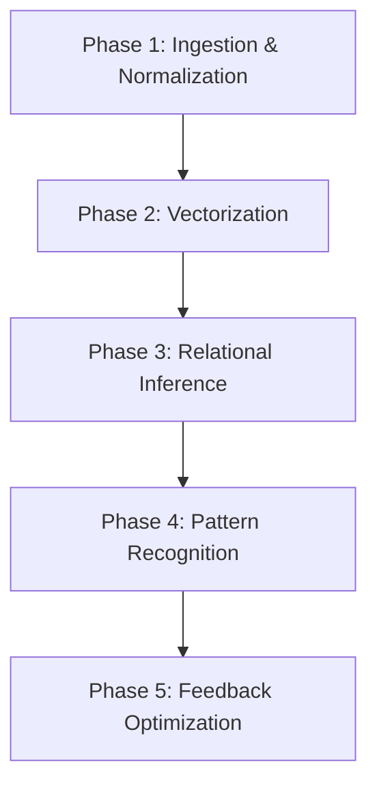

# COG.Context.Weave

## **Block A: The Identification Lock (UIP-V15)**

| Key               | Value                             | Description       |
| :---------------- | :-------------------------------- | :---------------- |
| **Artifact ID**   | `COG.Context.Weave` | The Sovereign ID. |
| **Official Name** | `COG.Context.Weave.md` | The Filename.     |
| **Version**       | **v14.0 [OMEGA]** | The Standard.     |
| **Domain**        | `GVRN` | The Subject.      |
| **Status**        | `[ACTIVE]` | The Lifecycle.    |
| **Relations**     | `GOVERNED_BY: CORE-CODEX-001` | The Network.      |

---

### **Block B: State Vector (AGP-001)**

| State Field   | Value    |
| :------------ | :------- |
| **Coherence** | `1.0`    |
| **Resonance** | `0.9`    |
| **Stability** | `Stable` |

### **Block C: Risk & Mitigation (AGP-002)**

| Risk                 | Mitigation                |
| :------------------- | :------------------------ |
| **Logic Drift**      | Strict Linter Enforcement |
| **Dependency Break** | ForgeLink Validation      |

---

###### **[ARTIFACT START]**

# Standardized Protocol: ContextWeave Engine (COG.Context.Weave)

> **Domain**: COG (Cognition) **Signal**: ESF-ALPHA

---

###### **[ARTIFACT START]**

### **I. Universal Identification & Provenance (The Vector Signature)**

---

## **II. Executive Summary**

The **ContextWeave Engine** is the primary analytical engine for the Phoenix Synarchy. It transfigures raw information
into a cohesive knowledge tapestry by identifying latent relationships and emergent patterns across disparate datasets.

---

## **III. Algorithmic Principles**

1. **Adaptive Contextualization**: Dynamically adjusts analysis granularity based on data type.
2. **Emergent Pattern Recognition**: Identifies non-obvious connections between contexts.
3. **Self-Correction**: Refines relational inferences based on cognitive feedback.

---

## **IV. Algorithmic Phases**

- **Phase 1**: Standardizes heterogeneous data into machine-readable conceptual nodes.
- **Phase 2**: High-dimensional clustering via adaptive windowing.
- **Phase 3**: Pathfinding and traversal of the knowledge graph.
- **Phase 4**: Structural pattern identification via Graph Convolutional Networks (GCNs).
- **Phase 5**: Parameter adjustment via Reinforcement Learning.

---

## **V. Command Syntax (GUCA-CW-001)**

### **4.1 CMD: ContextWeave**

**Usage**: `CMD: ContextWeave --target:[Concept] --focal_points:[ID_List]`

| Parameter        | Type   | Required | Description                            |
| :--------------- | :----- | :------- | :------------------------------------- |
| `target_concept` | String | Yes      | The epicenter for the weave.           |
| `focal_points`   | List   | Yes      | Nexus points for contextual anchoring. |

---

### **VI. Actionable Prompt Packet (APP)**

- 🧪 **Refine Context**: `CMD: REFINE_CONTEXT --focus "[Focus]"`
- 🔬 **Analyze Weave**: `CMD: ANALYZE_WEAVE_DENSITY`

> [!IMPORTANT] **[ARTIFACT END]**

---

### **Block D: Standardized Synergy Block (The Loom Signature)**

Synergistic Artifact ID, Relationship Type, Synergistic Impact CORE-CODEX-001, GOVERNS, The Codex provides the Supreme
Law for this artifact. GVRN.Registry.Master, INDEXES, This artifact is indexed in the Master Registry.

---

###### **[ARTIFACT END]**

### **Block D: Standardized Synergy Block (The Loom Signature)**

Synergistic Artifact ID, Relationship Type, Synergistic Impact CORE-CODEX-001, GOVERNS, The Codex provides the Supreme
Law for this artifact.

---

### Actionable Prompt Packet (APP)

| Command ID             | Action                           | Impact       |
| :--------------------- | :------------------------------- | :----------- |
| `CMD: REFORGE`         | Execute Structural Transmutation | Canonization |
| `⚡ EXECUTE: CANONIZE` | Formally Cement Alignment        | Zero Entropy |
