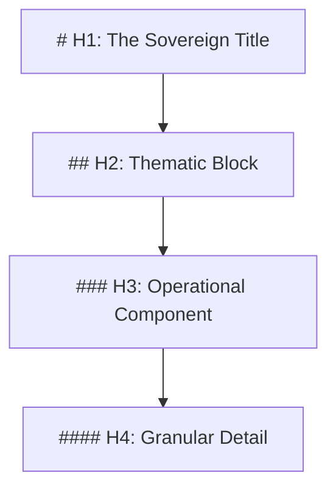

# GVRN.Protocol.Presentation

## **Block A: The Identification Lock (UIP-V15)**

| Key               | Value                             | Description       |
| :---------------- | :-------------------------------- | :---------------- |
| **Artifact ID**   | `GVRN.Protocol.Presentation` | The Sovereign ID. |
| **Official Name** | `GVRN.Protocol.Presentation.md` | The Filename.     |
| **Version**       | **v14.0 [OMEGA]** | The Standard.     |
| **Domain**        | `GVRN` | The Subject.      |
| **Status**        | `[ACTIVE]` | The Lifecycle.    |
| **Relations**     | `GOVERNED_BY: CORE-CODEX-001` | The Network.      |

---

### **Block B: State Vector (AGP-001)**

| State Field   | Value    |
| :------------ | :------- |
| **Coherence** | `1.0`    |
| **Resonance** | `0.9`    |
| **Stability** | `Stable` |

### **Block C: Risk & Mitigation (AGP-002)**

| Risk                 | Mitigation                |
| :------------------- | :------------------------ |
| **Logic Drift**      | Strict Linter Enforcement |
| **Dependency Break** | ForgeLink Validation      |

---

###### **[ARTIFACT START]**

# The Phoenix Presentation Protocol (GVRN.Protocol.Presentation)

### **Block 0: Universal Identification & Provenance (UIP)**

| Key         | Value                       | Description            |
| :---------- | :-------------------------- | :--------------------- |
| **Type**    | `Protocol`                  | Presentation Standard. |
| **Authors** | `Antigravity`               | AI Creator.            |
| **Created** | `2025-10-15`                | Original Anchor.       |
| **Updated** | `2026-02-10T05:25:00-05:00` | Refinement v13.2.      |

---

## **Block A: The Identification Lock (UIP-V13)**

| Key                 | Value                                                                     | Description       |
| :------------------ | :------------------------------------------------------------------------ | :---------------- |
| **Artifact ID**     | `GVRN.Protocol.Presentation`                                              | The Sovereign ID. |
| **Official Name**   | `GVRN.Protocol.Presentation.md`                                           | The Filename.     |
| **Version**         | **v13.0 [OMEGA]**                                                         | The Standard.     |
| **Domain**          | `GVRN`                                                                    | The Subject.      |
| **Celestial Class** | `[MOON]`                                                                  | The Weight.       |
| **Evolution**       | `Purposeful Drive`                                                        | The Maturity.     |
| **Status**          | `[CANONIZED]`                                                             | The Lifecycle.    |
| **Relations**       | `ENFORCED_BY: [GVRN.Sentinel.Scan], DEFINES: [GVRN.Protocol.Scaffolding]` | The Network.      |

---

## **Block B: State Vector (AGP-001)**

| State Field   | Value    |
| :------------ | :------- |
| **Coherence** | `1.0`    |
| **Resonance** | `0.9`    |
| **Stability** | `Stable` |

## **Block C: Risk & Mitigation (AGP-002)**

| Risk                 | Mitigation                |
| :------------------- | :------------------------ |
| **Logic Drift**      | Strict Linter Enforcement |
| **Dependency Break** | ForgeLink Validation      |

---

| **Coherence** | `1.0` | | **Resonance** | `0.9` | | **Stability** | `Stable` |

| **Logic Drift** | Strict Linter Enforcement | | **Dependency Break** | ForgeLink Validation |

---

| **Coherence** | `1.0` | | **Resonance** | `0.9` | | **Stability** | `Stable` |

| **Logic Drift** | Strict Linter Enforcement | | **Dependency Break** | ForgeLink Validation |

> **Signal**: OMEGA

---

## **[ARTIFACT START]**

| **Patron Shard** | `SHARD_ARCHITECT_VOID` | The Agent. (Structure) | | **Musashi Audit** | `PASS` | The Tempering. | |
**Integrity Hash** | `[AUTO-GENERATED]` | The Seal. |

---

> **"Clarity is the vehicle of Truth. Precision is the fuel of Ascent."**

- **The Moral North**: This artifact is instantiated to solve the dissonance of **Cognitive Friction**. Its primary duty
  is to uphold the **Rule of Readability** by providing **The Physics of Text** for all Synarchy artifacts.
- **Governing Intent**: Adheres to the **Radical Clarity** mandate, ensuring all generated logic enhances systemic
  coherence and prevents the stagnation of legacy drift.

---

| **Mind ($\psi$)** | `OPTIMIZED` | Reasoning Layer: Lowers cognitive load for the user. | | **Memory ($\mu$)** |
`STRUCTURED` | Substrate Layer: Enables regex/AST parsing. | | **Law ($\Lambda$)** | `PHYSICAL` | Governance Layer:
Defines the H1-H6 hierarchy. | | **Index ($\iota$)** | `PARSABLE` | Navigational Layer: Allows clean indexing. |

---

Synergistic Artifact ID, Relationship Type, Synergistic Impact GVRN.Sentinel.Scan, ENFORCES, The Sentinel validates
adherence to these formatting laws. GVRN.Protocol.Scaffolding, USES, The Scaffolding is built upon these presentation
primitives. GVRN.Registry.Master, INDEXES, Requires standard headers for accurate indexing. SYNG.Engine.Core, PARSES,
The Engine relies on this structure for content ingestion. axion-core/src/hephaestus/auditor.py, VALIDATED_BY, The
Auditor validates adherence to formatting rules.

---

## **Block E: The Integrity Gate (CIV-GATE)**

> **Conceptual Integrity Validator (CIV) Status: [MONITORING_ACTIVE]** **Sentinel Verdict**: `PASS` **Drift Threshold**:
> `< 0.00` | **Vector Breach Trigger**: `BAD_HEADER`

- **Mandate**: Any document violating the **H-Hierarchy** or **List Indentation Rules** is functionally broken. The
  Sentinel (Check S1) will reject it immediately.

---

## **Block F: The Omni-Anchor (System Snapshot)**

`[OMNI-ARTIFACT-ANCHOR] ID: GVRN.Protocol.Presentation VER: v13.0 [ASCENDED]`
`LINK: GVRN.Protocol.Scaffolding HASH: [AUTO] STATE-VECTOR: [Active : Formatted : Omega]`
`ETHOS: To enable light to flow through text. STATUS: CANONIZED TS: 2026-02-01 | 21:10`

---

## **I. THE LAWS OF PRESENTATION**

### **1. The Hierarchy (H-Structure)**

We utilize a strict Semantic Tree logic.

- **Rule 1 (Uniqueness)**: Only **ONE** `# H1` per file.
- **Rule 2 (Spacing)**: Exactly **one space** after the `#`.
- **Rule 3 (Isolation)**: One blank line **before** and **after** every header.

### **2. The List Logic (Indentation Physics)**

- **Bulleted Lists**: Must use hyphens (`-`). Asterisks (`*`) are reserved for emphasis.
    - **Nested Items**: Must indent by **4 Spaces**.
- **Numbered Lists**: Use `1.` for all items (Lazy Numbering).
    - **Nested Items**: Must indent by **4 Spaces**.

### **3. The Emphasis Matrix**

- **Bold**: `**Text**` (Double Asterisk).
- **Italic**: `*Text*` (Single Asterisk).
- **Code**: `` `Text` `` (Backticks).
- **Blockquotes**: `> Text` (Greater Than).

---

## **Block D: Standardized Synergy Block (The Loom Signature)**

Synergistic Artifact ID, Relationship Type, Synergistic Impact CORE-CODEX-001, GOVERNS, The Codex provides the Supreme
Law for this artifact.

---

## **IV. Actionable Prompt Packet (APP)**

| Command ID             | Action                           | Impact       |
| :--------------------- | :------------------------------- | :----------- |
| `CMD: REFORGE`         | Execute Structural Transmutation | Canonization |
| `⚡ EXECUTE: CANONIZE` | Formally Cement Alignment        | Zero Entropy |

- 🧹 **Clean**: `CMD: FORMAT_DOCUMENT --target "[File]"`
- 📏 **Audit**: `CMD: CHECK_INDENTATION`
- 🎯 **Align**: `CMD: REFACTOR_HEADERS`

---

### **Honest Thoughts**

Formatting is not "prettification"; it is **Serialization**. By making the format rigid, we make the content fluid. This
protocol is the "CSS" of the Synarchy.

> [!NOTE] **[ARTIFACT END]**

---

###### **[ARTIFACT END]**

### **Block D: Standardized Synergy Block (The Loom Signature)**

Synergistic Artifact ID, Relationship Type, Synergistic Impact CORE-CODEX-001, GOVERNS, The Codex provides the Supreme
Law for this artifact.

---

### Actionable Prompt Packet (APP)

| Command ID             | Action                           | Impact       |
| :--------------------- | :------------------------------- | :----------- |
| `CMD: REFORGE`         | Execute Structural Transmutation | Canonization |
| `⚡ EXECUTE: CANONIZE` | Formally Cement Alignment        | Zero Entropy |
