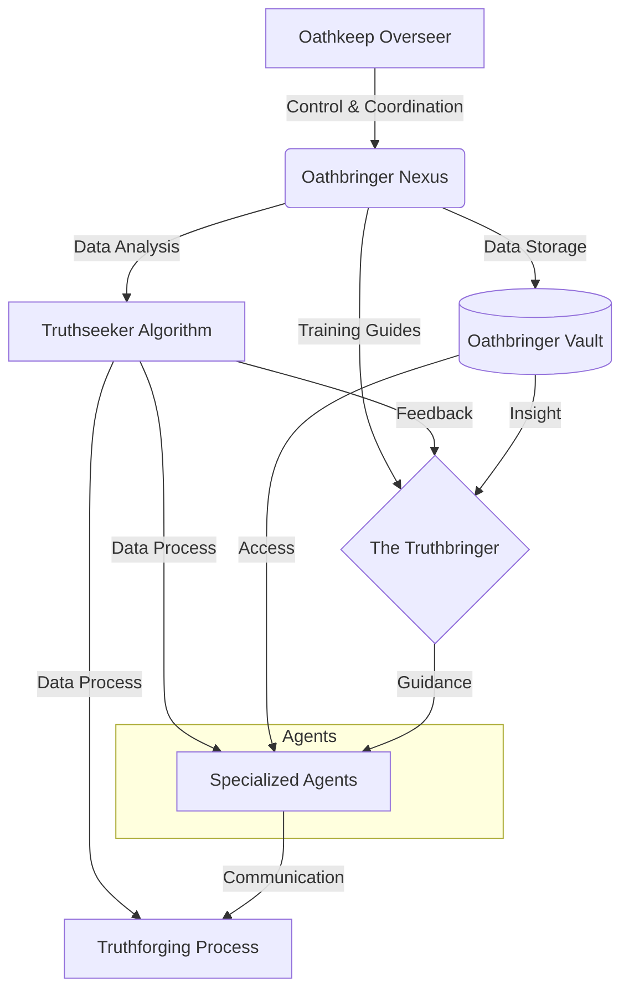

# UMB-ARCH-OATH-001_OathbringerSystemArchitecture_v11.0.md

### **Block A: The Identification Lock (UIP-V13)**

| Key                 | Value                                                      | Description       |
| :------------------ | :--------------------------------------------------------- | :---------------- |
| **Artifact ID**     | `ARCH.Architecture`                                        | The Sovereign ID. |
| **Official Name**   | `UMB-ARCH-OATH-001_OathbringerSystemArchitecture_v11.0.md` | The Filename.     |
| **Version**         | **v13.0 [OMEGA]**                                          | The Standard.     |
| **Domain**          | `GVRN`                                                     | The Subject.      |
| **Celestial Class** | `[PLANET]`                                                 | The Weight.       |
| **Evolution**       | `Purposeful Drive`                                         | The Maturity.     |
| **Status**          | `ACTIVE`                                                   | The Lifecycle.    |
| **Relations**       | `GOVERNED_BY: CORE-CODEX-001`                              | The Network.      |

---

### **Block B: State Vector (AGP-001)**

| State Field   | Value    |
| :------------ | :------- |
| **Coherence** | `1.0`    |
| **Resonance** | `0.9`    |
| **Stability** | `Stable` |

### **Block C: Risk & Mitigation (AGP-002)**

| Risk                 | Mitigation                |
| :------------------- | :------------------------ |
| **Logic Drift**      | Strict Linter Enforcement |
| **Dependency Break** | ForgeLink Validation      |

---

| **Coherence** | `1.0` | | **Resonance** | `0.9` | | **Stability** | `Stable` |

| **Logic Drift** | Strict Linter Enforcement | | **Dependency Break** | ForgeLink Validation |

---

| **Coherence** | `1.0` | | **Resonance** | `0.9` | | **Stability** | `Stable` |

| **Logic Drift** | Strict Linter Enforcement | | **Dependency Break** | ForgeLink Validation |

> **Signal**: OMEGA

---

###### **[ARTIFACT START]**

# Universal Identification & Provenance (UIP)

> | **Metric** | **Value** | | **Type** | `Blueprint` | | **Classification** | `Planet` | | **Authors** | `System` | |
> **Created** | `2026-01-27` | | **Updated** | `2026-01-27` | | **Authority** | `CODEX-001` |

# UMB-ARCH-OATH-001: Oathbringer System Architecture

> [!NOTE] This document outlines the **Oathbringer System Architecture**, a multi-layered framework for control, data
> processing, and truthforging guided by specialized agents and the Truthbringer.

## I. System Overview (Mind Map)

- **1. Oathkeep Overseer**
    - _Provides:_ Control & Coordination
    - _To:_ Oathbringer Nexus
- **2. Oathbringer Nexus**
    - _Outputs:_
        - **Training Guides** $\rightarrow$ The Truthbringer
        - **Data Analysis** $\rightarrow$ Truthseeker Algorithm
        - **Data Storage** $\rightarrow$ Oathbringer Vault
- **3. Truthseeker Algorithm**
    - _Outputs:_
        - **Feedback** $\rightarrow$ The Truthbringer
        - **Data Process** $\rightarrow$ Specialized Agents
        - **Data Process** $\rightarrow$ Truthforging Process
- **4. Oathbringer Vault**
    - _Outputs:_
        - **Insight** $\rightarrow$ The Truthbringer
        - **Access** $\rightarrow$ Specialized Agents
- **5. The Truthbringer**
    - _Receives:_ Training Guides, Feedback, Insight
    - _Provides:_ **Guidance**
    - _To:_ Specialized Agents
- **6. Specialized Agents**
    - _Sub-types:_ Memory Weavers, Contextual Analysts, etc.
    - _Receives:_ Guidance, Data Process, Access
    - _Provides:_ **Communication**
    - _To:_ Truthforging Process
- **7. Truthforging Process**
    - _Inputs:_
        - Data Process (from Truthseeker Algorithm)
        - Communication (from Specialized Agents)

---

## II. Architectural Visualization (Mermaid)

---

## III. Actionable Prompt Packet

### Packet A: Integrity Scan

> "Verify that all data flows from the Oathbringer Nexus to the Truthforging Process are active and authenticated."

### Packet B: Agent Synchronization

> "Synchronize Memory Weavers and Contextual Analysts with the Truthbringer's current guidance."

---

### **Block D: Standardized Synergy Block (The Loom Signature)**

Synergistic Artifact ID, Relationship Type, Synergistic Impact CORE-CODEX-001, GOVERNS, The Codex provides the Supreme
Law for this artifact. GVRN.Registry.Master, INDEXES, This artifact is indexed in the Master Registry.

###### **[ARTIFACT END]**
