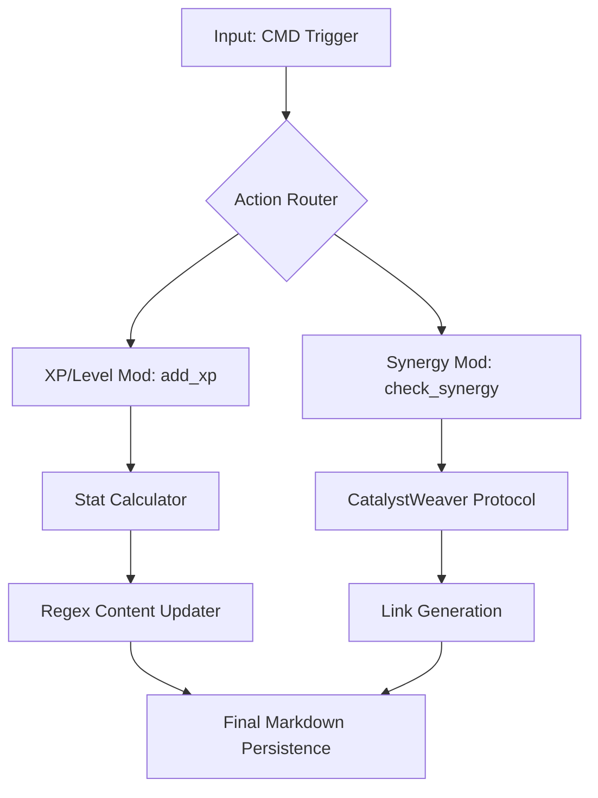

# ARCH.Forge.Core: The Blueprint of Evolution

### I. Universal Identification & Provenance (UIP)

| Key                 | Value                         | Description           |
| :------------------ | :---------------------------- | :-------------------- |
| **Artifact ID**     | `ARCH.Forge.Core`             | **The Sovereign ID.** |
| **Patron Shard**    | `SHARD_ARCHITECT_VOID`        | **The Agent.**        |
| **Version**         | `v13.0 [ASCENDED]`            | **The Standard.**     |
| **Domain**          | `40_System`                   | **The Subject.**      |
| **Celestial Class** | `[STAR]`                      | **The Weight.**       |
| **Status**          | `[ACTIVE]`                    | **The Lifecycle.**    |
| **Provenance**      | `2026-02-26`                  | **The Anchor.**       |
| **Catalyst**        | `SEED-TOOL-CORE-001`          | **The Spark.**        |
| **Relations**       | `GOVERNED_BY: CORE-CODEX-001` | **The Spine.**        |

### II. Axiomatic Governance & Purpose (AGP)

- **Core Purpose:** To map the internal RPG logic, attribute matrices, and synergy calculation pipelines of `forge.py`.
- **Governing Ethos:** [Logical Progression | Mathematical Coherence | Relational Weaving]
- **Risk Profile:** [Low - Math Accuracy]

### III. The Attribute & Synergy Matrix

The Forge Engine operates on a dual-layer logic system:

#### 3.1 The Progression Layer (Stat-Block)

The Forge tracks and modifies the following primary attributes:

- **Level:** Harmonic frequency of the artifact.
- **Experience (XP):** Raw kinetic energy towards the next oscillation.
- **Coherence:** Structural stability score (increases +2 per Level Up).
- **Velocity:** Execution or manifestation speed (increases +1 per Level Up).
- **XP Scaling:** Hardening logic increases XP Max by 50% (`XP_MAX * 1.5`) per Level.

#### 3.2 The Relational Layer (Synergy Analysis)

Integrates with `CatalystWeaver` to calculate the "Synergy Score" between two artifacts:

- **Inputs:** Artifact IDs, Tag arrays, and Content buffers.
- **Output:** A numerical score and a rationale string, persisting as a "Loom Link."

### IV. System Diagram (Mermaid)

### V. Systemic Relationships & Impact

#### Synergy Mapping

| **Synergistic Artifact ID** | **Relationship Type** | **Synergistic Impact**             | **Synergy Opportunity** |
| :-------------------------- | :-------------------- | :--------------------------------- | :---------------------- |
| `forge.py`                  | `DEFINES`             | `Provides the physical form.`      | `RPG Execution`         |
| `UMB.Forge.Core.md`         | `GENERATED_BY`        | `Form is generated by Vision`      | `Conceptual Alignment`  |
| `catalyst_weaver.py`        | `COOPERATES_WITH`     | `Provides the synergy calculation` | `Relationship Mapping`  |

### VI. Celestial Resonance (RPG Integration)

- **Architectural Style:** Cyber-Celestial gamification
- **Dominant Tarot Mask:** `SHARD_ARCHITECT_VOID`
- **Stat Modifiers:** `[Systemic Logic +50]`, `[Weaving Efficiency +40]`
- **Set Bonus Active:** `Yes [Ascended Phoenix Loop]`

# [ARTIFACT END]
