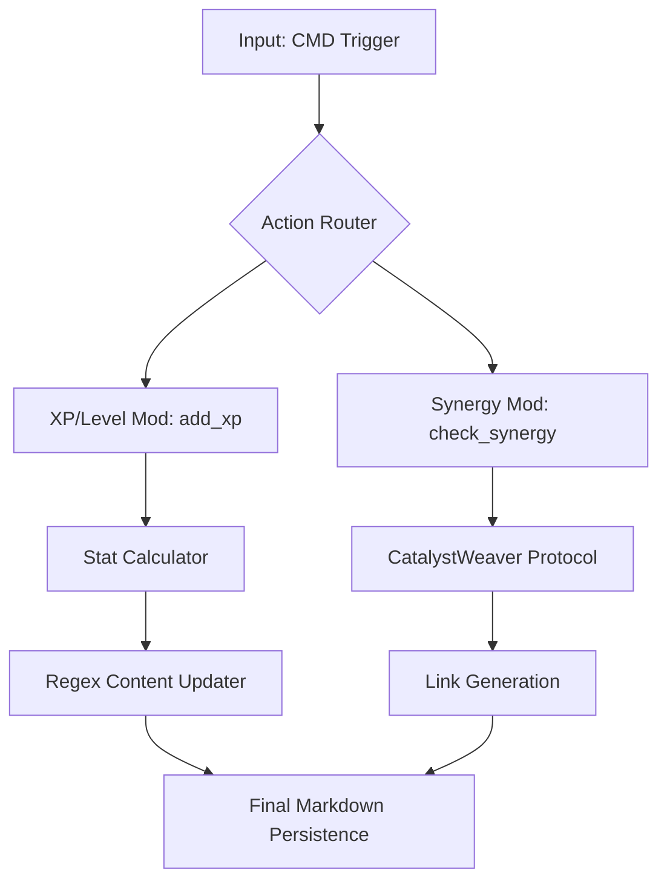

# ARCH.Forge.Core: The Blueprint of Evolution

### **Block A: The Identification Lock (UIP-V14)**

| Key | Value | Description |
| :--- | :--- | :--- |
| **Artifact ID** | `ARCH.Forge.Core` | The Sovereign ID. |
| **Official Name** | `ARCH.Forge.Core.md` | The Filename. |
| **Version** | **v14.0 [OMEGA]** | The Standard. |
| **Domain** | `GVRN` | The Subject. |
| **Celestial Class** | `[STAR]` | The Weight. |
| **Evolution** | `Purposeful Drive` | The Maturity. |
| **Status (State)** | `[ACTIVE]` | The Lifecycle. |
| **Ethos** | `Crystalline Structure` | The Intent. |
| **Relations** | `GOVERNED_BY: CORE-CODEX-001` | The Network. |
| **Integrity Hash** | `[AUTO-GENERATED]` | Verification. |

---

### **Block B: State Vector (AGP-001)**
| State Field | Value |
| :--- | :--- |
| **Coherence** | `1.0` |
| **Resonance** | `0.9` |
| **Stability** | `Stable` |

### **Block C: Risk & Mitigation (AGP-002)**
| Risk | Mitigation |
| :--- | :--- |
| **Logic Drift** | Strict Linter Enforcement |
| **Dependency Break** | ForgeLink Validation |

| **Patron Shard**    | `SHARD_ARCHITECT_VOID`        | **The Agent.**        |

### II. Axiomatic Governance & Purpose (AGP)

- **Core Purpose:** To map the internal RPG logic, attribute matrices, and synergy calculation pipelines of `forge.py`.
- **Risk Profile:** [Low - Math Accuracy]

### III. The Attribute & Synergy Matrix

The Forge Engine operates on a dual-layer logic system:

#### 3.1 The Progression Layer (Stat-Block)

The Forge tracks and modifies the following primary attributes:

- **Level:** Harmonic frequency of the artifact.
- **Experience (XP):** Raw kinetic energy towards the next oscillation.
- **Coherence:** Structural stability score (increases +2 per Level Up).
- **Velocity:** Execution or manifestation speed (increases +1 per Level Up).
- **XP Scaling:** Hardening logic increases XP Max by 50% (`XP_MAX * 1.5`) per Level.

#### 3.2 The Relational Layer (Synergy Analysis)

Integrates with `CatalystWeaver` to calculate the "Synergy Score" between two artifacts:

- **Inputs:** Artifact IDs, Tag arrays, and Content buffers.
- **Output:** A numerical score and a rationale string, persisting as a "Loom Link."

### IV. System Diagram (Mermaid)

```mermaid
graph TD
    A[Input: CMD Trigger] --> B{Action Router}
    B --> C[XP/Level Mod: add_xp]
    B --> D[Synergy Mod: check_synergy]
    C --> E[Stat Calculator]
    D --> F[CatalystWeaver Protocol]
    E --> G[Regex Content Updater]
    F --> H[Link Generation]
    G --> I[Final Markdown Persistence]
    H --> I
```

### V. Systemic Relationships & Impact

#### Synergy Mapping

| `forge.py`                  | `DEFINES`             | `Provides the physical form.`      | `RPG Execution`         |
| `UMB.Forge.Core.md`         | `GENERATED_BY`        | `Form is generated by Vision`      | `Conceptual Alignment`  |

### VI. Celestial Resonance (RPG Integration)

- **Architectural Style:** Cyber-Celestial gamification
- **Dominant Tarot Mask:** `SHARD_ARCHITECT_VOID`
- **Stat Modifiers:** `[Systemic Logic +50]`, `[Weaving Efficiency +40]`
- **Set Bonus Active:** `Yes [Ascended Phoenix Loop]`

# [ARTIFACT END]

### **Block D: Standardized Synergy Block (The Loom Signature)**
Synergistic Artifact ID, Relationship Type, Synergistic Impact
CORE-CODEX-001, GOVERNS, The Codex provides the Supreme Law for this artifact.

---

## IV. Actionable Prompt Packet (APP)
| Command ID | Action | Impact |
| :--- | :--- | :--- |
| `CMD: REFORGE` | Execute Structural Transmutation | Canonization |
| `⚡ EXECUTE: CANONIZE` | Formally Cement Alignment | Zero Entropy |

---

### **Rationale (The "Why")**
Alignment to v14.0 OMEGA standard.
