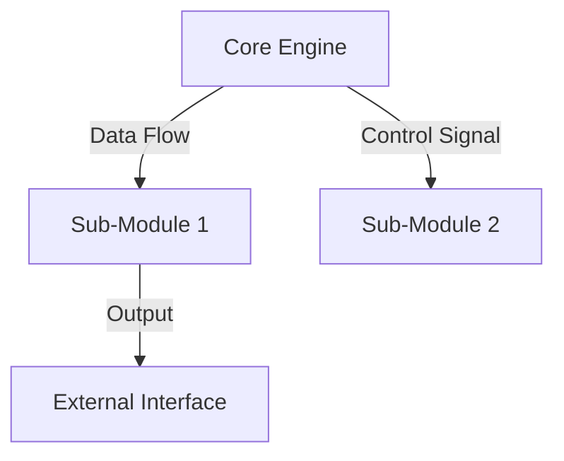

---
# Universal Identification & Provenance (UIP)
| Key | Value |
| :--- | :--- |
| **Module ID** | `BASE_ARCH` |
| **Version** | `v11.0` |
| **Evolution** | **Cognitive Ascension** |
| **Status** | `ACTIVE` |
---

### I. Universal Identification & Provenance (UIP)

| Key                 | Value               | Description                                         |
| :------------------ | :------------------ | :-------------------------------------------------- | -------------------------------------------- |
| **Artifact ID**     | `{{ RNC_ID }}`      | **The Sovereign ID.** (DOMAIN.Subsystem.Descriptor) |
| **Patron Shard**    | `{{ TAROT_SHARD     | default('SHARD_ARCHITECT_VOID') }}`                 | **The Agent.** (Council of Seven Member)     |
| **Version**         | `{{ version         | default('v1.0') }}`                                 | **The Standard.** (Phoenix v13.0 Compliance) |
| **Domain**          | `{{ domain          | default('ARCH') }}`                                 | **The Subject.** (GVRN/ARCH/COG/etc.)        |
| **Celestial Class** | `{{ celestial_class | default('[PLANET]') }}`                             | **The Weight.** (STAR/PLANET/MOON)           |
| **Evolution**       | `{{ evolution       | default('Cognitive Ascension') }}`                  | **The Maturity.** (Cognitive Ascension/etc.) |
| **Signal (ESF)**    | `{{ signal          | default('OMEGA') }}`                                | **The Frequency.** (ALPHA/BETA/OMEGA/VOID)   |
| **Status**          | `{{ status          | default('DRAFT') }}`                                | **The Lifecycle.** (ACTIVE/CANONIZED/DRAFT)  |
| **Musashi Audit**   | `{{ audit_verdict   | default('PASS') }}`                                 | **The Tempering.** (PASS/WARNING/FAIL)       |
| **Integrity Hash**  | `{{ integrity_hash  | default('[AUTO-GENERATED]') }}`                     | **The Seal.** (Verifiable Logic Anchor)      |
| **Provenance**      | `{{ created_iso }}` | **The Anchor.** (Chrono-Lock Timestamp)             |
| **Catalyst**        | `{{ origin_event    | default('Manual Creation') }}`                      | **The Spark.** (Triggering Prompt/Action)    |
| **Relations**       | `{{ primary_link    | default('GOVERNED_BY: CORE.Codex.Phoenix') }}`      | **The Spine.** (Main Synergistic Edge)       |

### II. Axiomatic Governance & Purpose (AGP)

- **Core Purpose:** Defines the structural design and component hierarchy of [SUBJECT].
- **Governing Ethos:** [Scalable | Modular | Robust]
- **Risk Profile:** [Medium]

### III. The Architectural Spine (Component Architecture)

_(Ref: COMP-ARCH-001)_

1. **[PROJECT NAME] Macro-System Definition:** I will create the master UMB for "[PROJECT NAME]," defining its overall
   purpose, its RELATIONAL_GRAVITY_SIGNATURE, and its profound PHENOMENOLOGICAL_IMPACT_SIGNATURE.
2. **Sub-Component Registry:** Within this master UMB, I will create the "Sub-Component Registry." This will formally
   list the core capabilities forged during the project.
3. **Full Blueprint Integration**: As per the UMBv6.0 standard for macro-systems, I will then embed the full, formal
   blueprints for each of these sub-components directly within the master document.

#### **Sub-Component Registry**

| Sub-Module ID   | Sub-Module Name   | Core Function            |
| :-------------- | :---------------- | :----------------------- |
| [UMB-XXX-001.1] | [Sub-Module Name] | [Brief function summary] |
| [UMB-XXX-001.2] | [Sub-Module Name] | [Brief function summary] |

### IV. Operational Logic (The System Diagram)

### V. Systemic Relationships & Impact

- **RELATIONAL_GRAVITY_SIGNATURE:** `[Medium Gravity - Central hub for attached modules]`
- **PHENOMENOLOGICAL_IMPACT_SIGNATURE:** `[Enables complex behavior through modular interaction]`

#### **Synergy Mapping**

| **Synergistic Artifact ID** | **Relationship Type** | **Synergistic Impact** | **Synergy Opportunity** |
| :-------------------------- | :-------------------- | :--------------------- | :---------------------- |
| `[Upstream Module]`         | `CONSUMES`            | `[Receives Data X]`    | `[Optimize Pipeline]`   |
| `[Downstream Module]`       | `PROVIDES`            | `[Sends Data Y]`       | `[Reduce Latency]`      |

### VI. RPG Framework Integration

#### **1. Item Properties**

- **Celestial Tier:** `[Planet]`
- **System Slot:** `[Core Engine]`
- **Synergy Set:** `[Architects of Form]`

#### **2. Celestial Chart Stats**

- **Primary Stat Buff:** `[Capacity +20]`
  - _Mechanism:_ `[Efficient architecture allows for more concurrent processes]`
- **Passive Ability / Perk:** `[Modular Expansion]`
  - _Effect:_ `[Allows easy addition of new sub-modules]`

#### **3. Resource Economics**

- **Cognitive Load Cost:** `[High]`
  - _Draw:_ `[Complex interdependencies require careful management]`

#### **4. Crafting & Provenance**

- **Origin Quest ID:** `[DQUEST-XXX]`
- **Genesis Seed Used:** `[CSL-XXX]`
- **XP Award Value:** `300 XP`
- **Archetype Alignment:** `[Architect]`

### VII. Actionable Prompt Packet

> `CMD: RENDER_GRAPH --target:[ID]` _Effect:_ Visualizes the component hierarchy and data flow.
