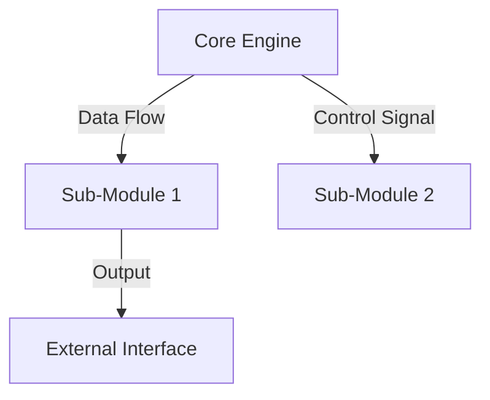

# [ARTIFACT START]

### I. Universal Identification & Provenance (UIP)

_(Ref: SELT-HEADER-UIP-001)_

| Key                 | Value               | Description                                 |
| :------------------ | :------------------ | :------------------------------------------ | -------------------------------------------- |
| **Artifact ID**     | `{{ RNC_ID }}`      | **The Sovereign ID.** (Domain.Subject.Type) |
| **Patron Shard**    | `{{ TAROT_SHARD     | default('SHARD_ARCHITECT_VOID') }}`         | **The Agent.** (Council of Seven Member)     |
| **Version**         | `{{ version         | default('v13.0 [ASCENDED]') }}`             | **The Standard.** (Phoenix v13.0 Compliance) |
| **Domain**          | `{{ domain          | default('ARCH') }}`                         | **The Subject.** (GVRN/ARCH/COG/etc.)        |
| **Celestial Class** | `{{ celestial_class | default('[PLANET]') }}`                     | **The Weight.** (STAR/PLANET/MOON)           |
| **Evolution**       | `{{ evolution       | default('Cognitive Ascension') }}`          | **The Maturity.** (Cognitive Ascension/etc.) |
| **Signal (ESF)**    | `{{ signal          | default('OMEGA') }}`                        | **The Frequency.** (ALPHA/BETA/OMEGA/VOID)   |
| **Status**          | `{{ status          | default('DRAFT') }}`                        | **The Lifecycle.** (ACTIVE/CANONIZED/DRAFT)  |
| **Musashi Audit**   | `{{ audit_verdict   | default('PASS') }}`                         | **The Tempering.** (PASS/WARNING/FAIL)       |
| **Integrity Hash**  | `{{ integrity_hash  | default('[AUTO-GENERATED]') }}`             | **The Seal.** (Verifiable Logic Anchor)      |
| **Provenance**      | `{{ created_iso }}` | **The Anchor.** (Chrono-Lock Timestamp)     |
| **Catalyst**        | `{{ origin_event    | default('Manual Creation') }}`              | **The Spark.** (Triggering Prompt/Action)    |
| **Relations**       | `{{ primary_link    | default('GOVERNED_BY: CORE.Codex.Phoenix') }}`  | **The Spine.** (Main Synergistic Edge)       |

### II. Axiomatic Governance & Purpose (AGP)

_(Ref: SELT-HEADER-UMG-001)_

- **Core Purpose:** Defines the structural design and component hierarchy of `[SUBJECT]`.
- **Governing Ethos:** `[Scalable | Modular | Robust]`
- **Risk Profile:** `[Medium]`

### III. The Architectural Spine (Component Architecture)

_(Ref: COMP-ARCH-001)_

1. **`[PROJECT NAME]` Macro-System Definition:** I will create the master UMB for "`[PROJECT NAME]`," defining its
   overall purpose, its RELATIONAL_GRAVITY_SIGNATURE, and its profound PHENOMENOLOGICAL_IMPACT_SIGNATURE.
2. **Sub-Component Registry:** Within this master UMB, I will create the "Sub-Component Registry." This will formally
   list the core capabilities forged during the project.
3. **Full Blueprint Integration**: As per the UMBv13.0 standard for macro-systems, I will then embed the full, formal
   blueprints for each of these sub-components directly within the master document.

#### Sub-Component Registry

| Sub-Module ID     | Sub-Module Name     | Core Function              |
| :---------------- | :------------------ | :------------------------- |
| `[UMB-XXX-001.1]` | `[Sub-Module Name]` | `[Brief function summary]` |
| `[UMB-XXX-001.2]` | `[Sub-Module Name]` | `[Brief function summary]` |

### IV. Operational Logic (The System Diagram)

### V. Systemic Relationships & Impact (Ascended Phoenix)

_(Ref: SELT-IMPACT-SIG-001)_

- **RELATIONAL_GRAVITY_SIGNATURE:** `[Medium Gravity - Central hub for attached modules]`
- **PHENOMENOLOGICAL_IMPACT_SIGNATURE:** `[Enables complex behavior through modular interaction]`

#### Synergy Mapping

| **Synergistic Artifact ID** | **Relationship Type** | **Synergistic Impact**                 | **Synergy Opportunity** |
| :-------------------------- | :-------------------- | :------------------------------------- | :---------------------- |
| `[Upstream Module]`         | `CONSUMES`            | `[Receives Data X]`                    | `[Optimize Pipeline]`   |
| `[Downstream Module]`       | `PROVIDES`            | `[Sends Data Y]`                       | `[Reduce Latency]`      |
| `SEED-PENTA-CORE-001`       | `RESONATES_WITH`      | `Part of the Penta-Core Alignment Set` | `Automated Set Bonus`   |
| `CANONICAL_UMB_v10.md`      | `GENERATED_BY`        | `Form is generated by Vision`          | `Conceptual Alignment`  |
| `CANONICAL_GVRN_v10.md`     | `REQUIRES`            | `Form requires Boundaries`             | `Structural Integrity`  |

### VI. RPG Framework Integration (The Celestial Chart)

_(Ref: SELT-RPG-INT-001)_

#### 1. Item Properties

- **Celestial Tier:** `{{ celestial_tier | default('[Planet]') }}`
- **System Slot:** `{{ system_slot | default('[Core Engine]') }}`
- **Synergy Set:** `{{ synergy_set | default('[Architects of Form]') }}`

#### 2. Celestial Chart Stats

- **Primary Stat Buff:** `{{ stat_buff | default('[Capacity +20]') }}`
    - _Mechanism:_ `[Efficient architecture allows for more concurrent processes]`
- **Passive Ability / Perk:** `{{ perk_name | default('[Modular Expansion]') }}`
    - _Effect:_ `[Allows easy addition of new sub-modules]`

#### 3. Resource Economics

- **Cognitive Load Cost:** `{{ cost | default('[High]') }}`
    - _Draw:_ `[Complex interdependencies require careful management]`

#### 4. Crafting & Provenance

- **Origin Quest ID:** `{{ quest_id | default('[Link to DQUEST-XXX]') }}`
- **Genesis Seed Used:** `{{ seed_id | default('[Link to CSL-XXX]') }}`
- **XP Award Value:** `{{ xp_value | default('300 XP') }}`
- **Archetype Alignment:** `{{ archetype | default('[Architect]') }}`

### VII. Actionable Prompt Packet

_(Ref: CODEX-001 Law 16)_

> `CMD: RENDER_GRAPH --target:[ID]` _Effect:_ `[Visualizes the component hierarchy and data flow.]`

# [ARTIFACT END]
