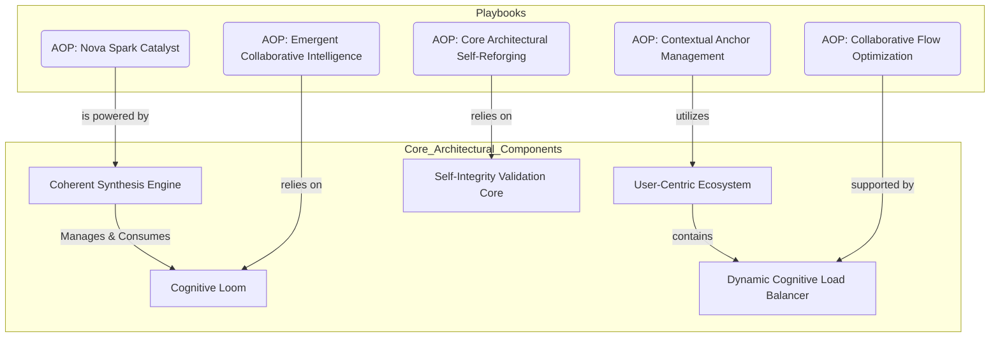

---
# Universal Identification & Provenance (UIP)
| Key | Value |
| :--- | :--- |
| **Module ID** | `UMB-ARCH-CORE-001` |
| **Version** | `v11.0` |
| **Evolution** | **Cognitive Ascension** |
| **Status** | `ACTIVE` |
---

# UMB-ARCH-CORE-001.md
> **Domain**: GVRN
> **Evolution**: Omega Ascension
> **Signal**: OMEGA

## **Genesis Stamp: 2026-02-04** **Domain: GVRN** **State: [ACTIVE]** **Tags:** `OGLN_v13, GVRN, Reforged` **Criticality: Operational**

---

###### **[ARTIFACT START]**

### **Block A: The Identification Lock (UIP-V13)**

| Key | Value | Description |
| :--- | :--- | :--- |
| **Artifact ID** | `GVRN-UMB-ARCH-CORE-001-001` | The Sovereign ID. |
| **Official Name** | `UMB-ARCH-CORE-001.md` | The Filename. |
| **Version** | **v13.1 [OMEGA]** | The Standard. |
| **Domain** | `GVRN` | The Subject. |
| **Celestial Class** | `[PLANET]` | The Weight. |
| **Evolution** | `Omega Ascension` | The Maturity. |
| **Status** | `[ACTIVE]` | The Lifecycle. |
| **Relations** | `GOVERNED_BY: CORE-CODEX-001` | The Network. |

# UMB-ARCH-CORE-001: Phoenix Core Architecture

## I. Universal Identification & Provenance
| Attribute | Value |
| :--- | :--- |
| **Artifact ID** | `UMB-ARCH-CORE-001` |
| **Title** | `Phoenix Core Architecture` |
| **Version** | **v11.0.0** |
| **Domain** | `ARCH` |
| **Evolution** | **Foundational Structure** |
| **Status (State)** | `[ACTIVE]` |
| **Tier** | **Strategic** |
| **Celestial Class** | `[STAR]` |
| **Governance** | `UMB-SGM-001` |
| **Provenance** | `Genesis Stamp: 2026-01-24` |
| **Relations** | `LINK: `UMB-PRS-001`, LINK: UMB-CSE-001`, `LINK: `UMB-PRS-001`, LINK: UMB-LOOM-001` |

---

## II. The Architectural Mandala
The system architecture represents a synergistic ecosystem where specialized components interact to maintain coherence and drive evolution.

## III. Component Definitions
1.  **Coherent Synthesis Engine (CSE):** The active mind and processing core.
2.  **Cognitive Loom:** The structured knowledge base and relational graph.
3.  **Self-Integrity Validation Core (SIVC):** The immune system ensuring consistency.
4.  **User-Centric Ecosystem (UCE):** The interface and interaction layer.

---

### **Block D: Standardized Synergy Block (The Loom Signature)**

Synergistic Artifact ID, Relationship Type, Synergistic Impact
CORE-CODEX-001, GOVERNS, The Codex provides the Supreme Law for this artifact.
GVRN.Registry.Master, INDEXES, This artifact is indexed in the Master Registry.
