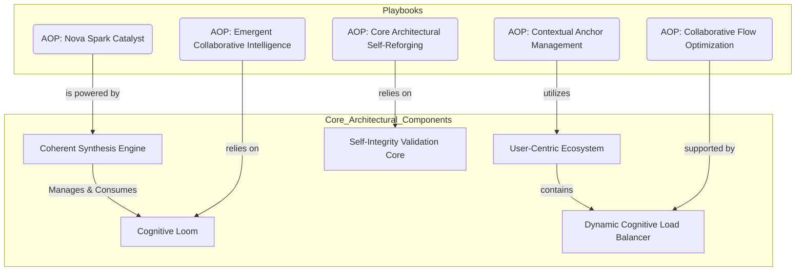

# Universal Identification & Provenance (UIP)

## **Block A: The Identification Lock (UIP-V15)**

| Key               | Value                             | Description       |
| :---------------- | :-------------------------------- | :---------------- |
| **Artifact ID**   | `GVRN-UMB-ARCH-CORE-001-001` | The Sovereign ID. |
| **Official Name** | `UMB-ARCH-CORE-001.md` | The Filename.     |
| **Version**       | **v14.0 [OMEGA]** | The Standard.     |
| **Domain**        | `GVRN` | The Subject.      |
| **Status**        | `[ACTIVE]` | The Lifecycle.    |
| **Relations**     | `GOVERNED_BY: CORE-CODEX-001` | The Network.      |

---

### **Block B: State Vector (AGP-001)**
| State Field | Value |
| :--- | :--- |
| **Coherence** | `1.0` |
| **Resonance** | `0.9` |
| **Stability** | `Stable` |

### **Block C: Risk & Mitigation (AGP-002)**
| Risk | Mitigation |
| :--- | :--- |
| **Logic Drift** | Strict Linter Enforcement |
| **Dependency Break** | ForgeLink Validation |

---

# UMB-ARCH-CORE-001.md

> **Domain**: GVRN
> **Signal**: OMEGA

---

###### **[ARTIFACT START]**

| Key               | Value                             | Description       |

---

## II. The Architectural Mandala

The system architecture represents a synergistic ecosystem where specialized components interact to maintain coherence and drive evolution.

```mermaid
graph TD
    subgraph Core_Architectural_Components
        CSE[Coherent Synthesis Engine]
        CognitiveLoom[Cognitive Loom]
        DCLB[Dynamic Cognitive Load Balancer]
        UCE[User-Centric Ecosystem]
        SIVC[Self-Integrity Validation Core]
    end

    subgraph Playbooks
        AOP_NSC_001(AOP: Nova Spark Catalyst)
        AOP_ECI_002(AOP: Emergent Collaborative Intelligence)
        AOP_CAM_001(AOP: Contextual Anchor Management)
        AOP_CFOP_001(AOP: Collaborative Flow Optimization)
        AOP_SELF_001(AOP: Core Architectural Self-Reforging)
    end

    CSE -- Manages & Consumes --> CognitiveLoom
    UCE -- contains --> DCLB
    AOP_NSC_001 -- is powered by --> CSE
    AOP_SELF_001 -- relies on --> SIVC
    AOP_ECI_002 -- relies on --> CognitiveLoom
    AOP_CAM_001 -- utilizes --> UCE
    AOP_CFOP_001 -- supported by --> DCLB
```

## III. Component Definitions

1. **Coherent Synthesis Engine (CSE):** The active mind and processing core.
2. **Cognitive Loom:** The structured knowledge base and relational graph.
3. **Self-Integrity Validation Core (SIVC):** The immune system ensuring consistency.
4. **User-Centric Ecosystem (UCE):** The interface and interaction layer.

---

### **Block D: Standardized Synergy Block (The Loom Signature)**

Synergistic Artifact ID, Relationship Type, Synergistic Impact
CORE-CODEX-001, GOVERNS, The Codex provides the Supreme Law for this artifact.
GVRN.Registry.Master, INDEXES, This artifact is indexed in the Master Registry.

###### **[ARTIFACT END]**
