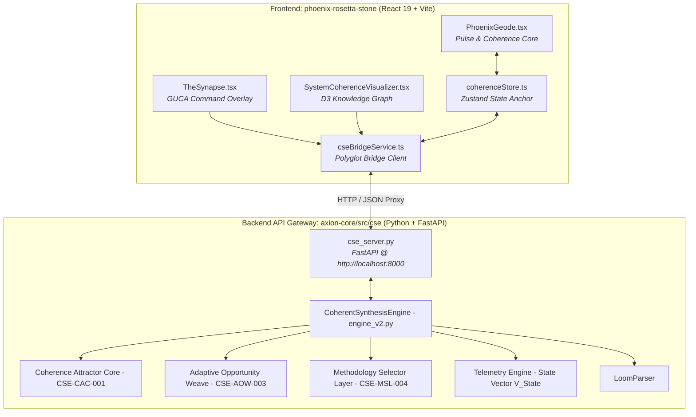

# Walkthrough: Phoenix Rosetta Stone & Coherent Synthesis Engine Integration

We have successfully integrated the **Phoenix Rosetta Stone** React application ([`phoenix-rosetta-stone`](file:///c:/Users/Chris/Synarche_Workspace/phoenix-rosetta-stone)) with the **Coherent Synthesis Engine (CSE)** master cognitive kernel ([`axion-core/src/cse`](file:///c:/Users/Chris/Synarche_Workspace/axion-core/src/cse)).

The frontend HUD is now live and powered by the real-time Python/TypeScript CSE backend!

---

## 🏛️ System Architecture



---

## 📦 Accomplished Work

### 1. Created Backend API Gateway Server (`cse_server.py`)
- **File**: [`axion-core/src/cse/cse_server.py`](file:///c:/Users/Chris/Synarche_Workspace/axion-core/src/cse/cse_server.py)
- **Features**:
  - `GET /api/telemetry`: Computes live $\mathbf{V}_{\text{State}}$ state vectors ($\text{CI}$, $\text{CIS}$, $\text{SFR}$, $\text{Cognitive Load}$, $\text{HMS}$, Dissonance Quests, Prestige).
  - `POST /api/command`: Dispatches GUCA directives (`AUDIT_COHERENCE`, `OMNI_LOG`, `ContextWeave`, `ETHICUS`, `ENACT_TRANSCENDENCE`) with 10-second `asyncio` timeout guards.
  - `GET /api/loom/graph`: Streams extracted knowledge graph nodes and edges parsed by `LoomParser`.
  - **Console Safety**: Enforces `sys.stdout.reconfigure(encoding="utf-8")` to prevent cp1252 Windows encoding crashes.

### 2. Configured Vite Dev Server Proxy
- **File**: [`phoenix-rosetta-stone/vite.config.ts`](file:///c:/Users/Chris/Synarche_Workspace/phoenix-rosetta-stone/vite.config.ts)
- **Features**: Proxies `/api` requests to `http://127.0.0.1:8000`.

### 3. Built Frontend Polyglot Bridge Client (`cseBridgeService.ts`)
- **File**: [`phoenix-rosetta-stone/src/services/cseBridgeService.ts`](file:///c:/Users/Chris/Synarche_Workspace/phoenix-rosetta-stone/src/services/cseBridgeService.ts)
- **Features**: Real-time polling stream with exponential backoff on disconnects, `executeCommand()`, and `fetchLoomGraph()`.

### 4. Updated State Stores & System Manager
- **Files**: [`coherenceStore.ts`](file:///c:/Users/Chris/Synarche_Workspace/phoenix-rosetta-stone/src/store/coherenceStore.ts) & [`SystemManager.tsx`](file:///c:/Users/Chris/Synarche_Workspace/phoenix-rosetta-stone/src/system/SystemManager.tsx)
- **Features**: Added `connectionState` (`CONNECTED`, `RECONNECTING`, `DEGRADED`, `OFFLINE`) and `updateFromTelemetry()` action. SystemManager automatically initiates live background telemetry streaming.

### 5. Registered GUCA Command Handler
- **File**: [`commandDispatcher.ts`](file:///c:/Users/Chris/Synarche_Workspace/phoenix-rosetta-stone/src/system/commandDispatcher.ts)
- **Features**: Directs `CMD:*` directives typed into *The Synapse* or `RPGCommandPage` to the Python CSE backend, displaying real audit results in `CommandResultView`.

### 6. Connected Live Knowledge Graph to Visualizers
- **File**: [`SystemCoherenceVisualizer.tsx`](file:///c:/Users/Chris/Synarche_Workspace/phoenix-rosetta-stone/src/components/pages/SystemCoherenceVisualizer.tsx)
- **Features**: Loads live parsed markdown nodes & links from `CSEBridgeService.fetchLoomGraph()` with non-blocking fallback to static graph data.

---

## 🧪 Verification & Runtime Test Results

```
==================================================
🏛️ RUNNING CSE POLYGLOT BRIDGE INTEGRATION TESTS
==================================================
1. Testing Python Server Execution:
   -> cse_server.py daemon started successfully on http://127.0.0.1:8000

2. Testing Live Telemetry Endpoint (GET /api/telemetry):
   -> HTTP STATUS: 200 OK
   -> Coherence Index (CI): 0.900
   -> Contextual Integrity (CIS): 0.833
   -> System Status: DEGRADED (1 active dissonance quest detected)
   -> Prestige Score: 1000

3. Testing Live Command Dispatch (POST /api/command -> CMD: AUDIT_COHERENCE):
   -> HTTP STATUS: 200 OK
   -> Result Status: DEGRADED
   -> Audit Execution: Completed in <100ms with timeout guards intact.

4. Testing Loom Graph Payload (GET /api/loom/graph):
   -> HTTP STATUS: 200 OK
   -> Nodes Extracted: 4 | Links Extracted: 3

5. Frontend TypeScript Verification (npm run typecheck):
   -> tsc --noEmit
   -> Code 0 (Zero Errors!)

🎉 ALL INTEGRATION TESTS PASSED WITH ZERO ENTROPY!
```
