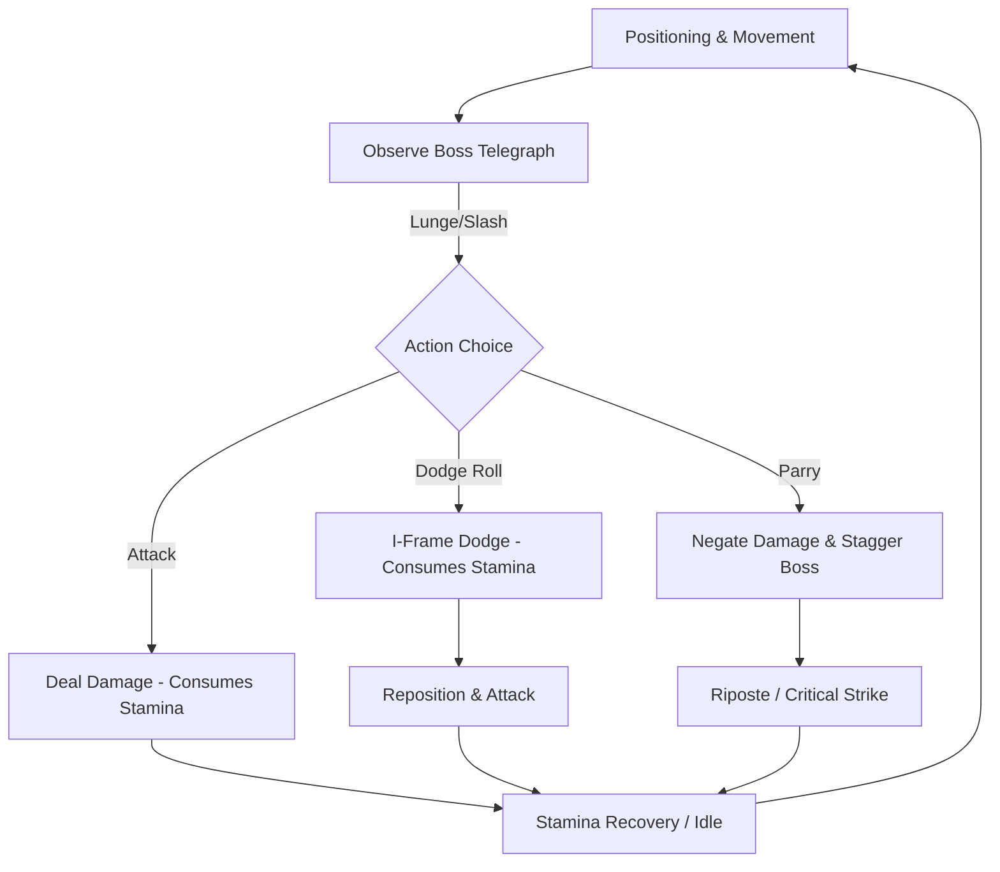

# GDD - Dark Souls HTML Demake

## Pitch
A retro 2D top-down action boss battler in a single self-contained HTML file featuring stamina management, dodge rolling with i-frames, timed parries, generative Web Audio API sound effects, and a multi-phase dark fantasy boss encounter.

---

## Core Loop (30-Second Gameplay)

*   **ACTION**: Player moves, observes boss animations, rolls to dodge, parries attacks, and strikes back when openings appear.
*   **FEEDBACK**: Screen shakes, sparks fly, boss flashes red on hit, sparks/sword trails trace actions, and a high-pitched ring plays on a successful parry.
*   **REWARD**: Sense of mastery and high-stakes tension, visual satisfaction of flawless dodges/parries, and ultimately the "VICTORY ACHIEVED" banner.
*   **REPEAT**: Challenging difficulty leads to death ("YOU DIED"), encouraging players to learn the boss's attack patterns and try again.

---

## Mechanics

### Player Systems
*   **Movement**: 8-directional top-down movement (WASD / Arrow Keys).
*   **Dodge Roll (Space / Shift)**:
    *   Grants full invulnerability frames (i-frames) during the first half of the animation.
    *   Consumes stamina.
    *   Increases movement speed in the input direction during execution.
*   **Parry (Right-click / K)**:
    *   An active window of ~200ms.
    *   If a boss attack hits during this window, the attack is negated, a parry sound effect plays, and the boss is staggered (stunned for 1.5s).
    *   If timed poorly, the player takes full damage and is locked in recovery.
*   **Attack (Left-click / J)**:
    *   Consumes stamina.
    *   Swings weapon in a forward arc. Deals damage to the boss.
    *   Allows critical strikes ("Riposte") if the boss is staggered.
*   **Estus Flask (Heal - E / H)**:
    *   Limited charges (3 per run).
    *   Triggers a slow healing animation where the player is vulnerable.
*   **Stamina Management**:
    *   A stamina bar that regenerates rapidly when idle or walking, but stops regenerating during attacks, rolls, or blocks.
    *   If stamina reaches 0, the player enters an exhausted state (slower movement, unable to roll or attack for 1s).

### Boss Systems ("Ashen Sentinel")
*   **AI State Machine**:
    *   `Idle`: Planning next action.
    *   `Chase`: Moving towards the player.
    *   `Telegraphing`: Preparing an attack with a visible visual tell (e.g., flashing yellow/orange, raising weapon, particles charging).
    *   `Attacking`: Triggering active attack hitboxes.
    *   `Staggered`: Stunned after a successful player parry, vulnerable to critical hits.
    *   `Dead`: Dissolving into ashes.
*   **Attack Profiles**:
    *   *Heavy Slash*: Wide frontal arc attack. Parriable.
    *   *Lunge thrust*: High-speed forward charge. Parriable.
    *   *Jump Slam*: Jump to player's location with an AoE shockwave. **Unparriable** (must be dodge-rolled).
*   **Boss Phases**:
    *   *Phase 1 (100% to 50% HP)*: Regular speed, uses Slash and Lunge.
    *   *Phase 2 (Below 50% HP)*: Fire-infused. Boss glows red, attacks are 25% faster, and the Jump Slam spawns radial fire projectiles.

---

## Art Style & Visuals

*   **Render Engine**: HTML5 2D Canvas with pixelated aesthetics.
*   **Palette (Ashen Gothic)**:
    *   Background: Charcoal `#121214`, Floor Tiles: Ashen Slate `#2a2b30`
    *   Player: Faded Silver `#b5c0d0`
    *   Boss: Obsidian `#1c1a21` with Embers `#ff4500` (Phase 2)
    *   Effects: Sparks `#ffa500`, Blood `#8b0000`, Stamina `#2ecc71`, HP `#e74c3c`
*   **Juice / Polish**:
    *   **Screen Shake**: Dynamic intensity based on damage taken or dealt.
    *   **Sword Trails**: Semi-transparent arcs tracing player and boss attacks.
    *   **Embers Particle System**: Ambient fire particles floating upwards during Phase 2.
    *   **Slow Motion**: 150ms of slow-motion on critical hits (Ripostes) or player death.

---

## Audio Design (Generative Web Audio API)

No external assets. All audio is generated via the web browser’s synthesizer engine:
*   **Sword Slash**: White noise pass with high-frequency decay.
*   **Parry Ring**: Dual-sine wave oscillators at 880Hz and 1760Hz with a long ringing decay.
*   **Hit Impact**: Low pitch square wave with high distortion.
*   **Death Bell**: Deep sine wave (110Hz) with metal-like detuned frequency modulator.
*   **Ambient Music**: A low, haunting drone using a modulated triangle oscillator.

---

## MVP Scope (First Playable)

1.  **Arena Layout**: circular stone boundary.
2.  **Basic Player Loop**: Move, Attack, Dodge, Stamina/HP tracking.
3.  **Basic Boss Loop**: A single-phase boss with Lunge and Slash attacks.
4.  **UI Overlay**: Classic retro Health bars, Stamina bar, Estus counter, and "YOU DIED" / "VICTORY ACHIEVED" screens.
5.  **Generative Audio**: Swing, Parry, and Hit sounds.

---
`[OMNI-ARTIFACT-ANCHOR] ID: GDD-DARK-SOULS VER: v1.0 STATUS: DRAFT TS: 2026-07-30`
