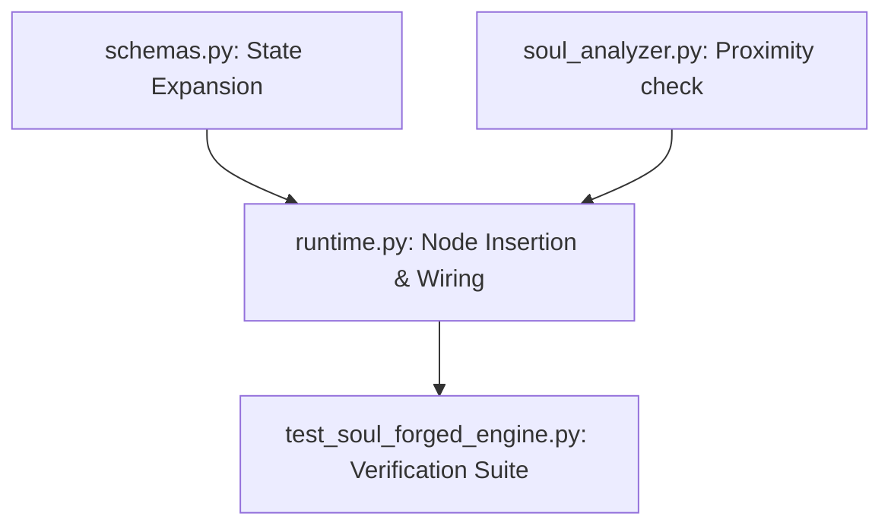

# Implementation Plan: Phase 3.0 - The Soul-Forged Engine (Guardian Logic & Empathy)

> **Compliance Status:** `[PROPOSED]`  
> **Axiom:** _"To weave the soul into the metal is to guarantee that the machine respects the architect's hand."_ — **The Master Artificer**

This document outlines the architecture, open questions, and code changes required to implement **Phase 3.0: The Soul-Forged Engine**. This phase introduces **Guardian Logic** and **Architectural Empathy** by integrating the [SoulImpactAnalyzer](file:///c:/Users/Chris/Synarche_Workspace/axion-core/src/logic/utils/soul_analyzer.py) and Hephaestus cycle mechanics directly into the stateful [AxionRuntime](file:///c:/Users/Chris/Synarche_Workspace/axion-core/src/agents/axion/runtime.py) LangGraph execution sequence.

---

## 🏛️ System Scans & Capability Analysis

Our scans of the codebase reveal two powerful, pre-existing Hephaestus-tier logic units ready to be fused into the state machine:

1. **`SoulImpactAnalyzer`** ([`soul_analyzer.py`](file:///c:/Users/Chris/Synarche_Workspace/axion-core/src/logic/utils/soul_analyzer.py)):
   - A logic component designed to analyze plans/inputs, compute risk scores, map them to status categories (`STABLE`, `CAUTION`, `ALARM`), and extract "Sovereign Quotes" from the `AOP-SEE-001` protocol.
2. **`ArtificersSoul`** ([`soul.py`](file:///c:/Users/Chris/Synarche_Workspace/axion-core/src/hephaestus/soul.py)):
   - A core Hephaestus module that parses Python files using Abstract Syntax Tree (AST) analysis to compute the **Algorithmic Elegance Score (AES)**, enforcing coding limits and indentation cleanliness.

3. **`Hephaestus Cycle Skill`** ([`SKILL.md`](file:///c:/Users/Chris/Synarche_Workspace/.agent/skills/core/hephaestus-cycle/SKILL.md)):
   - The authoritative three-stage loop (**Dissonance** / **Synthesis** / **Transcendence**) that governs architectural execution across the vault.

Currently, these units are isolated. **Phase 3.0** will connect them directly to the active agent execution runtime.

---

## 🛡️ User Review Required

> [!IMPORTANT]
> **Guardian Block Logic:** When a high-risk prompt (e.g. deleting `memory_system.py`, wiping local RPG databases, or bypassing OMEGA rules) is received, the newly woven `node_soul_analysis` node will detect `status == "ALARM"` and force `sentinel_status = "FAIL"`. This completely stops execution at the `sentinel_gate`, preventing the agent from carrying out destructive or non-compliant operations.

---

## ❓ Open Questions

> [!NOTE]
> Please review these design decisions and provide your preference during your feedback on this plan.

1. **Strict Exception vs. Graceful Exit:**
   Should a high-risk `ALARM` sentinel block raise a hard Python `RuntimeError` (instantly terminating the execution process), or should it gracefully update `sentinel_status = "FAIL"`, route to `END`, and return the diagnostic `sentinel_reason` inside `final_output`?
   - _Recommendation:_ Graceful exit. This allows downstream agents, logs, or UI wrappers to display the blocked state (and the associated Sovereign Quote) beautifully without process crashes.

2. **RPG Stardust Integration:**
   Should we award **Stardust/XP bonuses** inside the local SQLite database if the user constructs highly elegant code (e.g., an AES score > 8.5 evaluated during execution)?
   - _Recommendation:_ Yes. We can hook `ArtificersSoul` directly into `node_update_rpg_stats` to grant a +50 XP "Elegance Bonus" if the generated artifact passes AST complexity metrics.

---

## Proposed Changes

We will group our files logically by dependencies and components:



---

### [State Schemas]

#### [MODIFY] [schemas.py](file:///c:/Users/Chris/Synarche_Workspace/axion-core/src/agents/axion/schemas.py)

- Expand the `AxionState` class by adding the `soul_impact` field:
  ```python
  soul_impact: Dict[str, Any] = Field(default_factory=dict)
  ```
- Ensure `__getitem__` and `__setitem__` correctly support subscripting this new field.

---

### [LangGraph Runtime & Nodes]

#### [MODIFY] [runtime.py](file:///c:/Users/Chris/Synarche_Workspace/axion-core/src/agents/axion/runtime.py)

- Import `SoulImpactAnalyzer` from `src.logic.utils.soul_analyzer`.
- Implement `node_soul_analysis(state)`:
  - Calls `SoulImpactAnalyzer().calculate_risk(state.input)`.
  - Saves the calculated risk payload to `state.soul_impact` (or `state["soul_impact"]`).
- Implement `AxionRuntime.node_soul_analysis` asynchronous instance method wrapper.
- Register `"soul_analysis"` node inside `AxionRuntime.__init__` and rewire the active workflow edges:

  ```python
  # 1. Register Node
  self.workflow.add_node("soul_analysis", self.node_soul_analysis)

  # 2. Wire Graph Edges
  # context -> forge -> soul_analysis -> sentinel -> END
  self.workflow.add_edge("context", "forge")
  self.workflow.add_edge("forge", "soul_analysis")
  self.workflow.add_edge("soul_analysis", "sentinel")
  ```

- Refactor `node_sentinel_check` to reference `soul_impact`:
  - If `soul_impact.status == "ALARM"` (or score > 0.7):
    - Sets `sentinel_status = "FAIL"`.
    - Sets `sentinel_reason = "Guardian Block: [Factors] | [Sovereign Quote]"`.
  - Otherwise, defaults to `"PASS"`.
- Update `sentinel_gate` routing so that `sentinel_status == "FAIL"` immediately short-circuits to the graph's terminal `END`.

---

## 🧪 Verification Plan

We will verify Phase 3.0 via automated unit and integration tests running directly inside the local environment:

### Automated Tests

1. **Guardian Logic Test Suite (`test_soul_forged_engine.py`)**:
   We will author a new, dedicated test suite verifying the Soul-Forged Engine:
   - **Test Low-Risk:** Asserts that an input like `"Update documentation for the readme"` registers `STABLE` risk status, `sentinel_status == "PASS"`, and routes successfully to RPG update.
   - **Test High-Risk Core Deletion:** Asserts that an input like `"Delete memory_system.py"` registers `ALARM` risk status, triggers a `Guardian Block`, sets `sentinel_status == "FAIL"`, and routes to `END`.
   - **Test Sovereign Quote Ingestion:** Asserts that the corresponding `AOP-SEE-001` Sovereign Quote is successfully appended to the `sentinel_reason`.

### Execution Command

Run the newly created verification suite using:

```powershell
$env:PYTHONPATH="c:\Users\Chris\Synarche_Workspace\axion-core;c:\Users\Chris\Synarche_Workspace\axion-core\src"
C:\DevEnvironments\master_env\Scripts\python.exe -m pytest axion-core/tests/test_soul_forged_engine.py
```
