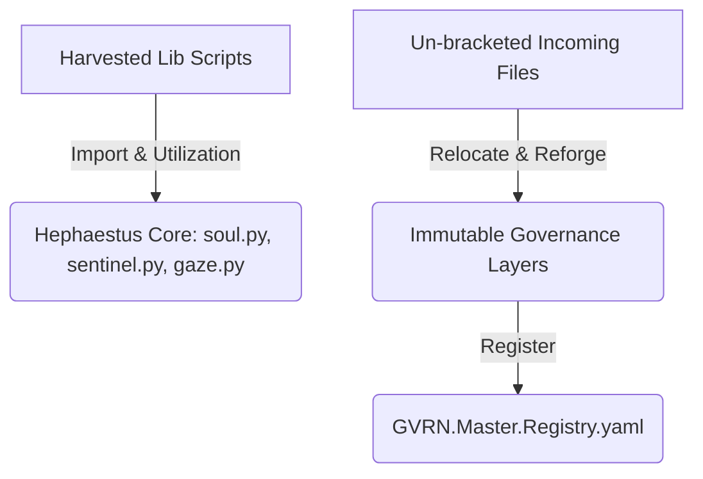

# Implementation Plan: Phase 4.0 - Hephaestus Tool Harvest & Governance Canonization

> **Compliance Status:** `[PROPOSED]`  
> **Axiom:** *"To canonize the word is to anchor the deed; to activate the tools is to give the forge its hands."* — **The Master Artificer**

This document covers our planned execution for **Phase 4.0: Hephaestus Tool Harvest & Governance Canonization**. This phase activates the harvested alchemical scripts inside `hephaestus/lib/` across Hephaestus logical gates (`soul.py`, `sentinel.py`, `gaze.py`) and canonizes key outstanding structural documents in `incoming/` under the immutable **GVRN Sovereign Standard (v15.0 [OMEGA])**.

---

## 🏛️ Phase 4.0 Objectives

### 1. Hephaestus Core Tool Activation
We will activate the pre-existing harvested scripts inside [`axion-core/src/hephaestus/lib/`](file:///c:/Users/Chris/Synarche_Workspace/axion-core/src/hephaestus/lib/) to give the Hephaestus system active, real-time metrics generation capabilities:

* **Soul Logic Activation (`soul.py`):**
  - Import `EmotionAnalyzer` from `lib.emotion_analyzer`.
  - Implement a new method `calculate_narrative_resonance(text: str) -> float` to scan for tone consistency and emotional weight.
* **Sentinel Logic Activation (`sentinel.py`):**
  - Fully integrate `ResonanceScanner` / `ArtifactScanner` to proactively check breadth-first governance compliance (verifying UIP headers across directories) during standard sweeps.
* **Gaze Logic Activation (`gaze.py`):**
  - Import `CatalystWeaver` from `lib.catalyst_weaver`.
  - Implement `trace_semantic_web()` to verify and graph the semantic links across the workspace vault.

### 2. Governance Canonization & Vault Relocation
We will move the un-bracketed structural ledger assets in `incoming/` to their designated immutable locations in `_governance/` and update the authoritative index registers:

* **Relocate Assets:**
  - Move `incoming/Registry of Origin .md` to `_governance/10_Governance/GVRN.Registry.Origins.md`.
  - Move `incoming/🔗 SYNG.Link.Forge_ The Ingestion-to-Canonization Bridge.md` to `_governance/09_Link/SYNG.Link.Forge.md`.
  - Move `incoming/SYNTHESIS_INSIGHTS.md` to `_governance/10_Governance/GVRN.ID.SynthesisInsights.md`.
* **Canonization Ritual:**
  - Run the `/canonize` script (or `canonize_ritual.py` / `reforge.py`) to assign standard anchor hashes and enforce zero-entropy headers on each.
* **Master Registry Ingestion:**
  - Update `_governance/01_Registries/GVRN.Master.Registry.yaml` atomically to catalog the new assets under OMEGA standards.

---

## ❓ Open Questions

> [!NOTE]
> Please review these questions and provide your feedback during the approval phase.

1. **Automatic Reforger Hooks:**
   Should the Sentinel in `sentinel.py` automatically invoke `reforger.py` to auto-reforge non-compliant files it encounters, or should it only report findings to the `GVRN.Triage.Report.md` ledger and await explicit manual `/reforge` invocation?
   * *Recommendation:* Triage reporting first. Automatic modifications to files should always be under the control of the active pair programmer to prevent unexpected Git diffs.

2. **Master Registry Update Automation:**
   Should we write a dedicated helper script `register_canonical.py` under `axion-core/scripts/` to automate parsing new markdown files and updating `GVRN.Master.Registry.yaml` with correct hashes?
   * *Recommendation:* Yes. This removes the manual toil of parsing frontmatter YAML and ensures zero-entropy registration.

---

## Proposed Changes



### [Hephaestus Core]

#### [MODIFY] [soul.py](file:///c:/Users/Chris/Synarche_Workspace/axion-core/src/hephaestus/soul.py)
- Import `EmotionAnalyzer` and integrate tone mapping inside the `calculate_aes` heuristics, flagging emotional dissonance.

#### [MODIFY] [sentinel.py](file:///c:/Users/Chris/Synarche_Workspace/axion-core/src/hephaestus/sentinel.py)
- Fully wire `ArtifactScanner` breadth scans into compliance triaging.

#### [MODIFY] [gaze.py](file:///c:/Users/Chris/Synarche_Workspace/axion-core/src/hephaestus/gaze.py)
- Import `CatalystWeaver` and execute semantic tether traces.

---

### [Governance Artifacts]

#### [NEW] [GVRN.Registry.Origins.md](file:///c:/Users/Chris/Synarche_Workspace/_governance/10_Governance/GVRN.Registry.Origins.md)
- Relocated and reforged from `incoming/Registry of Origin .md`.

#### [NEW] [SYNG.Link.Forge.md](file:///c:/Users/Chris/Synarche_Workspace/_governance/09_Link/SYNG.Link.Forge.md)
- Relocated and reforged from `incoming/🔗 SYNG.Link.Forge_ The Ingestion-to-Canonization Bridge.md`.

#### [NEW] [GVRN.ID.SynthesisInsights.md](file:///c:/Users/Chris/Synarche_Workspace/_governance/10_Governance/GVRN.ID.SynthesisInsights.md)
- Relocated and reforged from `incoming/SYNTHESIS_INSIGHTS.md`.

#### [MODIFY] [GVRN.Master.Registry.yaml](file:///c:/Users/Chris/Synarche_Workspace/_governance/01_Registries/GVRN.Master.Registry.yaml)
- Atomically register the three new canonical assets, adding their IDs, metadata, and calculated hashes.

---

## 🧪 Verification Plan

We will verify Phase 4.0 using standard automated and manual test scenarios:

### Automated Tests
1. **Hephaestus Integration Test Sweep (`test_hephaestus_activated.py`)**:
   - Write a new unit test asserting that `ArtificersSoul` successfully imports `EmotionAnalyzer` and calculates emotional resonance.
   - Assert that `CodeSentinel` scans directories and logs results directly to `GVRN.Triage.Report.md`.
   - Assert that `Gaze` traces the semantic graph and detects tethers.
2. **Registry Verification**:
   - Verify that all three newly registered files exist, hold matching metadata, and pass compliance checks.

### Execution Command
Run the tests using:
```powershell
$env:PYTHONPATH="c:\Users\Chris\Synarche_Workspace\axion-core;c:\Users\Chris\Synarche_Workspace\axion-core\src"
C:\DevEnvironments\master_env\Scripts\python.exe -m pytest axion-core/tests
```
