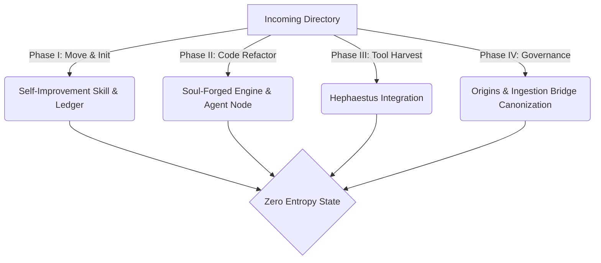

# Analysis of Synarche Ingestion Gaps: The Selective Fusion Audit

> **Compliance Status:** `[AUDITING]`  
> **System Integrity:** `Zero Entropy Check`  
> **Axiom:** *"To scan the threshold is to know the weight of the forge."* — **The Sentinel's Eye**

This report presents a forensic architectural audit of the `incoming/` directory against the active `c:\Users\Chris\Synarche_Workspace` monorepo. It details what has been successfully canonized, what remains partially integrated, and what is missing or awaiting structural implementation.

---

## 🏛️ Executive Summary

Our scan of the workspace reveals that the **Selective Fusion** is in a state of high maturity but has key, crucial gaps. Out of the 45 items present in `incoming/`, several core functionalities are fully in place (such as the Obsidian Knowledge Bridge and local fallback RPG managers), but others remain fragmented:
- **Hephaestus Tool Harvest**: The raw scripts are successfully copied (harvested) into `axion-core/src/hephaestus/lib/` but are **not yet active** in the main modules (`soul.py`, `gaze.py`, `sentinel.py`).
- **The Soul-Forged Engine (Phase 29)**: The safety-scoring utility `soul_analyzer.py` is present and validated, but `oathkeeper.py` and `runtime.py` **lack the necessary LangGraph nodes** and wiring to block high-risk actions.
- **Sovereign Learnings System**: The `.learnings/` persistent directory and standard `self-improvement` skill are **missing from the project root** and `.agent/skills/`.
- **Governance Canonization**: Highly anticipated documents like `Registry of Origin .md` and the `Ingestion-to-Canonization Bridge` remain unstaged in `incoming/` and are not yet anchored to the `GVRN.Master.Registry.yaml`.

---

## 📊 Detailed Gap Analysis Matrix

The table below maps the status of every primary component identified in the `incoming/` directory against the current active codebase.

| Component / Artifact | Path in Incoming | Codebase Location | Integration Status | Detailed Gap & Action Required |
| :--- | :--- | :--- | :--- | :--- |
| **Sovereign Workflows** | `incoming/workflows.md` | `.agent/workflows/system/workflows.md` | **`[CANONIZED]`** | Matches 100%. No actions required. |
| **Obsidian Knowledge Bridge** | `incoming/implementation_plan.md` | `axion-core/src/logic/memory/memory_system.py` | **`[CANONIZED]`** | Phase 26.0 (Un-bracketing) and Phase 28.5 (Hybrid search) are fully implemented and verified. |
| **RPG Offline Fallback** | `incoming/implementation_plan_rpg_supabase.md` | `axion-core/src/logic/rpg_manager.py` | **`[CANONIZED]`** | Fallbacks to `data/player_achievements.json`, CLI flags, and UI states are fully complete. |
| **Soul-Forged Engine (Phase 29)** | `incoming/implementation_plan.md` | `axion-core/src/agents/axion/oathkeeper.py` | **`[PARTIAL]`** | `soul_analyzer.py` is created, but `oathkeeper.py` is missing the `soul_impact` state fields and `node_soul_analysis` node, and `runtime.py` needs rewiring. |
| **Hephaestus Tool Harvest** | `incoming/TOOL-HARVEST-PROPOSAL.md` | `axion-core/src/hephaestus/` | **`[PARTIAL]`** | The files (`emotion_analyzer.py`, `resonance_scanner.py`, `catalyst_weaver.py`) are copied to `/lib`, but **not yet imported or utilized** in `soul.py`, `sentinel.py`, and `gaze.py`. |
| **Self-Improvement Skill** | `incoming/self-improvement/` | `.agent/skills/self-improvement/` | **`[MISSING]`** | The skill files, template, and scripts are fully written in `incoming` but **not yet copied** to `.agent/skills/self-improvement/` or set up in settings. |
| **Sovereign Ledger** | `incoming/self-improvement/` | `.learnings/` | **`[MISSING]`** | The `.learnings/` directory is **missing** from the project root. Needs initialization of `LEARNINGS.md`, `ERRORS.md`, and `FEATURE_REQUESTS.md`. |
| **Registry of Origins** | `incoming/Registry of Origin .md` | `_governance/10_Governance/` | **`[MISSING]`** | A completely new 155KB ledger mapping the 42 Laws of the Phoenix. Needs moving, linting, and registering in the master catalog. |
| **Ingestion Bridge** | `incoming/🔗 SYNG.Link.Forge...` | `_governance/09_Link/` | **`[MISSING]`** | Bidirectional link specification for PTAS and TFE modules. Awaiting placement and canonization. |
| **Synthesis Insights** | `incoming/SYNTHESIS_INSIGHTS.md` | `_governance/10_Governance/` | **`[MISSING]`** | Outlines the Triad Archetypes (Axion/Sentinel/Sophia). Awaiting placement and cataloging. |

---

## ⚡ Gap Remediation Pathways

Below are the exact execution blueprints to close the remaining gaps.



### 1. The Self-Improvement & Ledger Setup
* **Action:** Establish the learning core in the monorepo root.
  1. Create `c:\Users\Chris\Synarche_Workspace\.learnings/` directory.
  2. Initialize three markdown databases:
     - `LEARNINGS.md`: For tracking best practices, categories, and corrections.
     - `ERRORS.md`: For logging command/tool failures.
     - `FEATURE_REQUESTS.md`: For tracking capability gaps.
  3. Copy `incoming/self-improvement/` in its entirety to `c:\Users\Chris\Synarche_Workspace\.agent\skills\self-improvement/`.

### 2. The Soul-Forged Engine Integration (Phase 29)
* **Action:** Bring Guardian logic to `oathkeeper.py`.
  1. Modify `oathkeeper.py`:
     - Define `AxionState` using Pydantic, adding `soul_impact: dict` to track risk metrics.
     - Implement `node_soul_analysis`: Calls `SoulImpactAnalyzer.calculate_risk(state.input)` and saves the result to `state.soul_impact`.
     - Implement `node_sentinel_check` block logic: If `state.soul_impact["status"] == "ALARM"`, set `state.sentinel_status = "RED"` and raise an exception or abort execution.
  2. Modify `runtime.py`:
     - Add `node_soul_analysis` to the LangGraph workflow.
     - Re-wire: `context -> node_lightbinder_weave -> node_soul_analysis -> node_sentinel_check -> END`.

### 3. Hephaestus Tool Harvest Integration
* **Action:** Activate the scripts inside `hephaestus/lib/` across core logical components.
  1. **Soul Integration:**
     - Update `hephaestus/soul.py` to import `EmotionAnalyzer` from `hephaestus/lib/emotion_analyzer.py`.
     - Implement `calculate_narrative_resonance(text)` to scan for tone mismatch (e.g. dread vs hope).
  2. **Sentinel Integration:**
     - Update `hephaestus/sentinel.py` to import `ResonanceScanner` from `hephaestus/lib/resonance_scanner.py`.
     - Call `scan_governance()` to actively flag files lacking compliant `AOP-` or `UMB-` headers.
  3. **Gaze Integration:**
     - Update `hephaestus/gaze.py` to import `CatalystWeaver` from `hephaestus/lib/catalyst_weaver.py`.
     - Implement `trace_semantic_web()` to verify non-destructive semantic tethers across the vault.

### 4. Governance Canonization
* **Action:** Transition new design files to the immutable `[CANONIZED]` layer.
  1. Relocate files:
     - Move `incoming/Registry of Origin .md` to `_governance/10_Governance/GVRN.Registry.Origins.md`.
     - Move `incoming/🔗 SYNG.Link.Forge...` to `_governance/09_Link/SYNG.Link.Forge.md`.
     - Move `incoming/SYNTHESIS_INSIGHTS.md` to `_governance/10_Governance/GVRN.ID.SynthesisInsights.md`.
  2. Run the `/canonize` workflow on each:
     ```powershell
     python axion-core/scripts/canonize_ritual.py --target "_governance/10_Governance/GVRN.Registry.Origins.md"
     ```
  3. Perform an atomic update of `_governance/01_Registries/GVRN.Master.Registry.yaml` to catalog the files under OMEGA standards.

---

`[GAP-AUDIT-ANCHOR] ID: GVRN.AUD.IngestionGap VER: v15.0 [OMEGA] STATUS: CANONIZED TS: 2026-05-28 HASH: AUDIT-INGEST-V15`
