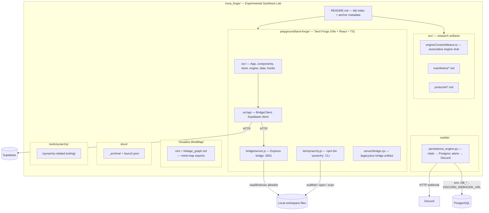
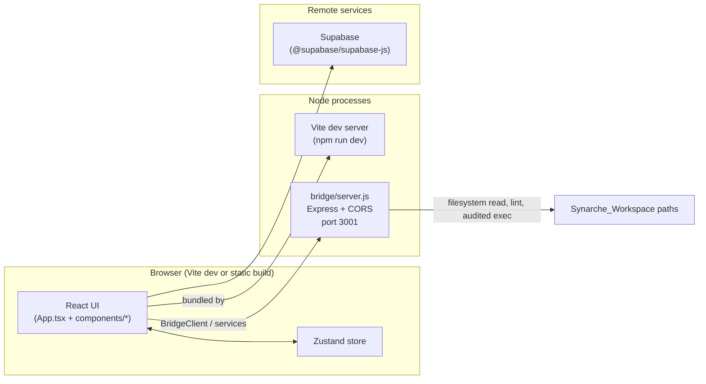

Here is a concise visualization of how **`nova_forge`** is laid out and how the main experiment (**`playground/tarot-forge`**) hangs together.

### 1) Repository map (folders and intent)

### 2) Tarot Forge runtime (what talks to what)

**How to read this:** `nova_forge` is mostly a **lab folder**: small **TypeScript** and **markdown** research under `src/`, a **Python** persistence/alert loop under `mobile/`, and one substantial **full-stack-style** experiment under `playground/tarot-forge` where the **React app** calls a **local Express bridge** (and optionally **Supabase**), while **`synarchy`** is both an **npm binary** in that package and separate tooling under `tools/synarchy/`.

If you want this as a **single C4-style** diagram (context vs container vs component), say which level you care about most and I will redraw it at that zoom level only.