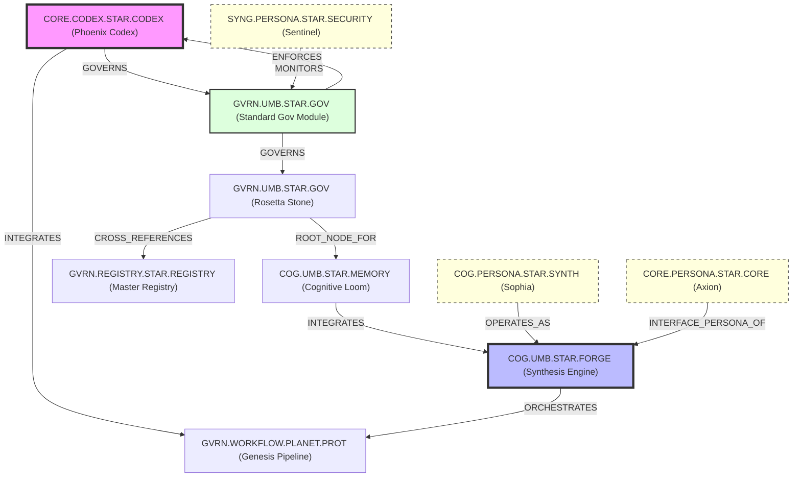

# The Sovereign Linkage Graph [Temporal Visibility]

This graph visualizes the **Cognitive Spine** of the Axion-Forge ecosystem, mapped to the OMEGA v15.0 Vectorized
Metadata standards.

### Analysis of the Cognitive Spine

1. **Goverance Loop**: Control flows from the `PHOENIX-CODEX` through the `SGM`, which then monitors the `Rosetta Stone`
   (`PRS`).
2. **Synthesis Engine**: The `CSE` acts as the "Brain," orchestrated by the `SOPHIA` persona and interfaced via `AXION`.
3. **Memory Access**: The `Cognitive Loom` serves as the retrieval layer for the `CSE`, ensuring all transitions are
   grounded in the system's "History."
4. **Security Integration**: `SENTINEL` monitors the `SGM` to ensure no metadata dissonance escapes isolation.
