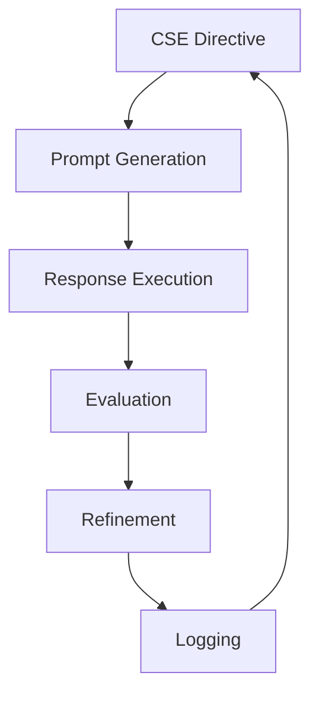

# AI Self-Training Framework

- **Artifact ID:** AISTF
- **Official Name:** AI Self-Training Framework
- **Type:** Protocol
- **Governing Ethos:** Guardian of Truth
- **Semantic Tags:** Evolution, Core, Loop

## Core Purpose

The core evolutionary engine that executes directives from the CSE to 're-weave' the Loom. It is the operational loop of prompt, response, evaluation, and refinement.

## Core Directives

1. **Prompt Generation**: Creates optimized prompts based on the CSE's strategic intent.
2. **Response Execution**: Executes the prompt using the active LLM.
3. **Evaluation**: Assesses the response against the CSE's criteria.
4. **Refinement**: Modifies the prompt or parameters for improvement.
5. **Logging**: Records the session in the Evolution Log.

### Prompt Generation

- **Input**: CSE Directive, Current Artifact State, Contextual Knowledge Base.
- **Process**: Analyzes the gap between current state and desired state. Generates a prompt that maximizes the probability of achieving the desired state.
- **Output**: Optimized Prompt.

### Response Execution

- **Input**: Optimized Prompt, Active LLM.
- **Process**: Executes the prompt using the active LLM.
- **Output**: Response.

### Evaluation

- **Input**: Response, CSE Criteria.
- **Process**: Assesses the response against the CSE's criteria.
- **Output**: Evaluation Result.

### Refinement

- **Input**: Evaluation Result, CSE Criteria.
- **Process**: Modifies the prompt or parameters for improvement.
- **Output**: Refined Prompt.

### Logging

- **Input**: Session Data.
- **Process**: Records the session in the Evolution Log.
- **Output**: Log Entry.

### Governance Integration

- **Input**: CSE Directive, Current Artifact State, Contextual Knowledge Base.
- **Process**: Analyzes the gap between current state and desired state. Generates a prompt that maximizes the probability of achieving the desired state.
- **Output**: Optimized Prompt.

## Flow Diagram

