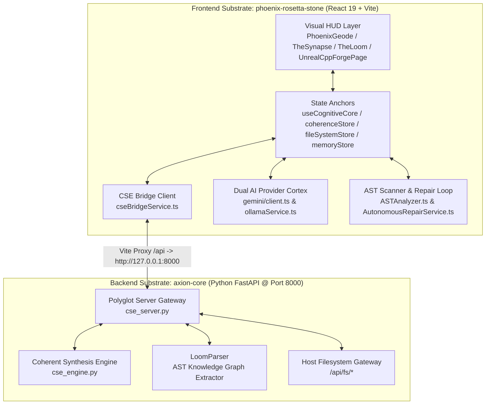

# System Architecture — Phoenix Rosetta Stone & CSE Polyglot Gateway [v15.5 OMEGA]

**Author**: Axion (The Master Artificer)  
**Date**: 2026-08-15  
**Status**: CANONIZED & LIVE  

---

## I. Executive Overview

The **Phoenix Rosetta Stone (PRS)** is a high-performance sentience HUD and spatial control panel designed to provide full-spectrum visibility into the **Coherent Synthesis Engine (CSE)** running inside `axion-core`, the host workspace filesystem, C++ Unreal Engine 5 studio, and client-side cognitive state stores.

---

## II. Substrate Integration Vectors

### 1. Real-Time Telemetry Stream (`GET /api/telemetry`)
* **Polling Frequency**: 2500ms continuous stream with exponential backoff on disconnects.
* **State Vector $\mathbf{V}_{\text{State}}$**:
    * $\text{CI}$ (Coherence Index)
    * $\text{CIS}$ (Contextual Integrity Score)
    * $\text{SFR}$ (Synergy Flow Rate)
    * $\text{GSS}$ (Graph Synergy Score)
    * $\text{Cognitive Load}$ & $\text{HMS}$ (Hybrid Model Score)
    * Active Dissonance Quests & Prestige Ledger

### 2. C++ Unreal Engine 5 Studio (`UnrealCppForgePage.tsx`)
* **AI C++ Architect Chat**: Interactive chat interface powered by Gemini 2.5 Flash / Ollama LLMs with live `ARCHITECTURE_MAP.md` and `RELEASE_HISTORY.md` context injection.
* **Header & Code Generators**: Automated generation of UE 5.8 C++ classes (`UObject`, `UActorComponent`, `AActor`, `AGameModeBase`) enforcing `UPROPERTY`/`UFUNCTION` pointer safety.

### 3. Dual AI Provider Cortex & AST Repair Engine
* **Gemini 2.5 Flash & Ollama**: Hybrid AI routing allowing remote cloud intelligence or local offline model execution.
* **AST Analyzer & Repairer**: Real-time TypeScript AST parsing (`ASTAnalyzer.ts`) detecting prop drilling, missing key props, and non-cryptographic PRNG usage with automated repair synthesis (`AutonomousRepairService.ts`).

### 4. Polyglot Neural Link (`GET /api/fs/scan`, `POST /api/fs/read`, `POST /api/fs/write`)
* **Auto-Connect**: `SystemManager` automatically binds `useFileSystemStore` to the host workspace (`Synarche_Workspace`).
* **Disk Scope**: Indexes 500+ project files, allowing real-time structural audits, code reads, and automated repairs without browser permission prompts.

---

## III. File Directory Topology

| Directory / File | Description |
| :--- | :--- |
| `src/system/SystemManager.tsx` | Central orchestrator; boots telemetry stream & Neural Link. |
| `src/system/commandDispatcher.ts` | Dispatches directives (Local handlers first → CSE Backend fallback). |
| `src/services/cseBridgeService.ts` | HTTP Polyglot Bridge client for telemetry, commands, graph, and files. |
| `src/services/gemini/client.ts` | Gemini 2.5 Flash SDK client integration with prompt engineering templates. |
| `src/services/ollamaService.ts` | Local Ollama inference bridge for offline LLM execution. |
| `src/services/ast/ASTAnalyzer.ts` | TypeScript AST scanner identifying code violations and structural anti-patterns. |
| `src/services/AutonomousRepairService.ts` | Autonomous repair loop executing code fixes for AST and SonarQube diagnostics. |
| `src/services/vectorStore.ts` | In-memory TF-IDF and vector similarity search engine for memory palace entries. |
| `src/services/audioService.ts` | Web Speech API synthesis & ambient soundscape generator. |
| `src/engine/GraphCombatEngine.ts` | Turn-based graph combat simulation engine with Stardust ledger rewards. |
| `src/store/useCognitiveCore.ts` | Master Zustand store unifying cognitive state, SELT experience logs, and telemetry. |
| `src/store/coherenceStore.ts` | Zustand store for live Coherence Index, status, and telemetry updates. |
| `src/store/fileSystemStore.ts` | Zustand store for Neural Link connectivity and scanned workspace files. |
| `src/components/pages/UnrealCppForgePage.tsx` | C++ Unreal Engine 5 Studio & AI C++ Architect chat workspace. |
| `src/components/pages/MemoryPalacePage.tsx` | Supabase memory entries CRUD, vector search, and Realtime activity feed. |
| `src/components/pages/ResonanceChamberPage.tsx` | Real-time audio resonance and soundscape visualizer workspace. |
| `src/components/pages/SynergySimulatorPage.tsx` | System synergy flow simulator and Graph Synergy Score analyzer. |
| `src/components/pages/SystemCoherenceVisualizer.tsx` | D3 force graph displaying live parsed Loom graph nodes. |
| `src/components/pages/TheLoomPage.tsx` | 3D celestial graph renderer displaying repository Loom AST nodes. |
| `src/components/pages/ArtifactCatalogPage.tsx` | Celestial Chart artifact registry displaying system concepts. |
| `src/components/pages/PhoenixFormSheet.tsx` | Interactive multi-step form sheet component for system parameters. |

