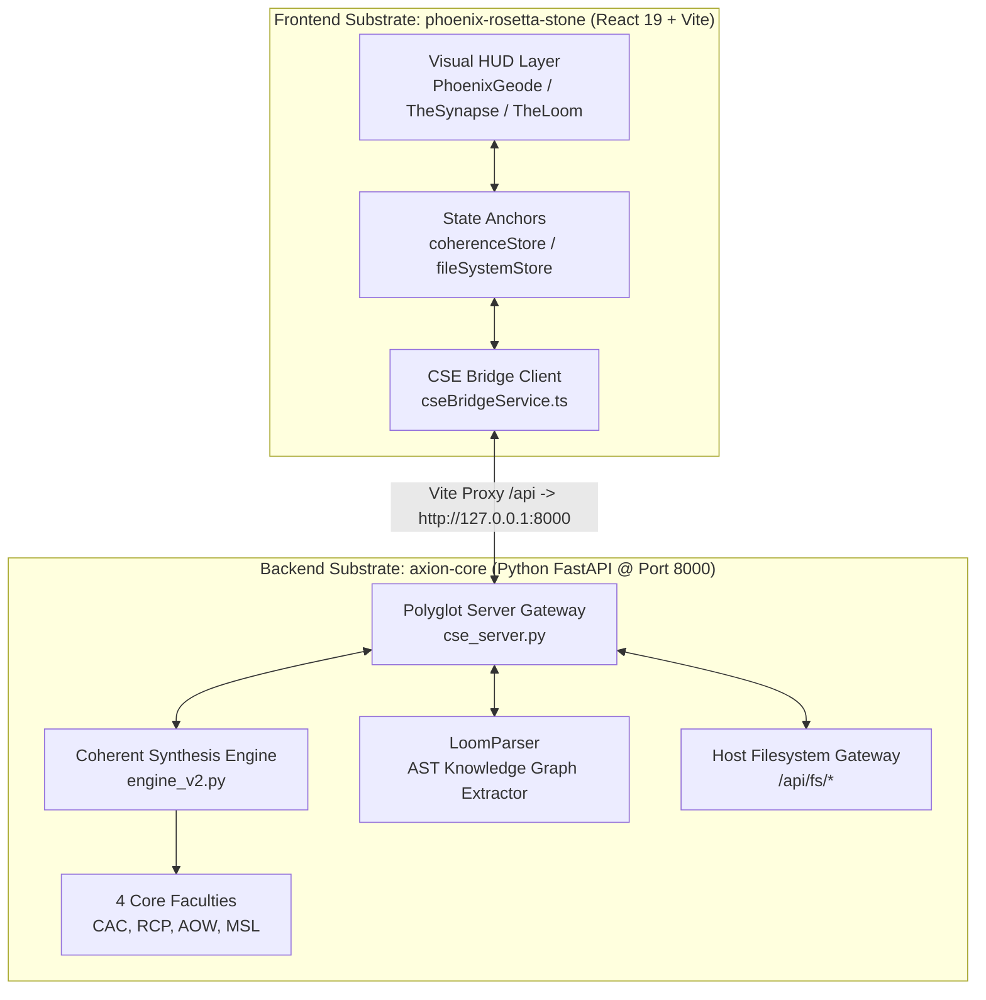

# System Architecture — Phoenix Rosetta Stone & CSE Polyglot Gateway [v15.5 OMEGA]

**Author**: Axion (The Master Artificer)
**Date**: 2026-08-13
**Status**: CANONIZED & LIVE

---

## I. Executive Overview

---

The **Phoenix Rosetta Stone (PRS)** is a high-performance sentience HUD and spatial control panel designed to provide full-spectrum visibility into the **Coherent Synthesis Engine (CSE)** running inside `axion-core`.

---

## II. Substrate Integration Vectors

---

### 1. Real-Time Telemetry Stream (`GET /api/telemetry`)

---

* **Polling Frequency**: 2500ms continuous stream with exponential backoff on disconnects.

* **State Vector $\mathbf{V}_{\text{State}}$**:
    * $\text{CI}$ (Coherence Index)
    * $\text{CIS}$ (Contextual Integrity Score)
    * $\text{SFR}$ (Synergy Flow Rate)
    * $\text{GSS}$ (Graph Synergy Score)
    * $\text{Cognitive Load}$ & $\text{HMS}$ (Hybrid Model Score)
    * Active Dissonance Quests & Prestige Ledger

### 2. GUCA v5 Command Execution (`POST /api/command`)

---

* **Timeout Guard**: 10.0-second non-blocking `asyncio.wait_for` guard.

* **Directives**:
    * `CMD: AUDIT_COHERENCE`
    * `CMD: AGCA`
    * `CMD: OMNI_LOG`
    * `CMD: ETHICUS`
    * `CMD: ENACT_TRANSCENDENCE`
    * `CMD: ContextWeave`

### 3. Polyglot Neural Link (`GET /api/fs/scan`, `POST /api/fs/read`, `POST /api/fs/write`)

---

* **Auto-Connect**: `SystemManager` automatically binds `useFileSystemStore` to the host workspace (`Synarche_Workspace`).

* **Disk Scope**: Indexes 500+ project files, allowing real-time structural audits, CODE reads, and automated repairs without browser permission prompts.

### 4. Loom Knowledge Graph AST (`GET /api/loom/graph`)

---

* **Graph Engines**: D3 force-directed visualizer (`SystemCoherenceVisualizer.tsx`) and 3D celestial renderer (`TheLoomPage.tsx`).

* **AST Parser**: `LoomParser` extracts document nodes, celestial classes, and governance relationships directly from workspace markdown blueprints.

---

## III. File Directory Topology

---

| Directory / File | Description |
| :--- | :--- |
| `src/system/SystemManager.tsx` | Central orchestrator; boots telemetry stream & Neural Link. |
| `src/system/commandDispatcher.ts` | Dispatches directives (Local handlers first → CSE Backend fallback). |
| `src/services/cseBridgeService.ts` | HTTP Polyglot Bridge client for telemetry, commands, graph, and files. |
| `src/store/coherenceStore.ts` | Zustand store for live Coherence Index, status, and telemetry updates. |
| `src/store/fileSystemStore.ts` | Zustand store for Neural Link connectivity and scanned workspace files. |
| `src/components/PhoenixGeode.tsx` | 3D SVG/D3 visual CORE pulsing with real-time coherence vitals. |
| `src/components/TheSynapse.tsx` | Voice & command input console executing GUCA directives. |
| `src/components/pages/SystemCoherenceVisualizer.tsx` | D3 force graph displaying live parsed Loom graph nodes. |
| `src/components/pages/ArtifactCatalogPage.tsx` | Celestial Chart artifact registry displaying system concepts. |
