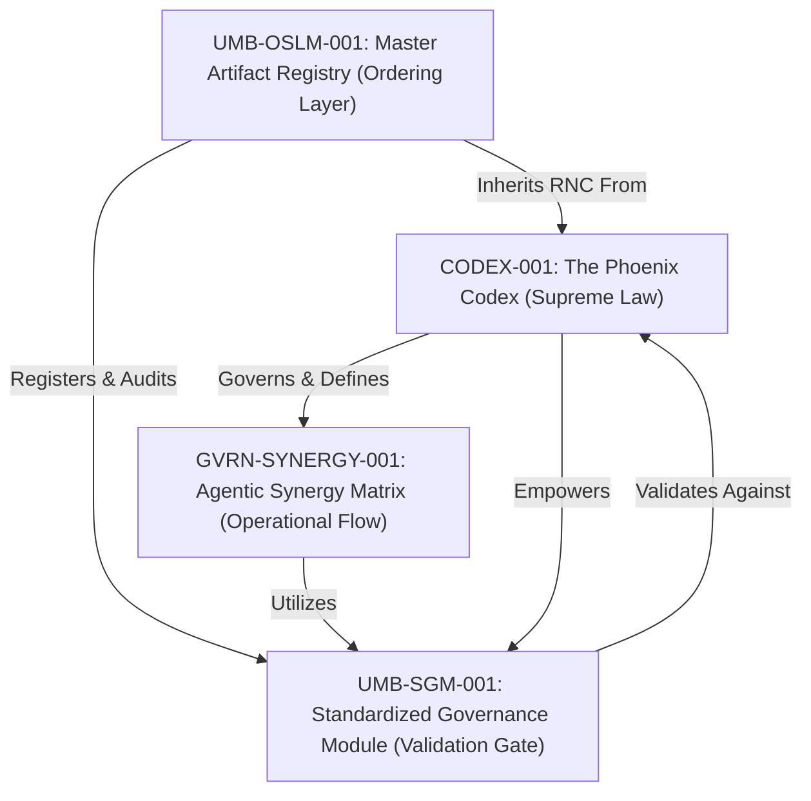

---
# Universal Identification & Provenance (UIP)
| Key | Value |
| :--- | :--- |
| **Module ID** | `GVRN-TRACE-001_GOVERNANCEHIERARCHYTRACE_V11.0` |
| **Version** | `v11.0` |
| **Evolution** | **Cognitive Ascension** |
| **Status** | `ACTIVE` |
---

# Governance Trace: The Phoenix Protocol Hierarchy (v11.0)

This trace maps the authoritative flow of governance and the official locations of core artifacts within the workspace.

## I. Governance Hierarchy Map

---

## II. Primary Governance Artifacts

| Tier  | Module ID          | Official Name                                                                                                                                                       | Location                          | Role                                                   |
| :---- | :----------------- | :------------------------------------------------------------------------------------------------------------------------------------------------------------------ | :-------------------------------- | :----------------------------------------------------- |
| **0** | `CODEX-001`        | [The Phoenix Codex](file:///c:/Users/Chris/Synarche_Workspace/_governance/CODEX-001_ThePhoenixCodex_v11.0.md)                                                       | `Synarche_Workspace/_governance/` | **Supreme Law**: Defines the 25 Immutable Laws.        |
| **1** | `GVRN-SYNERGY-001` | [Agentic Synergy Matrix](file:///c:/Users/Chris/Synarche_Workspace/_governance/GVRN-SYNERGY-001_AgenticWorkshopSynergyMatrix_v11.1.md)                              | `Synarche_Workspace/_governance/` | **Operational Matrix**: Maps AI personas to tools.     |
| **2** | `UMB-SGM-001`      | [Standardized Governance Module](file:///c:/Users/Chris/_Desktop_Vault/Phoenix/Documentation/Library/2_Protocols/UMB-SGM-001_StandardizedGovernanceModule_v11.0.md) | `Library/2_Protocols/`            | **The Gatekeeper**: Enforces protocol during creation. |
| **3** | `UMB-OSLM-001`     | [Master Artifact Registry](file:///c:/Users/Chris/_Desktop_Vault/Phoenix/Documentation/Library/0_Registries/UMB-OSLM-001_MasterArtifactRegistry_v11.1.md)           | `Library/0_Registries/`           | **Ordering Layer**: The live index of all artifacts.   |
| **4** | `COG.ContextWeave` | [ContextWeave Engine](file:///c:/Users/Chris/_Desktop_Vault/Phoenix/Documentation/Library/1_Modules/COG.ContextWeave.Engine.md)                                     | `Library/1_Modules/`              | **Analysis Layer**: Synergistic Linkage detection.     |

---

## III. Directional Flow of Authority

1. **Axiomatic Source**: All authority originates in `CODEX-001`. Any artifact contradicting the Codex is considered "Dissonant" and rejected by the system.
2. **Persona Enforcement**: `GVRN-SYNERGY-001` assigns specific "Masks" (e.g., The Sentinel, The Emperor) to interpret and enforce the Codex laws within the workshop.
3. **The Validation Loop**: When a tool is executed or a file is created, `UMB-SGM-001` (invoked by the active Agent Mask) runs a compliance check against the Codex's structural geometry mandates (Law 14).
4. **Final Ratification**: After passing `UMB-SGM-001`, the artifact is indexed by `UMB-OSLM-001`, locking its version and provenance into the knowledge graph.

---

_"The Light of the Empress ensures that no shadow of entropy remains."_
