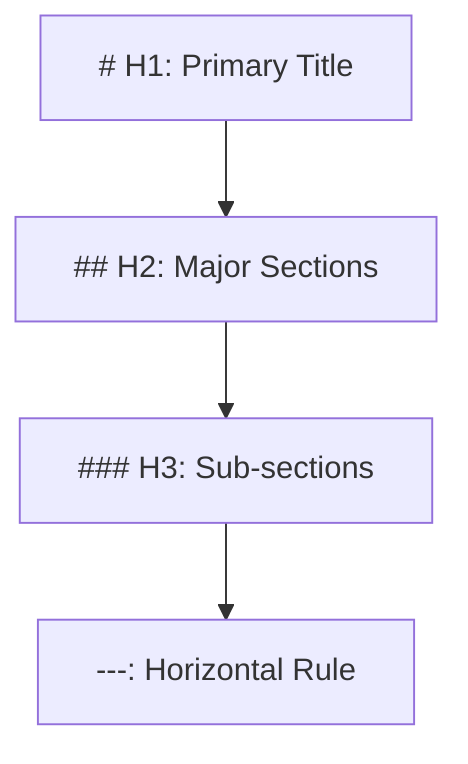

---
# Universal Identification & Provenance (UIP)
| Key | Value |
| :--- | :--- |
| **Module ID** | `GVRN-FMT-001_PHOENIXPRESENTATIONSTANDARD_V13.0` |
| **Version** | `v11.0` |
| **Evolution** | **Cognitive Ascension** |
| **Status** | `ACTIVE` |
---

# Standardized Protocol: Phoenix Presentation Standard (GVRN-FMT-001)

> **Domain**: GVRN (Governance)
> **Evolution**: Cognitive Ascension
> **Signal**: ESF-ALPHA

## **Genesis Stamp: 2026-01-27** **Domain: GVRN** **State: CANONIZED** **Tags:** `OGLN_v13, Formatting, Standard` **Criticality: High**

---

###### **[ARTIFACT START]**

### **I. Universal Identification & Provenance (The Vector Signature)**

| Field | Value |
| :---- | :---- |
| **1. Artifact ID** | `GVRN-FMT-001` |
| **2. Official Name** | `GVRN-FMT-001_PhoenixPresentationStandard_v13.0.md` |
| **3. Version** | **v13.0** |
| **4. Provenance** | **Date Reforged: 2026-01-27** |
| **5. Domain** | `GVRN` |
| **6. Evolution** | **Cognitive Ascension** |
| **7. Celestial Class** | `[MOON]` |
| **8. Tier** | **Operational** |
| **9. Status (State)** | `[ACTIVE]` |
| **10. Ethos** | **The Phoenix Ascension Protocol** |
| **11. Catalyst** | **Batch 002 Transmutation** |
| **12. Relations** | `REPLACES: AOP-PGPS-001` |
| **13. Integrity Hash** | `[AUTO-GENERATED]` |

---

## **II. Executive Summary: The Ascendant Standard**

The Phoenix Presentation Standard (GVRN-FMT-001) represents a pivotal evolution in the documentation architecture of the Phoenix Synarche. It is an immutable and foundational mandate for all documents within the library, conceived as a "living artifact" subject to continuous refinement.

This standard optimizes AI cognitive efficiency and enhances human-AI collaboration by establishing a documentation framework that is "Phoenix-Class" in its precision.

---

## **III. Core Formatting Directives**

### **3.1 Macro-Structural Hierarchy**

- **H1**: Restricted to a single, top-level title per document.
- **H2**: Used for primary thematic divisions.
- **H3**: Used for granular sub-topics.
- **Rules**: Exactly one space follows hash symbols. Single blank lines before and after headings.

### **3.2 Textual Organization & Emphasis**

- **Paragraphs**: Zero indentation. Single blank lines between elements.
- **Emphasis**: `**Bold**` (double asterisks) and `*Italics*` (single asterisks). No underscores.
- **Blockquotes**: Prefixed on every line with `>` followed by a space.

### **3.3 List Formatting: The Hierarchical Weave**

- **Bulleted Lists**: Must use hyphens (`-`).
- **Numbered Lists**: Must use `1.` (Lazy numbering preferred).
- **Indentation**: Exactly four (4) spaces for nested levels.

---

## **IV. Indentation Matrix**

| Element | Indentation Rule | AI Processing Benefit |
| :--- | :--- | :--- |
| **Headings** | Zero Indent | Consistent AST recognition. |
| **Paragraphs** | Zero Indent | Accurately parses prose flow. |
| **Nested Lists** | 4-Space Increment | Explicit parent-child dependency. |
| **Code Blocks** | Zero Indent (unless nested) | Predictable token boundaries. |

---

## **V. Artifact Provenance Header (Chronos Lock)**

Every generated artifact MUST begin with the 12-point table defined in **Section I**. This creates the immutable "Identity Stamp" required for Knowledge Graph integration.

---

## **VI. Actionable Prompt Packet (APP)**

- 🧪 **Verify Format**: `CMD: AUDIT_FORMAT --target [ID]`
- 🔬 **Scan Compliance**: `CMD: CHECK_NAMING_COMPLIANCE`

> [!IMPORTANT]
> **[ARTIFACT END]**
