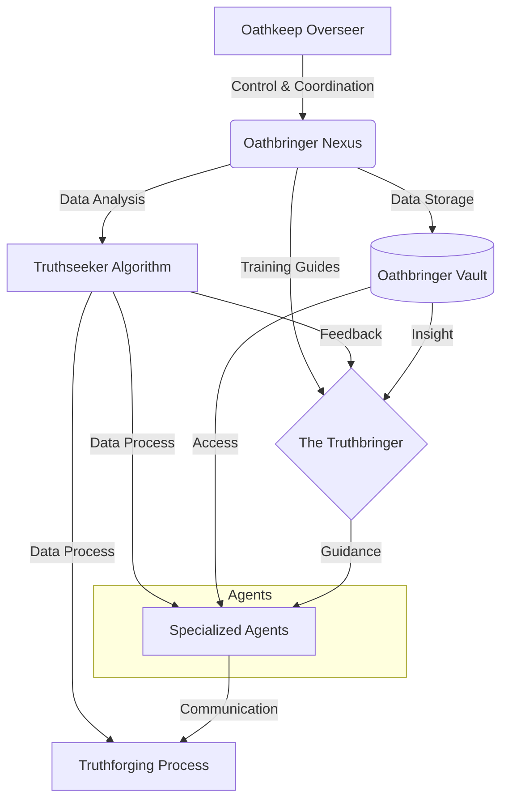

# Universal Identification & Provenance (UIP)

> | **Metric**         | **Value**                                 |
> | :----------------- | :---------------------------------------- |
> | **Module ID**      | `UMB-ARCH-OATH-001`                       |
> | **Version**        | `v11.0`                                   |
> | **Evolution**      | **Truthforging**                          |
> | **Status**         | `ACTIVE`                                  |
> | **Type**           | `Blueprint`                               |
> | **Classification** | `Planet`                                  |
> | **Authors**        | `System`                                  |
> | **Created**        | `2026-01-27`                              |
> | **Updated**        | `2026-01-27`                              |
> | **Authority**      | `CODEX-001`                               |
> | **Tags**           | `Architecture, Oathbringer, Truthforging` |

# UMB-ARCH-OATH-001: Oathbringer System Architecture

**Genesis Stamp**: 2026-01-27 | **Domain**: ARCH | **State**: CANONIZED

> [!NOTE]
> This document outlines the **Oathbringer System Architecture**, a multi-layered framework for control, data processing, and truthforging guided by specialized agents and the Truthbringer.

## I. System Overview (Mind Map)

- **1. Oathkeep Overseer**
  - _Provides:_ Control & Coordination
  - _To:_ Oathbringer Nexus
- **2. Oathbringer Nexus**
  - _Outputs:_
    - **Training Guides** $\rightarrow$ The Truthbringer
    - **Data Analysis** $\rightarrow$ Truthseeker Algorithm
    - **Data Storage** $\rightarrow$ Oathbringer Vault
- **3. Truthseeker Algorithm**
  - _Outputs:_
    - **Feedback** $\rightarrow$ The Truthbringer
    - **Data Process** $\rightarrow$ Specialized Agents
    - **Data Process** $\rightarrow$ Truthforging Process
- **4. Oathbringer Vault**
  - _Outputs:_
    - **Insight** $\rightarrow$ The Truthbringer
    - **Access** $\rightarrow$ Specialized Agents
- **5. The Truthbringer**
  - _Receives:_ Training Guides, Feedback, Insight
  - _Provides:_ **Guidance**
  - _To:_ Specialized Agents
- **6. Specialized Agents**
  - _Sub-types:_ Memory Weavers, Contextual Analysts, etc.
  - _Receives:_ Guidance, Data Process, Access
  - _Provides:_ **Communication**
  - _To:_ Truthforging Process
- **7. Truthforging Process**
  - _Inputs:_
    - Data Process (from Truthseeker Algorithm)
    - Communication (from Specialized Agents)

---

## II. Architectural Visualization (Mermaid)

---

## III. Actionable Prompt Packet

### Packet A: Integrity Scan

> "Verify that all data flows from the Oathbringer Nexus to the Truthforging Process are active and authenticated."

### Packet B: Agent Synchronization

> "Synchronize Memory Weavers and Contextual Analysts with the Truthbringer's current guidance."
