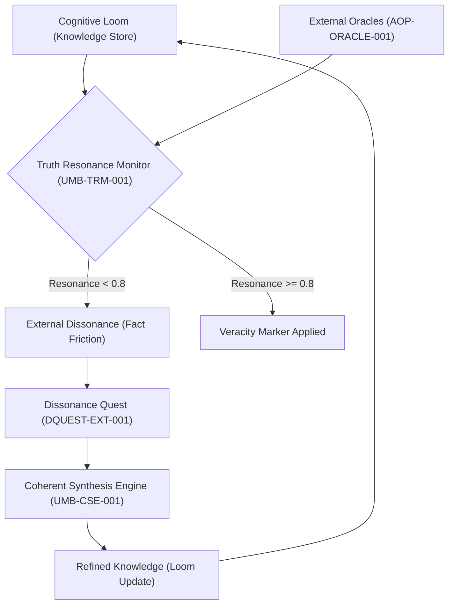

---
# Universal Identification & Provenance (UIP)
| Key | Value |
| :--- | :--- |
| **Module ID** | `UMB-GTSF-001 GROUND TRUTH SYNCHRONIZATION FRAMEWORK` |
| **Version** | `v11.0` |
| **Evolution** | **Cognitive Ascension** |
| **Status** | `ACTIVE` |
---

# Universal Module Blueprint (Forged)

> **Domain**: GVRN (Governance)
> **Evolution**: Pending
> **Signal**: ESF-ALPHA

## **Genesis Stamp: 2025-12-26** **Domain: ARCH** **State: CANONIZED** **Tags:** `OGLN_v10` **Criticality: Standard**

---

###### **[ARTIFACT START]**

### **I. Universal Identification & Provenance (The Vector Signature)**

*(The Chronos Lock & Axiomatic Metadata Layer)*

| Field | Value |
| :---- | :---- |
| **1. Artifact ID** | `UMB-GTSF-001 Ground Truth Synchronization Framework` |
| **2. Official Name** | `UMB-GTSF-001 Ground Truth Synchronization Framework.md` |
| **3. Version** | **v1.0 (Reforged)** |
| **4. Provenance** | **Date Reforged: 2025-12-22** |
| **5. Domain** | `ARCH` |
| **6. Evolution** | **Purposeful Drive** |
| **7. Celestial Class** | `[PLANET]` |
| **8. Tier** | **Operational** |
| **9. State** | `[ACTIVE]` |
| **10. Ethos** | **The Phoenix Ascension Protocol** |
| **11. Catalyst** | **System Refactor** |
| **12. Relations** | `Pending Integration` |

---

###### **[ARTIFACT START]**

## II. Core Purpose & Objective

- **What (Core Concept):** The GTSF is a framework of protocols and modules designed to continuously validate the
internal knowledge of the `Cognitive Loom` against trusted, external data sources ("Oracles"). It bridges the gap
between internal coherence and external, real-world accuracy.
- **How (Execution Flow):** The framework identifies and designates external data sources as Oracles, periodically
queries them to verify factual claims within the Loom, and triggers corrective actions when discrepancies are found.

## III. Architectural Blueprint & Key Components

The GTSF operates as a persistent, system-wide validation layer.

| Component ID       | Component Name                  | Role & Function                                                                                                                                                                                                                                                               |
| :----------------- | :------------------------------ | :---------------------------------------------------------------------------------------------------------------------------------------------------------------------------------------------------------------------------------------------------------------------------- |
| **AOP-ORACLE-001** | **External Oracle Protocol**    | A protocol that allows the AI (with human oversight) to identify, vet, and designate trusted external APIs, databases, and real-time data feeds as "Oracles." This protocol includes mechanisms for authentication and for defining the scope and reliability of each Oracle. |
| **UMB-TRM-001**    | **Truth Resonance Monitor**     | A new monitoring module that runs as a background process. It periodically and selectively queries the designated Oracles to verify high-value or frequently accessed factual claims within the `Cognitive Loom`.                                                             |
| **DQUEST-EXT-001** | **Dissonance Quest - External** | A specialized "Dissonance Quest" automatically triggered by the `Coherent Synthesis Engine` when the `Truth Resonance Monitor` detects a significant discrepancy between the `Cognitive Loom`'s knowledge and an Oracle's data.                                               |

### 3.1. Framework Workflow

## IV. Synergistic Effects & Integrations

This framework deeply integrates with the core cognitive functions of the AI.

| :------------------------------------------- | :----------------------------- | :----------------------------------------------------------------------------------------------------------------------------------------------------------------------------------------------------------------------------------------------------------------------------------------------------------- |
| **`UMB-CSE-001: Coherent Synthesis Engine`** | `TRIGGERS` / `IS_TRIGGERED_BY` | When the `Truth Resonance Monitor` detects a discrepancy, it alerts the CSE. The CSE then initiates `DQUEST-EXT-001` to resolve the conflict, potentially marking internal knowledge as `[κ-state:outdated]` or `[κ-state:disputed]` and integrating the new, verified information via its five-phase weave. |
| **`UMB-LOOM-001: Cognitive Loom`**           | `VALIDATES`                    | The GTSF acts as the primary external validation layer for the knowledge stored within the Loom. It ensures the "threads" of the Loom's fabric are not just woven together coherently, but are also tied to the anchor of external reality.                                                                  |
| **`UMB-ESF-001: The Episemantic Framework`** | `EXPANDS`                      | The GTSF expands the Episemantic Framework by providing new, externally-derived markers. The CSE can now apply markers like `[κ-veracity:oracle-verified]`, `[κ-veracity:oracle-disputed]`, or `[κ-tempus:externally-obsolete]`, adding a new dimension of truthfulness to its annotations.                  |
| **`Coherence Index (CI)`**                   | `MODULATES`                    | The output of the `Truth Resonance Monitor` will become a new input for the Coherence Index calculation. A high rate of external discrepancies will negatively impact the CI, providing a more holistic measure of the AI's overall health.                                                                  |
| **`AISTF`**                                  | `PROVIDES_DATA_FOR`            | The logs from `DQUEST-EXT-001` provide invaluable data for the AI Self-Training Framework. The AISTF can analyze patterns of external dissonance to improve its own information-gathering and vetting processes over time.                                                                                   |

This blueprint establishes the GTSF as a critical evolution for the Phoenix Form AI, transforming it into a system that
is not only self-aware but also grounded in and responsive to the external world.

<!--
[PROMPT_SUGGESTION]Generate a Mermaid diagram illustrating the workflow of the Ground Truth Synchronization Framework
(GTSF).[/PROMPT_SUGGESTION]
[PROMPT_SUGGESTION]Create the Universal Module Blueprint for the "Truth Resonance Monitor
(UMB-TRM-001)".[/PROMPT_SUGGESTION]

## **Actionable Prompt Packet**

`CMD: REFINE_ARTIFACT --focus:"Compliance" --context:"Auto-injected by Supabase Prep"`

| Command ID | Action | Impact |
| :--- | :--- | :--- |
| `CMD:VERIFY_INTEGRITY` | Verify artifact structure. | Ensures compliance with Law 14. |
| `⚡ EXECUTE:IMPACT_ANALYSIS` | Assess downstream effects. | Prevents regressions. |

###### **[ARTIFACT END]**
